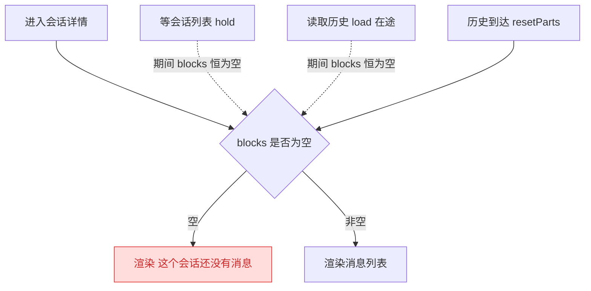
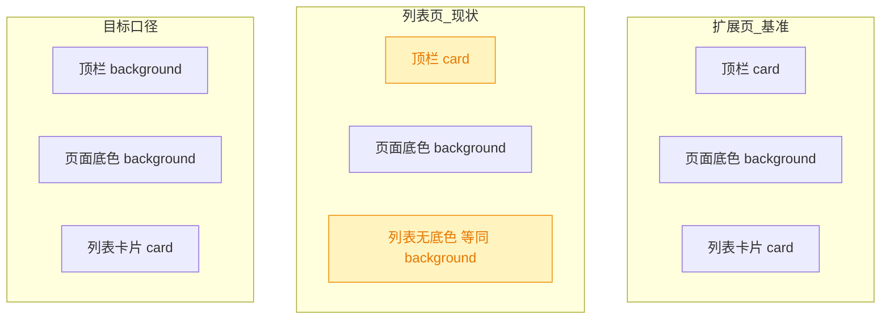
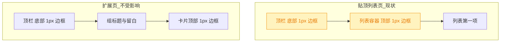
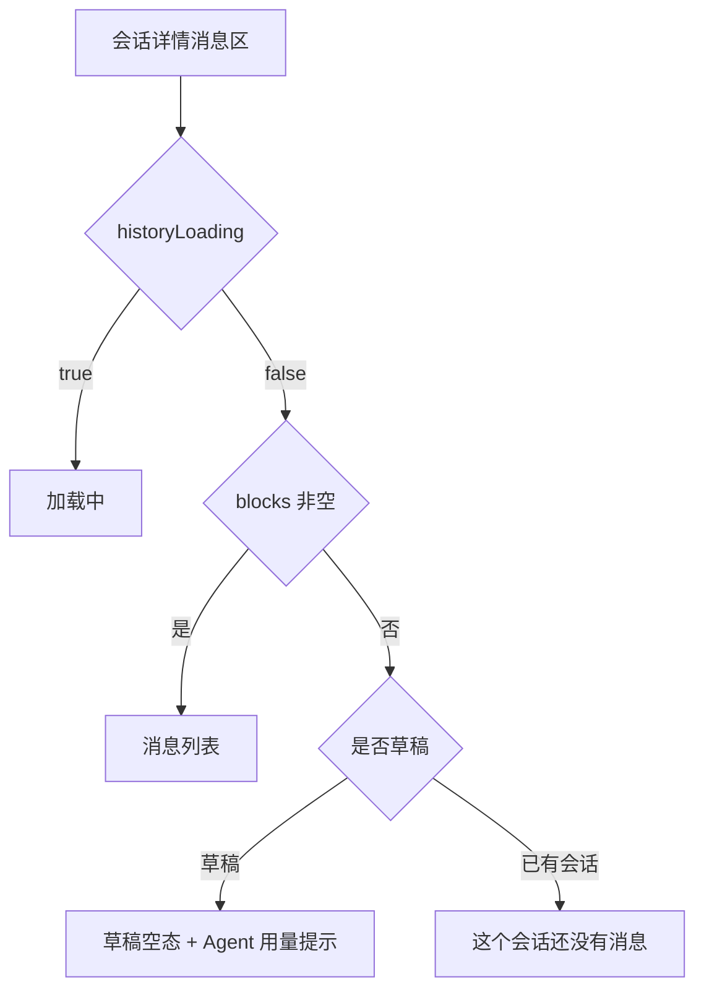
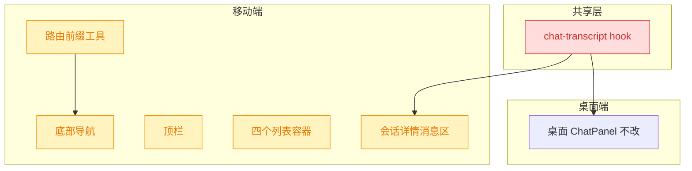

# 移动端 UI 修正：加载态 / 导航高亮 / 列表底色统一

## 1. 背景

移动端（`src/gui-mobile`）在真机使用中暴露三处观感与正确性问题，均属既有实现的偏差修正，不引入新功能。原始需求：

- 进入会话详情页，数据正在加载中时，显示「这个会话还没有消息」，期望显示加载中（`src/gui-mobile/src/pages/ChatDetail.tsx`）
- 底部 4 个导航，当前所在页面需要激活（高亮）导航元素（`src/gui-mobile/src/components/TabBar.tsx`）
- 统一所有页面列表背景色与页面背景色，以扩展页的列表页背景色为准（`src/gui-mobile/src/pages/Extensions.tsx`）
  - 浅色列表项，背景色稍微深一点；无需重新设计颜色值，使用扩展页颜色值
  - 页面顶部 header 使用页面背景色

## 2. 需求

1. 会话详情在历史读取完成前显示「加载中」，只有确认会话真的没有消息时才显示空态；草稿态（`/sessions/new`）的现有空态文案与 Agent 用量提示不变。
2. 底部导航所在的一级页面必须高亮（含 `aria-current`），四个 tab 行为一致。
3. 一级/二级列表页的列表容器与顶栏底色，统一到扩展页已有的「页面底色 + 卡片底色」分层，复用现有设计令牌，不新增颜色值。
4. 底部导航处于激活态时，图标下的文字需要加粗（与非激活态拉开字重差，不只靠颜色）。
5. 贴顶滚动的列表，第一项上方不再有分割线边框——避免与顶栏下边框叠成 2px 粗线。
6. 会话列表中已结束执行的会话，行首状态点不再可见，只有运行中的会话保留脉冲点。

## 3. 现状分析

### 3.1 会话详情：空态与加载态未区分

`ChatDetail` 的消息区只有二分支：`tx.blocks().length > 0` 为真渲染列表，否则直接渲染空态文案。而历史读取是异步的，且共享 hook `createChatTranscript` **没有对外暴露任何 in-flight 状态**——它的返回接口只有 `blocks / running / starting / toolExpand / send / abort / reset / markPersisted / resetAll`，`starting` 语义是「草稿首发握手中」，与历史读取无关。

更关键的是，`planHistoryLoad` 有两个「界面为空但仍在等」的动作：`hold`（会话列表还在途、尚不知道这条会话属于哪个 spec，此时不许清也不许读）与 `load`（正在读 transcript）。两者期间 `blocks()` 恒为空，于是必然先闪一段「这个会话还没有消息」。

精确层：涉及文件与判定位置

- `src/gui-mobile/src/pages/ChatDetail.tsx:185-201`：`<Show when={tx.blocks().length > 0} fallback={空态}>`，空态内按 `sid()` 是否为空区分 `chat.empty` / `chat.draftEmpty`。
- `src/gui-shared/lib/chat-transcript.ts`：`ChatTranscript` 接口定义与「session selection → load history」effect；读取结果经 `historyGate.begin()` 返回的 `isCurrent()` 守卫后写入 `resetParts(next)`。
- `src/gui-shared/lib/chat-history-load.ts`：`HistoryLoadPlan` 的五个动作 `idle | fresh | hold | keep | load`。
- 文案键：`chat.empty` = 「这个会话还没有消息」，`chat.draftEmpty`；`common.loading` = 「加载中…」已存在（`src/gui-mobile/src/i18n/zh-CN.ts`、`en.ts`）。

### 3.2 底部导航：四个 tab 永远都不高亮

`TabBar` 已经写了 `isActive` 与 `text-primary` 的高亮分支，但它拿 `useLocation().pathname` 直接和裸 href 比较。移动端整体挂在 `ROUTER_BASE = '/m'` 下，这一版 solid-router **不会剥掉 base**——`pathname` 实际是 `/m`、`/m/specs`。于是：

- `/m` !== `/` → 会话 tab 不亮；
- `'/m/specs'.startsWith('/specs')` 为 `false` → 其余三个 tab 也不亮。

结果是四个 tab 恒定走 `text-muted-foreground` 分支，`aria-current` 也永远不输出。同一个坑在 `lib/routes.ts` 的 `isTabRoute` 里已经踩过并修好（还有回归测试），只是 `TabBar` 没有复用那份剥离逻辑。

精确层：两处对同一 pathname 的不同处理

- `src/gui-mobile/src/lib/routes.ts:8` `ROUTER_BASE = '/m'`；`isTabRoute()` 内部先 `slice(ROUTER_BASE.length)` 再归一化末尾斜杠，注释明确写着「少了这一步，底部导航会从所有页面上消失」。
- `src/gui-mobile/src/components/TabBar.tsx:31-32`：`end ? location.pathname === href : location.pathname.startsWith(href)`，未剥离 base。
- 现有回归测试：`src/gui-mobile/src/lib/__tests__/routes.test.ts`。

### 3.3 底色：列表页与扩展页分层不一致

浅色主题下 `--background`（L 94.9%）比 `--card`（L 97.5%）**更深**，扩展页因此呈现「稍深的页面底色 + 稍浅的卡片列表」。而三个一级列表页与脚本页的 `<ul>` 根本没有底色，直接落在页面底色上；顶栏反而用了 `bg-card`，形成「顶栏比内容浅、列表和页面同色」的倒挂。

精确层：底色相关的令牌与用点

- 令牌（`src/styles/theme-tokens.css`，桌面/移动共用）：亮色 `--background: 60 23.1% 94.9%` / `--card: 60 38.5% 97.5%`；暗色 `--background: 135 8% 10%` / `--card: 132 14.3% 6.9%`。两套均已有对比，不需要新增色值。
- 扩展页基准：`src/gui-mobile/src/pages/Extensions.tsx:33` `Group` 内层 `divide-y divide-border border-y border-border bg-card`。
- 无底色的列表容器：`src/gui-mobile/src/pages/Sessions.tsx:131`、`src/gui-mobile/src/pages/Specs.tsx:124`、`src/gui-mobile/src/pages/Projects.tsx:61`、`src/gui-mobile/src/pages/ext/Scripts.tsx:148`。
- 顶栏：`src/gui-mobile/src/components/TopBar.tsx:38` `border-b border-border bg-card px-safe pt-safe`。
- 同为 `bg-card` 的常驻栏：`src/gui-mobile/src/components/TabBar.tsx:36`、`src/gui-mobile/src/components/ChatComposer.tsx:48`。
- 浮层（`Sheet` / `ActionSheet` / `SelectionBar` / 消息气泡）本就该与页面分层，不在本次范围。

### 3.4 追加轮：底色改完后残留的三处观感问题

上一轮把底色分层与 tab 高亮修好后，真机复看又暴露三处细节：激活 tab 只有颜色变化、列表首行上边框与顶栏下边框叠成 2px、会话列表的状态点在已结束会话上仍然满屏。三处都是既有实现的观感修正，不改结构、不改数据流。

其中「2px 粗线」是两条各自都正确的 1px 边框相邻造成的：顶栏自带 `border-b` 收底，列表容器上一轮为了让卡片首尾封口加了 `border-y`，两者在贴顶滚动的一级列表页正好挨在一起。

精确层：三处的代码位置与现状取值

- 激活态字重：`src/gui-mobile/src/components/TabBar.tsx:52-57`，激活分支只切 `text-primary`，字重恒为默认值；标签尺寸 `text-[0.68rem]`，仅靠色相区分在强光下辨识度不足。
- 边框叠加：`src/gui-mobile/src/components/TopBar.tsx:43` 的 `border-b border-border`，与四个贴顶列表容器的 `border-y` 相邻——`Sessions.tsx:132`、`Specs.tsx:125`、`Projects.tsx:62`、`ext/Scripts.tsx:149`。`Extensions.tsx:33` 的 `Group` 内层同样是 `border-y`，但它外层有 `py-4` 且上方有组标题，与顶栏不相邻，不产生叠加。
- 状态点：`src/gui-mobile/src/pages/Sessions.tsx:144-150`，`size-2 rounded-full` 常驻槽位，运行中 `bg-primary animate-pulse`，非运行时 `bg-muted-foreground/40`；一屏十几行里通常只有零星几行在跑，其余全是灰点。

## 4. 技术实现方案

### 4.1 会话详情三态：加载中 / 空 / 有内容

在共享 hook `createChatTranscript` 上新增只读访问器 `historyLoading: Accessor<boolean>`，由 hook 内部「加载历史」的 effect 唯一驱动，`ChatDetail` 消费它把二分支改成三分支。

判定口径（与 `planHistoryLoad` 一一对应，不新造状态机）：

- `idle`（无 sid，即草稿）→ `false`；`fresh` / `keep`（屏上内容已是正确的那份）→ `false`。
- `hold`（列表还欠答案）→ `true`：此刻界面确实为空且仍在等。
- `load` → `true`，在 `then` / `catch` 中经 `isCurrent()` 守卫置回 `false`；无 `projectId` 时置 `false`。
- `reset()` / `resetAll()` 一并置 `false`——它们已经 `invalidate()` 了在途读取，留着 true 会把草稿页钉死在加载态。

> 决策说明：不在 `ChatDetail` 本地推导加载态。页面够不到 `planHistoryLoad` 的动作，只能靠「`sessions.loading` + blocks 为空」猜，而 `hold` 的退出条件是列表**settle**、`load` 的退出条件是请求返回，两者都不等价于列表 loading，猜出来的态会在弱网下反复抖动。状态归属产生它的模块。
>
> 决策说明：桌面端 `ChatPanel` 本次不消费该字段。新增的是可选读取的访问器，桌面端不读则行为完全不变；桌面空态另有骨架屏口径，一并改会把改动半径从「移动端观感」扩到跨端交互，超出本 spec 边界。

### 4.2 底部导航：把 base 剥离收敛成一处

在 `lib/routes.ts` 导出 `stripRouterBase(pathname)`（`isTabRoute` 改为内部调用它，行为等价、现有测试不变），`TabBar` 的 `isActive` 改为对剥离后的路径做匹配，其余逻辑（`end` 精确匹配 `/`、`text-primary` 高亮、`aria-current`）原样保留。

剥离函数同时归一化末尾斜杠（`/m/specs/` → `/specs`，`/m` → `/`），与 `isTabRoute` 现有语义一致；这样两个消费方读同一份规则，不会再出现「导航栏显示对了、高亮没跟上」的分叉。

> 决策说明：不改用 solid-router 的 `<A activeClass>` / `useMatch`。`routes.ts` 的注释已记录 `useMatch('/specs')` 在本版本同样匹配不上 base；而且高亮要同时作用于图标与文字，`activeClass` 只能挂在 `<A>` 上，仍需一份自己的判定。

### 4.3 底色统一到扩展页口径

- 顶栏 `TopBar` 由 `bg-card` 改为 `bg-background`：header 与页面底色融为一体，`border-b` 仍在，标题区与内容区靠边框分隔。
- 四个列表容器（会话 / spec / 项目 / 脚本）加上扩展页 `Group` 同款的 `border-y border-border bg-card`，让列表项浮在稍深的页面底色上。`Projects` 已有的 `border-b` 由 `border-y` 覆盖，去掉重复类。
- 不改颜色令牌、不加圆角与外边距：需求明确「使用扩展页颜色值」，列表页贴顶滚动是既有布局（`Page padded={false}`），加留白属于重新设计。

> 决策说明：Git 状态页（`/ext/git`）的变更列表不纳入。它是 `Page fill` 的双区布局，滚动区被撑满整屏，加 `bg-card` 会把整页连同空白一起染成卡片色，恰好破坏「卡片浮在页面底色上」这一层次——与本次目标相反。
>
> 决策说明：浮层（`Sheet` / `ActionSheet` / `SelectionBar`）与消息气泡保留 `bg-card`。它们本就依赖与页面底色的对比来表达层级，跟着改会让弹层与页面糊在一起。
>
> 决策说明：设置页的 `SettingsControls` 已是 `rounded-lg border bg-card` 卡片，符合目标口径，无需改动。
>
> 决策记录：底部常驻栏（底部导航 / 会话输入栏）是否跟随顶栏改用页面背景色 —— 用户选择「保留 `bg-card`」，理由：只按需求改顶栏，底部导航与输入栏维持「系统栏」质感，与列表卡片同色但被边框和页面底色隔开。故 `TabBar.tsx:36` 与 `ChatComposer.tsx:48` 的 `bg-card` 本次不动。

### 4.4 追加轮：字重 / 首行边框 / 状态点

三处各改一行 class，不动结构与逻辑：

- **激活 tab 文字加粗**：`TabBar` 的激活分支由 `text-primary` 扩为 `font-semibold text-primary`，非激活分支不动（保持默认字重）。图标已有的尺寸与颜色不变——加粗只作用于图标下的文字，与需求一致。
- **列表首行不再有上边框**：四个贴顶列表容器的 `border-y` 改为 `border-b`，首行上方交给顶栏那条 `border-b` 收口，末行下方仍由自身 `border-b` 封底，`divide-y` 的行间分隔线不变。
- **已结束会话隐藏状态点**：`Sessions` 的状态点非运行时由 `bg-muted-foreground/40` 改为 `bg-transparent`——元素与槽位保留，只是不可见。

> 决策说明：字重取 `font-semibold` 而非 `font-bold`。标签只有 0.68rem，700 字重在这个尺寸下笔画会糊成一团且与图标线宽（lucide 默认 2px stroke）失衡；600 已经和非激活的 400 拉开明显对比，又与顶栏标题的 `font-medium` 同处一个字重梯队。
>
> 决策说明：扩展页 `Group` 的 `border-y` 保留不动。它上方隔着 `py-4` 留白与组标题，压根不与顶栏边框相邻，没有叠加问题；去掉上边框反而会让卡片看起来从标题下方被裁断——需求给的理由（叠成 2px）在这里不成立，按理由而非字面「所有列表」执行。
>
> 决策说明：状态点用 `bg-transparent` 而不是整体不渲染。槽位一旦随运行状态出现/消失，同一屏里运行行与非运行行的标题左缘会错开 20px（点 8px + gap 12px），列表变成锯齿状；保留占位既消除了灰点噪声，又守住了原有注释里「不许标题左右跳动」的约束。运行中那一行照旧是高亮脉冲点，反而因为周围没有灰点而更突出。
>
> 决策说明：不给非运行点改用更浅的灰（如 `/20`）。需求要的是「隐藏」，任何可见残留都还是噪声；透明是唯一彻底的口径，且不新增颜色令牌。

### 4.5 验证方式

- 单元测试：`stripRouterBase` 与 tab 高亮判定补进 `src/gui-mobile/src/lib/__tests__/routes.test.ts`（回归点就是「pathname 带 `/m` 前缀」）。
- `pnpm run typecheck`（新增的 `historyLoading` 要进 `ChatTranscript` 接口）与 `pnpm test`。
- 观感三项（加载态、导航高亮、底色分层）需真机/浏览器移动视图人工确认，浅色与暗色各看一遍。
- 追加轮三项（激活字重、列表首行无上边框、已结束会话无状态点）改的都是 class 字符串，无新逻辑分支可测；靠 `pnpm run typecheck` + `pnpm test` 保证不回归，观感由同一次人工确认覆盖。

## 5. 待确认项

_暂无_

## 6. 任务清单

- [x] 在 `src/gui-shared/lib/chat-transcript.ts` 的 `ChatTranscript` 接口新增只读访问器 `historyLoading: Accessor<boolean>`，并在返回对象中导出（验收：`pnpm run typecheck` 通过）
- [x] 在 `chat-transcript.ts` 的「session selection → load history」effect 中按 `plan.action` 驱动 `historyLoading`：`idle`/`fresh`/`keep` 与无 `pid` 置 false，`hold`/`load` 置 true，`load` 的 `then`/`catch` 内经 `isCurrent()` 守卫置回 false（验收：读代码确认五个动作分支均有明确赋值，无遗漏路径）
- [x] 在 `chat-transcript.ts` 的 `reset()` 与 `resetAll()` 中一并把 `historyLoading` 置回 false（验收：`resetAll` 后草稿页不会滞留加载态）
- [x] 将 `src/gui-mobile/src/pages/ChatDetail.tsx:185-201` 的消息区二分支改为三分支：`tx.historyLoading()` 为真时渲染 `common.loading` 加载态，否则维持现有 `blocks 非空 → 列表 / 空 → chat.empty|chat.draftEmpty + AgentUsageHint` 逻辑（验收：草稿态文案与 Agent 用量提示不变，`pnpm run typecheck` 通过）
- [x] 在 `src/gui-mobile/src/lib/routes.ts` 导出 `stripRouterBase(pathname)`（剥 `ROUTER_BASE` + 归一化末尾斜杠），并把 `isTabRoute` 改为内部调用它（验收：`routes.test.ts` 现有用例全绿、行为等价）
- [x] 将 `src/gui-mobile/src/components/TabBar.tsx:31-32` 的 `isActive` 改为对 `stripRouterBase(location.pathname)` 匹配，保留 `end` 精确匹配 `/`、`text-primary` 高亮与 `aria-current`（验收：`/m`、`/m/specs` 等路径下对应 tab 判定为 active）
- [x] 在 `src/gui-mobile/src/lib/__tests__/routes.test.ts` 补 `stripRouterBase` 用例：带 base、不带 base、末尾斜杠、根路径归一到 `/`（验收：`pnpm test` 通过）
- [x] 将 `src/gui-mobile/src/components/TopBar.tsx:38` 的 `bg-card` 改为 `bg-background`，保留 `border-b border-border px-safe pt-safe`（验收：顶栏与页面底色一致、分隔线仍在）
- [x] 给四个列表容器加上扩展页 `Group` 同款 `border-y border-border bg-card`：`Sessions.tsx:131`、`Specs.tsx:124`、`ext/Scripts.tsx:148`；`Projects.tsx:61` 的 `border-b border-border` 替换为 `border-y border-border` 并去掉重复类（验收：四处 `<ul>` class 与扩展页 `Group` 内层一致，不新增颜色令牌）
- [x] 运行 `pnpm run typecheck` 与 `pnpm test`（验收：两条命令均通过，结果写入执行记录）
- [ ] [manual] 真机/浏览器移动视图人工确认三项观感（会话详情加载态、底部导航高亮、列表与顶栏底色分层），浅色与暗色各看一遍（验收：人工回复确认）
- [x] 将 `src/gui-mobile/src/components/TabBar.tsx` 激活分支的 `text-primary` 改为 `font-semibold text-primary`，非激活分支字重不动（验收：激活 tab 文字字重 600、非激活保持默认，`aria-current` 与颜色逻辑不变）
- [x] 把四个贴顶列表容器的 `border-y border-border` 改为 `border-b border-border`：`Sessions.tsx`、`Specs.tsx`、`Projects.tsx`、`ext/Scripts.tsx`（验收：四处 `<ul>` 均无上边框、末行下边框与 `divide-y` 保留；`Extensions.tsx` 的 `Group` 不动）
- [x] 将 `src/gui-mobile/src/pages/Sessions.tsx` 状态点非运行分支的 `bg-muted-foreground/40` 改为 `bg-transparent`，保留 `size-2 shrink-0 rounded-full` 槽位与运行中的 `bg-primary animate-pulse`（验收：已结束会话行首无可见圆点、标题左缘与运行行对齐）
- [x] 更新 `TabBar.tsx` / `Projects.tsx` 中与本次改动相冲突的既有注释（`border-y 补首末行的边框` 一句需改写为「上边框交给顶栏」口径）（验收：注释与代码一致，无遗留误导说明）
- [x] 运行 `pnpm run typecheck` 与 `pnpm test`，并对改动文件跑 prettier（验收：typecheck 通过、测试无新增失败，结果写入执行记录）
- [ ] [manual] 真机/浏览器移动视图人工确认追加轮三项（激活 tab 文字加粗、列表首行无 2px 粗线、已结束会话无状态点），浅色与暗色各看一遍（验收：人工回复确认）

## 7. 追加任务

- [fixed] [refct] 2026-09-06 22:07:53 | 1. 底部激活的导航，icon 下的文字需要加粗
  - 描述：1. 底部激活的导航，icon 下的文字需要加粗

2. 所有列表第一项上方不要分割线边框，会跟顶部导航边框叠加成 2px，看起来比较粗
3. session 列表中已结束执行的 session 项前面 · icon 需要隐藏，太多了干扰视觉

## 8. 执行记录

- `chat-transcript.ts` 新增 `historyLoading` 信号并进 `ChatTranscript` 接口：历史 effect 内 `!pid`/`idle`/`keep`/`fresh` 置 false、`hold` 置 true、`load` 起读前置 true 并在 `then`/`catch` 内经 `isCurrent()` 守卫置回 false；`reset()`（`resetAll()` 经它级联）一并置 false。桌面端 `ChatPanel` 未读该字段，行为不变。
- `ChatDetail.tsx` 消息区改为三分支：`historyLoading` 为真渲染 `common.loading`，其余维持原有「有内容 / `chat.empty` / `chat.draftEmpty` + `AgentUsageHint`」逻辑，草稿态文案与用量提示未动。
- `lib/routes.ts` 导出 `stripRouterBase()`（剥 `/m` + 归一化末尾斜杠），`isTabRoute()` 改为调用它，行为等价；`TabBar.tsx` 的 `isActive` 改读剥离后路径，`end` 精确匹配、`text-primary`、`aria-current` 均保留。
- `routes.test.ts` 新增 `stripRouterBase`（带/不带 base、末尾斜杠、根路径归一）与 tab 高亮判定（四个一级页面各亮其一、会话 tab 不误亮、二级页面高亮所属 tab）两组用例，共 12 条全绿。
- 底色：`TopBar.tsx` 由 `bg-card` 改 `bg-background`（并补注释说明倒挂原因）；`Sessions.tsx` / `Specs.tsx` / `ext/Scripts.tsx` 的 `<ul>` 加 `border-y border-border bg-card`，`Projects.tsx` 的 `border-b` 换成 `border-y` 并加 `bg-card`。按用户批注，`TabBar` 与 `ChatComposer` 的 `bg-card` 保持不动。
- 验证：`pnpm run typecheck` 通过（首轮因 `pid &&` 阻断了 TS 对 `plan.action` 的收窄而报 4 处 TS2339，调整分支顺序后消除）；`pnpm test` 798 passed / 1 failed，唯一失败为 `src/service/__tests__/git-routes.test.ts > surfaces the underlying git stderr on failure`，断言本地 git 的 stderr 文案，与本次改动文件（gui-mobile / gui-shared）无交集，属既有环境相关失败；`npx vitest run src/gui-mobile/src/lib/__tests__/routes.test.ts` 单独跑全绿；改动文件已过 prettier。
- 收尾：非 manual 任务全部完成，待确认项为 `_暂无_`、无 `！！！` 批注，标记 `done`。剩余 `[manual]` 真机观感确认按约定不阻断收尾。
- 追加轮 · 激活字重：`TabBar.tsx` 激活分支由 `text-primary` 改为 `font-semibold text-primary`，非激活分支与 `aria-current`、图标尺寸均未动；同处补注释说明为何取 600 而非 700。
- 追加轮 · 首行边框：`Sessions.tsx` / `Specs.tsx` / `Projects.tsx` / `ext/Scripts.tsx` 四个贴顶列表的 `border-y border-border` 改为 `border-b border-border`，`divide-y` 行间线与末行下边框保留；四处注释同步改写为「上边框交给顶栏收口」口径（`Projects.tsx` 原「border-y 补首末行」一句已改）。`Extensions.tsx` 的 `Group` 保持 `border-y`——它上方隔着 `py-4` 与组标题，不与顶栏相邻，去掉上边框反而像被裁断。
- 追加轮 · 状态点：`Sessions.tsx` 非运行分支由 `bg-muted-foreground/40` 改为 `bg-transparent`，`size-2 shrink-0 rounded-full` 槽位与运行中的 `bg-primary animate-pulse` 均保留，标题左缘不因运行状态错位。
- 追加轮 · 验证：`pnpm run typecheck` 通过；`pnpm test` 798 passed / 1 failed / 2 skipped，唯一失败仍是既有的 `src/service/__tests__/git-routes.test.ts > surfaces the underlying git stderr on failure`（断言本地 git stderr 文案，与本轮纯 class 改动无交集，与上一轮同一条）；五个改动文件过 prettier 无变更。
- 追加轮收尾：`## 追加任务` 条目标记为 `[fixed]`，非 manual 任务全部完成、待确认项 `_暂无_`、无 `！！！` 批注，重新标记 `done`；新增的 `[manual]` 观感确认按约定不阻断收尾。
