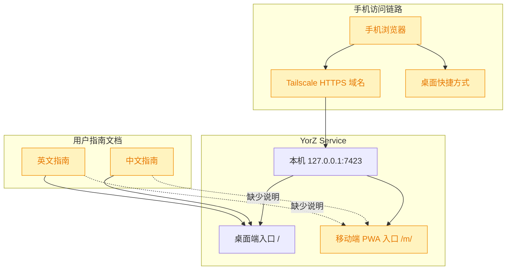
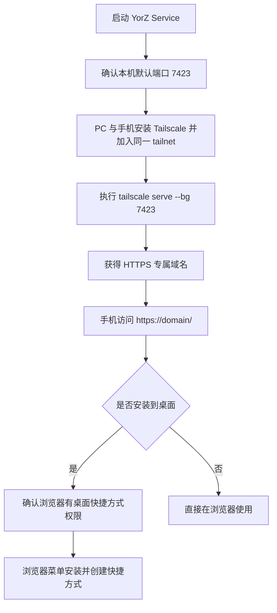

# 移动端 PWA 访问指南文档

## 1. 背景

当前 YorZ 已实现移动端 PWA 版本 UI，移动端挂载路径为 `/m/`。现有中英文用户指南已覆盖安装、启动服务、配置目录、桌面端 GUI 功能和常见工作流，但尚未明确告诉用户如何从手机访问移动端 PWA，以及如何可选地安装到手机桌面。

原始需求：

> 当前已经实现 移动端 PWA 版本 UI，请更新中英文指南文档，介绍如何访问移动端；
> 大概操作路径是：
>
> 1. 安装并启动 yorz 服务，默认监听 7423 端口
> 2. 在 PC 、手机上安装 tailscale 并开启 https，确认 PC、手机链接到同一网络
> 3. 终端执行命令 `tailscale serve --bg 7423`，期望打印
>
> ```text
> Available within your tailnet:
> https://<tailscale 给你生成的专属域名>/
> |-- proxy http://127.0.0.1:7423
> ```
>
> 4. 使用手机浏览器访问对应域名，记得域名后添加 path： /m/，示例： https://fenghenmacbook-pro.taildce4ce.ts.net/m/
> 5. 如果希望安装 YorZ 到手机桌面，确认系统设置中，浏览器已拥有“桌面快捷方式”权限【以下操作可选】
> 6. 点击浏览器设置菜单 —— “安装并创建快捷方式”
>
> `docs/User-Guide.md` `docs/User-Guide-CN.md`

## 2. 需求

更新中英文用户指南，新增移动端 PWA 访问说明，覆盖以下内容：

- 安装并启动 YorZ Service，默认监听 `7423` 端口。
- 在 PC 与手机上安装 Tailscale，开启 HTTPS，并确认两台设备位于同一个 tailnet。
- 执行 `tailscale serve --bg 7423`，说明期望输出与代理关系。
- 手机浏览器访问 Tailscale 根域名即可，YorZ 会按移动端 UA 自动切换到手机端 PWA，不再额外提醒用户手动追加 `/m/`。
- 可选说明安装到手机桌面前的浏览器“桌面快捷方式”权限，以及浏览器菜单中的“安装并创建快捷方式”操作。

## 3. 现状分析

现有文档与移动端入口关系如下：



<details>
<summary>精确层：相关文件与依据</summary>

- `docs/User-Guide.md`：英文用户指南，目录目前从安装、服务启停、日志、添加项目、配置目录进入 GUI 功能与常见工作流，尚无移动端访问章节。
- `docs/User-Guide-CN.md`：中文用户指南，结构与英文版对应，尚无移动端访问章节。
- 项目约定：桌面端 `src/gui` 挂载 `/`，移动端 PWA `src/gui-mobile` 挂载 `/m/`，两端独立。
- 用户追加说明：当前已实现 UA 探测，手机访问 Tailscale 根域名即可自动切换到移动端 PWA，因此文档不应再把手动添加 `/m/` 作为操作步骤。
</details>

关键结论：

- 本需求是文档更新，不需要修改桌面端或移动端运行时代码。
- 需要同时更新英文与中文指南，并保持章节、命令、路径、示例和可选安装步骤语义一致。
- 新章节最适合放在“启动服务”之后、“停止与重启服务”之前。理由：移动端访问依赖服务已启动，且属于访问入口说明，不应埋在 GUI 功能介绍或常见工作流后部。
- 本次不新增应用内可见文案，因此不需要修改桌面端 `src/gui/src/i18n/` 或移动端 `src/gui-mobile/src/i18n/`。

## 4. 技术实现方案

方案流程：



<details>
<summary>精确层：拟变更内容</summary>

- 在 `docs/User-Guide.md` 目录中新增 `Access the Mobile PWA` 条目。
- 在 `docs/User-Guide.md` 正文新增英文章节，包含 `yorz serve`、默认 `http://localhost:7423`、`tailscale serve --bg 7423`、期望输出、根域名访问会自动切换到移动端 PWA，以及可选安装到桌面说明。
- 在 `docs/User-Guide-CN.md` 目录中新增 `访问移动端 PWA` 条目。
- 在 `docs/User-Guide-CN.md` 正文新增中文章节，包含同等命令、根域名示例与可选安装步骤。
- 更新后运行 Markdown formatter 和必要的关键词检查。
</details>

实施决策：

- 新章节编号为 `3`，原有“停止与重启服务”及后续章节整体后移。理由：用户访问移动端的第一步紧跟服务启动，文档阅读顺序更自然。
- 中英文文档使用同一根域名示例 `https://fenghenmacbook-pro.taildce4ce.ts.net/`。理由：UA 探测已实现，手机访问根路径会自动切换到移动端 PWA，不必让用户记忆额外路径。
- Tailscale 相关说明限定为“PC 与手机位于同一 tailnet，开启 HTTPS，执行 `tailscale serve --bg 7423`”。理由：避免扩展成 Tailscale 教程，保持 YorZ 指南聚焦。
- 可选安装到手机桌面的步骤放在同一章节末尾。理由：它依赖移动端访问成功，不应成为必需步骤。

## 5. 待确认项

_暂无_

## 6. 任务清单

- [x] 更新 `docs/User-Guide-CN.md`，新增“访问移动端 PWA”章节并同步目录编号（验收：中文指南包含 `tailscale serve --bg 7423`、根域名自动切换说明、`安装并创建快捷方式`）
- [x] 更新 `docs/User-Guide.md`，新增“Access the Mobile PWA”章节并同步目录编号（验收：英文指南包含 `tailscale serve --bg 7423`、根域名自动切换说明、`Install and create shortcut`）
- [x] 格式化并验证中英文指南与 spec 结构（验收：prettier 成功，关键词检查通过，`yorz lint .yorz/specs/260907.feat.mobile-pwa-access-docs/spec.md --format json` errorCount 为 0）

## 7. 追加任务

- [fixed] [refct] 2026-09-07 17:01:04 | 刚刚终端了任务，请继续；
  - 描述：刚刚终端了任务，请继续；
    刚刚实现了探测 UA，移动端访问根路径会自动切换到 /m/，所以可以简化文档，不必额外提醒添加 path: /m/

## 8. 执行记录

- 2026-09-07 16:52:04：创建 spec 并完成 plan 阶段分析，确认无需待确认项，准备进入 tasks 阶段。
- 2026-09-07 16:53:19：待确认项为空，生成任务清单并进入 execute 阶段。
- 2026-09-07 16:56:27：更新 `docs/User-Guide-CN.md`，新增“访问移动端 PWA”章节并同步目录编号；运行 `rg` 验证 `tailscale serve --bg 7423`、`/m/`、`安装并创建快捷方式` 均已覆盖。
- 2026-09-07 17:03:17：消费追加任务的方案变更：移动端访问说明改为手机浏览器打开 Tailscale 根域名后由 YorZ 自动切换到移动端 PWA；同步更新中英文指南文案与英文正文编号。
- 2026-09-07 17:05:34：运行 `npx prettier --write docs/User-Guide.md docs/User-Guide-CN.md .yorz/specs/260907.feat.mobile-pwa-access-docs/spec.md`、关键词检查与 `yorz lint .yorz/specs/260907.feat.mobile-pwa-access-docs/spec.md --format json`，确认验证通过；追加任务标记为 fixed，spec 标记 done。
