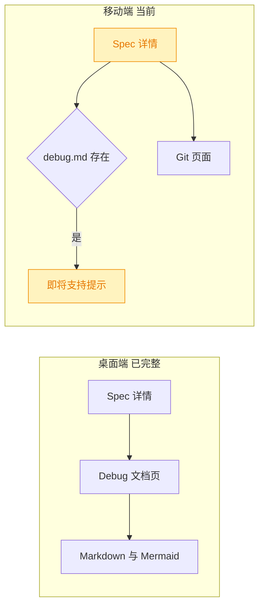
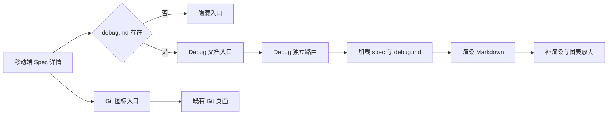
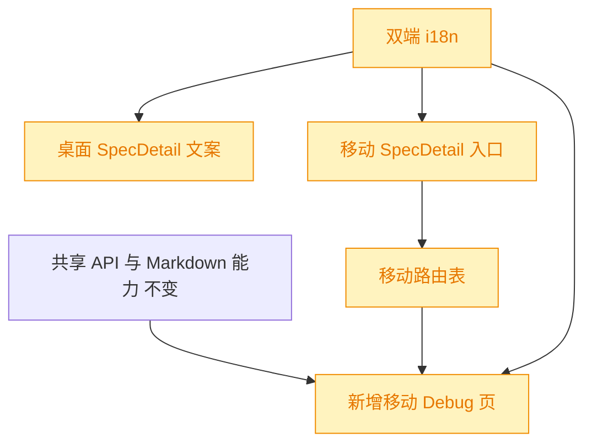

# 移动端 Spec Debug 入口与详情页

## 1. 背景

移动端 spec 详情页已经按 `debug.md` 是否存在控制 Debug 入口显隐，但入口仍使用“即将支持”占位行为，无法进入文档。桌面端已有可工作的 `SpecDebug` 页面，可作为移动端实现的功能参照。同时，双端入口文案和移动端 Git 入口的表现需要统一。

## 2. 需求

1. 修复 `@src/gui-mobile/src/pages/SpecDetail.tsx` 的 Debug 入口，使其可以进入并阅读当前 spec 的 `debug.md`，功能参考桌面端 `@src/gui/src/pages/SpecDebug.tsx`。
2. 将桌面端与移动端 `SpecDetail` 中的 Debug 入口文案统一为中文“Debug 文档”，英文使用对应的“Debug document”。
3. 将移动端 `SpecDetail` 的 Git 文字入口改为与桌面端一致的 Git 分支图标入口，并保留无障碍名称。

## 3. 现状分析

当前桌面端已经形成“详情入口 → Debug 独立页 → Markdown 与 Mermaid 渲染”的完整链路；移动端只完成了入口显隐探测，缺少页面和路由，点击时走通用 `comingSoon` 提示。移动端 Git 已有可用的 spec 作用域页面，但详情页入口仍以本地化文字渲染。

现有实现定位

- `@src/gui/src/pages/SpecDebug.tsx` 已实现 spec 摘要加载、`debug.md` 加载、frontmatter 剥离、Markdown 渲染、Mermaid 补渲染和空态。
- `@src/gui-mobile/src/pages/SpecDetail.tsx` 已通过 `api.getDebug` 探测 `debug.md`，但 Debug 按钮的点击处理仍为 `comingSoon`。
- `@src/gui-mobile/src/main.tsx` 已注册 spec 详情与 Git 路由，尚无 `/specs/:id/debug` 路由。
- `@src/gui-mobile/src/pages/SpecGit.tsx` 已承载 `/specs/:id/git`，因此 Git 需求只涉及入口视觉与无障碍属性。
- 双端展示文案均来自各自的 `i18n` 目录，不能在组件内硬编码。

## 4. 技术实现方案

新增移动端 `SpecDebug` 页面，沿用移动端的 `Page`、列表状态组件、共享 Markdown/Mermaid 能力和 `MermaidViewer`，并注册 `/specs/:id/debug` 路由。详情页 Debug 按钮在 `debug.md` 存在时导航到该路由；Debug 页面加载当前 spec 与 debug 文档，剥离 debug frontmatter 后渲染正文，支持 Mermaid 图形化与点按放大，并呈现加载、失败、空内容和无项目状态。

详情页动作区保留“追加任务”文字按钮；Debug 使用明确的本地化文字；Git 改为 `GitBranch` 图标按钮，通过 `aria-label` 与 `title` 使用既有 Git 本地化文案，导航地址不变。桌面端和移动端分别更新自身 i18n，不建立跨前端源码依赖。

### 4.1 兼容性与影响范围

本次不修改 API、spec 文件格式或路由前缀，只新增移动端内部路由和页面。桌面端仅调整入口文案；移动端详情页、路由表和 i18n 属于受影响区域，没有破坏性变更。

精确改动与验证范围

- 新增 `@src/gui-mobile/src/pages/SpecDebug.tsx`，使用 `@shared/api`、`@shared/lib/markdown` 与 `@shared/lib/mermaid-core`，不得直接引用桌面端源码。
- 修改 `@src/gui-mobile/src/main.tsx`，注册 `/specs/:id/debug`。
- 修改 `@src/gui-mobile/src/pages/SpecDetail.tsx`，将 Debug 点击改为路由导航，并以 `GitBranch` 渲染 Git 图标入口。
- 修改 `@src/gui-mobile/src/i18n/zh-CN.ts`、`@src/gui-mobile/src/i18n/en.ts`、`@src/gui/src/i18n/zh-CN.ts`、`@src/gui/src/i18n/en.ts`，统一 Debug 文档相关展示文案并补齐移动端空态键。
- 通过格式化、TypeScript 类型检查、相关单元测试及双前端构建验证。

### 4.2 决策说明

- 移动端 Debug 页采用现有 `Page` 骨架和移动端状态组件，以符合 `/m/` 下的滚动、安全区与返回导航约定；不复制桌面端布局组件。
- Debug 页复用共享 Markdown 和 Mermaid 核心能力，同时接入移动端已有 `MermaidViewer`，保证 debug 文档和 spec 正文在移动端的渲染体验一致。
- 英文文案使用“Debug document”，中文使用用户指定的“Debug 文档”；Git 图标继续使用既有 `specDetail.git` 作为可访问名称，无需新增重复文案键。

## 5. 待确认项

_暂无_

## 6. 任务清单

- [x] 新增移动端 `SpecDebug` 页面并接入共享 Markdown、Mermaid 渲染和移动端状态/查看器组件（验收：页面可加载、展示或空态处理 `debug.md`，且 Mermaid 支持点按放大）
- [x] 注册移动端 Debug 路由并打通 `SpecDetail` 的 Debug 导航（验收：`/m/specs/:id/debug` 可访问，存在 `debug.md` 时入口点击进入该页）
- [x] 将移动端 `SpecDetail` 的 Git 文字按钮替换为 `GitBranch` 图标按钮（验收：导航仍指向 spec Git 页，且具备本地化 `aria-label` 与 `title`）
- [x] 更新桌面端与移动端 i18n 的 Debug 文档文案（验收：中文显示“Debug 文档”，英文显示“Debug document”，组件无硬编码展示文案）
- [x] 格式化并执行类型检查、相关单元测试与双前端构建（验收：相关命令全部通过，或在执行记录中说明环境性失败）

## 7. 执行记录

- 2026-09-08 19:59:47：新增移动端 `SpecDebug` 页面，接入共享 Markdown/frontmatter/Mermaid 能力、移动端加载/错误/空态组件和 Mermaid 全屏查看器；以 `pnpm typecheck` 验证类型通过。
- 2026-09-08 19:59:47：注册 `/specs/:id/debug` 路由，并将详情页中受 `debug.md` 存在性控制的入口改为真实导航。
- 2026-09-08 19:59:47：移动端 Git 入口改用 `GitBranch` 图标，保留原导航并补充本地化 `aria-label`、`title`。
- 2026-09-08 19:59:47：双端中英文 Debug 入口分别统一为“Debug 文档”与“Debug document”，移动端新增 debug 空态文案键。
- 2026-09-08 20:03:48：完成 Prettier 格式化、`pnpm typecheck`、移动端路由与转场相关测试（2 个文件、17 项测试）、`pnpm run build:gui`、`pnpm run build:gui-mobile` 和 `git diff --check`，均通过；构建仅有既有的大 chunk 提示。尝试进行实际移动视口验收时当前环境无可用浏览器连接，因此未执行浏览器视觉检查。
- 2026-09-08 20:03:48：所有非 manual 任务完成，无待确认项、批注或开放追加任务，标记 spec 为 `done`。
