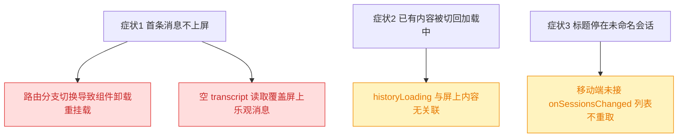
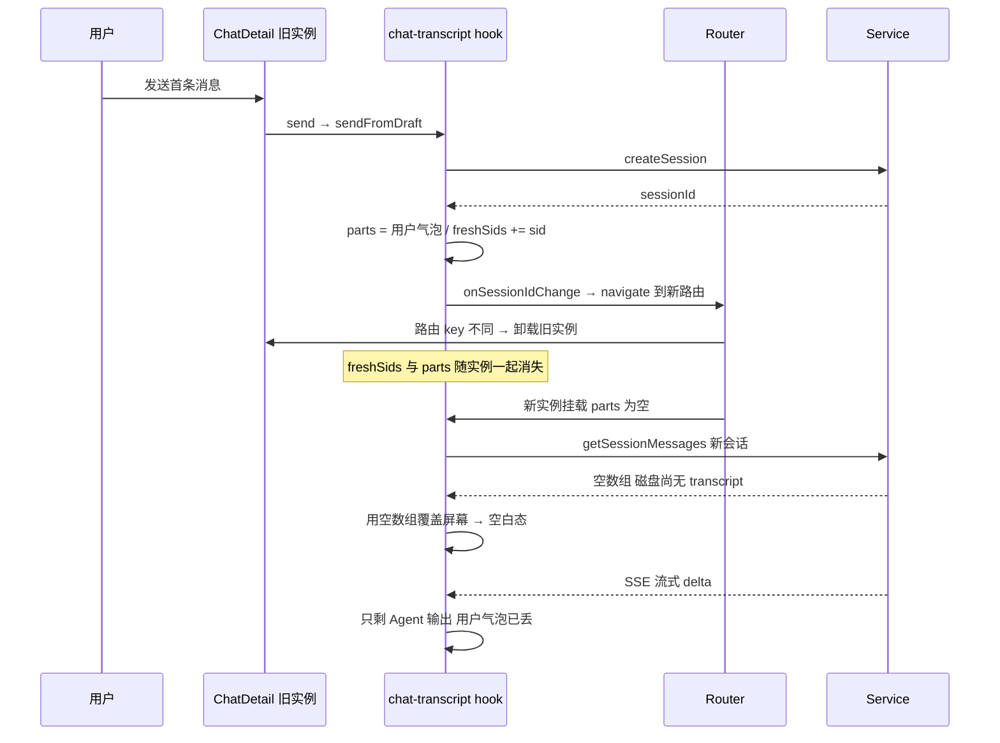
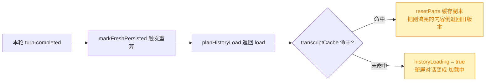
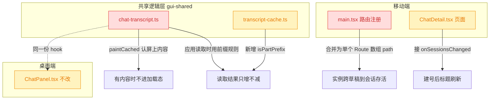
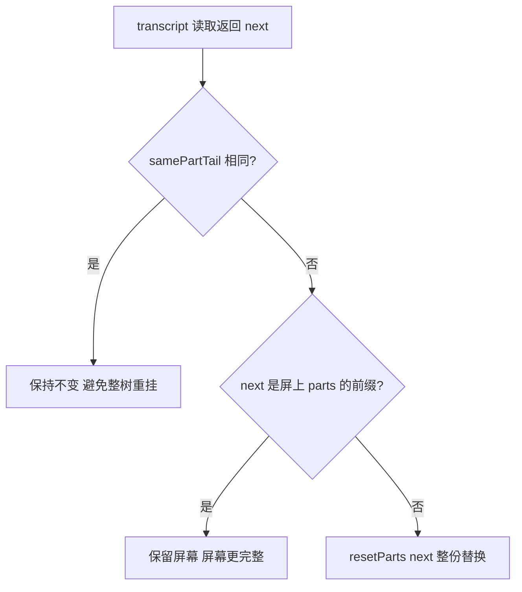
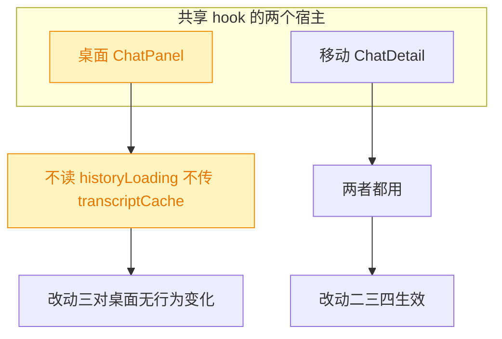

# 移动端会话详情：首条消息立即上屏与静默刷新

## 1. 背景

移动端 `@src/gui-mobile/src/pages/ChatDetail.tsx` 同时承载 `/sessions/new`（草稿态）与
`/sessions/:id`（真实会话）。文件顶部注释明确写着「两者不是两个页面……分成两个组件会把
『首发后从空白页变成真会话』拆成一次卸载 + 挂载，正在流式输出的内容会闪掉」——但实际路由
注册把它们写成了**两条独立的 `<Route>`**，注释描述的失效场景正在真实发生。

## 2. 需求

1. **首条消息立即上屏**：草稿页发送第一条消息后，用户气泡必须立刻出现并保持在屏上，
   直到被服务端 transcript 接管；已有历史的会话发送消息同样必须立即上屏。
2. **后台静默刷新**：消息区已有内容时，后台重新拉取 transcript 不得把页面切回「加载中」，
   数据取回后再静默替换。
3. **标题跟随建号**：首条消息创建 session 成功后，顶栏标题从「未命名会话」更新为服务端
   依据用户输入生成的具体标题。

## 3. 现状分析

### 3.1 三个症状，三条独立成因



### 3.2 成因一：路由分支切换 = 卸载重挂载

`@src/gui-mobile/src/main.tsx` 把草稿页与详情页注册成两条 `<Route>`。solid-router 判定
「是否复用已挂载的路由上下文」用的是 `route.key`，而 `key` 就是那条 `Route` 的定义对象本身：
两条 `Route` 是两个对象，key 必不相等，于是 `/sessions/new → /sessions/<id>` 走的是
**dispose 旧上下文 + createRoot 新上下文**，ChatDetail 整个重建。

重建代价恰好落在首发链路最关键的两份内存态上：`freshSids`（"本 tab 的内存消息比磁盘
transcript 更完整"的凭据）与 `parts`（乐观用户气泡）。



<details>
<summary>精确层：路由复用判定与相关代码位置</summary>

- `node_modules/@solidjs/router/dist/routers/components.jsx:63`：
  `if (prev && prevMatch && nextMatch.route.key === prevMatch.route.key) next[i] = prev[i]`
  —— key 相等才复用，否则 `disposers[i]()` + `createRoot(...)`。
- `node_modules/@solidjs/router/dist/routing.js:211`：`const shared = { key: routeDef, ... }`
  —— key 是 `Route` 定义对象；**同一个 `Route` 的 `path` 数组展开出的多个分支共享同一个 key**。
- `node_modules/@solidjs/router/dist/utils.js:109` `scoreRoute`：静态段计 3 分、`:param` 段计 2 分，
  故 `/sessions/new` 天然排在 `/sessions/:id` 前面，合并成数组 path 不改变匹配优先级。
- `@src/gui-mobile/src/main.tsx:50-51`：两条 `Route` 的注册处。
- `@src/gui-shared/lib/chat-transcript.ts:169`（`freshSids`）、`:536`（`resetParts([用户气泡])`）、
  `:543`（`onSessionIdChange`）。
- 导航用的是 `replace: true`，`decideDirection` 对 replace 直接返回 null，本次导航**没有**
  View Transition 参与，闪白与动画无关。

</details>

### 3.3 成因二：权威读取可以把屏幕改「短」

`chat-transcript` 收到 transcript 响应后，只用 `samePartTail`（长度 + 尾部）判断「是不是同一份」，
不同就整份换掉。于是任何**比屏上内容更短**的响应都会抹掉屏幕：

- 新建会话磁盘还没有 transcript → 返回空数组 → 抹掉乐观用户气泡（成因一之后的第二重伤害）；
- 已有历史的会话，用户在 transcript 读取途中就发出消息 → 读取回来的历史不含这条新消息 →
  乐观气泡同样被抹掉。

### 3.4 成因三：`historyLoading` 只跟「读取是否在飞」有关

hook 里 `historyLoading` 的契约写的是「消息区**为空**且仍欠内容」，实现却是
`setHistoryLoading(!paintCached(pid, sid))`：只要缓存没命中就置 true，完全不看屏上有没有内容。



这条路径在「首轮跑完」时必然命中：新建会话的 sid 从未进过 `transcriptCache`（缓存只在读取
成功与卸载时写入），于是刚看完整轮输出的用户会眼看着对话变回「加载中」。

### 3.5 成因四：移动端没有接列表重取

服务端在 `POST /sessions/:sid/messages` 里、**返回 202 之前**就已经根据用户输入把标题写好；
桌面端 ChatPanel 接了 `onSessionsChanged: () => void refetchSessions()`，移动端没传这个回调，
`sessions` 资源的 source 只有 `pid`，建号后再没有任何时机重取列表 → `current()` 恒为
undefined → 标题恒为 `chat.untitled`。

<details>
<summary>精确层：标题生成时序</summary>

- `@src/service/routes/sessions.ts:199`：`await p.sessions.send(sid, finalPrompt, prompt, ...)`
  之后才 `return c.json(..., 202)`。
- `@src/service/session-manager.ts:398`：`send()` 内 `await this.maybeUpdateTitleFromPrompt(...)`
  在派发 Agent 之前完成，标题来自用户原文而非展开后的 prompt。
- 结论：**POST 一旦 resolve，服务端标题已就绪**，此刻重取列表即可拿到真标题，无需轮询。
- `@src/gui-shared/lib/chat-transcript.ts:554`：`sendFromDraft` 正是在 POST 之后调用
  `o.onSessionsChanged?.()`，时机天然吻合。

</details>

## 4. 技术实现方案

### 4.1 总览：四处改动，各治一因



### 4.2 改动一：合并草稿与详情的路由分支

把两条 `Route` 合并为一条、`path` 传数组：

```
<Route path={['/sessions/new', '/sessions/:id']} component={ChatDetail} />
```

`createRoutes` 对数组 path 做 `reduce`，展开出的每个分支都携带**同一个** `key`（即这一条
`Route` 定义对象），于是 `/sessions/new → /sessions/<id>` 满足 key 相等，路由上下文被复用、
组件不再卸载；`params.id` 是响应式的，草稿分支下仍为 `undefined`，页面里 `params.id ?? ''`
的既有分支逻辑一个字都不用改。静态段得分高于参数段，匹配优先级与现在完全一致。

> 决策记录：不采用「删掉 `/sessions/new`、让 `:id` 吃下 `new` 当哨兵值」的写法——那会让
> 「new」成为一个必须在页面里特判的伪 id，且与真实 id 空间共存；数组 path 直接命中 router
> 的 key 复用机制，不引入任何新概念。

### 4.3 改动二：权威读取只增不减（`isPartPrefix`）

在 `@src/gui-shared/lib/transcript-cache.ts` 新增纯函数：判断「刚到达的 parts 是否是屏上
parts 的前缀」。是前缀就说明**屏幕严格领先于读取结果**（乐观气泡、或读取途中流进来的内容），
此时保留屏幕、丢弃读取结果；不是前缀才整份替换。



空数组是任何序列的前缀，所以「新建会话读到空 transcript」这一支被同一条规则覆盖，不需要
额外特判。压缩（compact）导致 transcript 真的变短时，内容必然对不上前缀，仍走整份替换。

### 4.4 改动三：`historyLoading` 与屏上内容对齐

让 `paintCached` 在「屏上已经是**这条会话自己的**非空内容」时直接返回 true（既不用缓存副本
覆盖更新的屏幕，也不置加载态）；同时在 `send` 压入乐观用户气泡后显式清掉加载标记。

判定「屏上内容属于当前 sid」用 `displayedSid === sid || paintedFromCache === sid`：`load`
分支在 `clear` 时已经先 `resetParts()` 把别的会话的内容清空，因此该判定不会把 A 的历史留在
B 的页面上；`hold` 分支不动 `displayedSid`，跨会话时依旧正确地显示「加载中」而不是错内容。

> 决策记录：不把 `historyLoading` 简化成 `pending && parts 为空` 的 memo。`hold` 分支下屏上
> 可能还挂着**上一条会话**的内容，那样会在新会话的标题下展示旧会话的消息——比多一次「加载中」
> 更糟。契约仍是「消息区为空且仍欠内容」，只是判定要带上作用域。

### 4.5 改动四：建号后重取会话列表

移动端 `sessions` 资源改为解构出 `refetch`，并给 hook 传 `onSessionsChanged`。该回调有两个
触发点，正好覆盖两种「列表已过时」：草稿首发 POST 成功之后（标题就绪），以及 codex 中途换
session id 之后。重取回来的列表经既有 effect 写回 `list` 与 localStorage，`current()` 命中，
标题、`specId`、跳转 icon 一并归位。

重取期间 `sessions.loading` 为 true，但首发会话在 `planHistoryLoad` 里先命中 `fresh` 分支
（早于 `hold` 判定），不会退回加载态。

### 4.6 兼容性与影响范围



- 桌面端 `ChatPanel` 全文不出现 `historyLoading`、也不传 `transcriptCache`，改动三对它是死代码；
  改动二（前缀规则）对它是纯增强：桌面同样存在「读取途中发消息」的窗口。
- 服务端零改动，沿用既有边界。

<details>
<summary>精确层：涉及文件与验证方式</summary>

改动文件：

- `@src/gui-mobile/src/main.tsx`：合并两条 `Route`。
- `@src/gui-mobile/src/pages/ChatDetail.tsx`：`createResource` 解构 `refetch`；hook 传
  `onSessionsChanged`。
- `@src/gui-shared/lib/transcript-cache.ts`：新增并导出 `isPartPrefix`。
- `@src/gui-shared/lib/chat-transcript.ts`：读取结果的应用规则、`paintCached` 的作用域判定、
  `send` 压入乐观气泡后清加载态。

验证：

- `pnpm test`（vitest，覆盖 `src/**/*.test.ts`）——为 `isPartPrefix` 补单测。
- `pnpm typecheck`（`tsc -b`，两个前端各自 include `gui-shared`，会各查一遍）。
- e2e（`pnpm test:e2e`）不覆盖发消息链路：种子数据里发一条消息会真的拉起 Agent，
  现有 `mobile-composer-completion.spec.ts` 也只测到输入框补全为止。

</details>

## 5. 待确认项

_暂无_

## 6. 任务清单

- [x] 在 src/gui-mobile/src/main.tsx 把 `/sessions/new` 与 `/sessions/:id` 合并为一条 `Route`（数组 path），并改写旁注说明 key 复用（验收：文件中 ChatDetail 只出现一次 Route 注册）
- [x] 在 src/gui-shared/lib/transcript-cache.ts 新增并导出 `isPartPrefix(next, current)`（验收：tsc 通过，函数复用既有 `samePart`）
- [x] 在 src/gui/src/lib/**tests**/transcript-cache.test.ts 补 `isPartPrefix` 单测：空数组前缀、真前缀、等长同内容、中途内容不同（验收：pnpm test 通过）
- [x] 在 src/gui-shared/lib/chat-transcript.ts 用前缀规则应用读取结果，屏幕领先时保留屏幕并把该副本写入缓存（验收：空 transcript 不再清屏）
- [x] 在 src/gui-shared/lib/chat-transcript.ts 让 `paintCached` 在屏上已是本会话非空内容时直接返回 true（用 `untrack` 读 parts，避免 effect 追踪流式更新）（验收：重读同一会话不进加载态、不被旧缓存倒退）
- [x] 在 src/gui-shared/lib/chat-transcript.ts 的 `send` 压入乐观用户气泡后清掉加载标记（验收：读取途中发消息立即上屏）
- [x] 在 src/gui-mobile/src/pages/ChatDetail.tsx 解构 `sessions` 资源的 `refetch` 并给 hook 传 `onSessionsChanged`（验收：建号后标题由未命名会话变为服务端标题）
- [x] 运行 pnpm test 与 pnpm typecheck 并记录结果（验收：两条命令均通过）

## 7. 追加任务

- [done] [fix] 2026-09-08 19:19:23 | claude 正常，codex 在空白页发送消息后，消息未直接上屏，而是显示“加载中...”，跳转 "这个会话还没有消息"，再跳转正确的显示状态：用户发送的第一
  - 描述：claude 正常，codex 在空白页发送消息后，消息未直接上屏，而是显示“加载中...”，跳转 "这个会话还没有消息"，再跳转正确的显示状态：用户发送的第一条消息，第二条 codex 输出的内容
  - 结论：根因是 codex 换 session id（`session-started`）时四份账非原子搬迁——中途的
    `onSessionsChanged` 同步 flush 了 history effect，撞上「`displayedSid` 已是新 id、
    `o.sessionId()` 还是旧 id」的半搬完状态，`planHistoryLoad` 误判为切换会话返回
    `load{clear:true}`，清空乐观气泡并进加载态。详见
    `@.yorz/specs/260908.fix.mobile-chat-optimistic-message/debug.md` 的 Debug 1。

## 8. 执行记录

- 路由合并：`@src/gui-mobile/src/main.tsx` 两条 `Route` 合并为
  `<Route path={['/sessions/new', '/sessions/:id']} component={ChatDetail} />`，旁注改写为
  「为什么必须同一条 Route」——key 复用机制、以及写成两条会丢掉哪两份内存态。
- 只增不减：`@src/gui-shared/lib/transcript-cache.ts` 新增 `isPartPrefix`，复用既有 `samePart`；
  `chat-transcript.ts` 的读取应用改为 `samePartTail(...) || isPartPrefix(next, shown)` 才保留，
  并把真正留在屏上的那一份写进缓存（读取被挡下时 `next` 是更差的副本）。
- 加载态与内容对齐：新增 `hasOwnContent(sid)`（`untrack` 读 `parts`，不让历史 effect 追踪流式
  更新），`paintCached` 在屏上已是本会话内容时直接返回 true——既不用旧缓存倒退屏幕，也不再
  把已有对话切回「加载中」；`send` 压入乐观气泡后显式清掉加载标记。
- 标题：`@src/gui-mobile/src/pages/ChatDetail.tsx` 解构 `refetch` 并接上 `onSessionsChanged`，
  草稿首发 POST 成功后重取列表，标题 / specId / 运行态一并归位。
- 验证：`pnpm typecheck` 通过；`npx vitest run` 覆盖 transcript-cache（26 例，含新增 6 例
  `isPartPrefix`）、chat-history-load、mobile routes 全绿；`pnpm build:gui-mobile` 构建通过。
  `pnpm test` 全量有 1 例失败（`src/service/__tests__/git-routes.test.ts` 的 git 报错文案），
  已用 `git stash` 在改动前复现同样失败，确认与本次无关。
  发消息链路无法进 e2e：种子工程发一条消息会真的拉起 Agent。
- 收尾：任务清单全部完成，无待确认项 / 批注 / 追加任务，标记 done。
