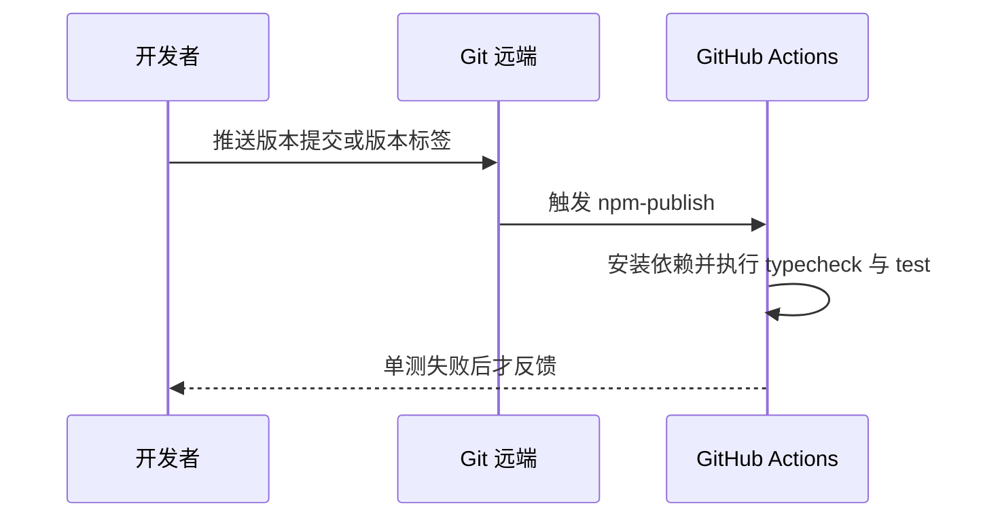
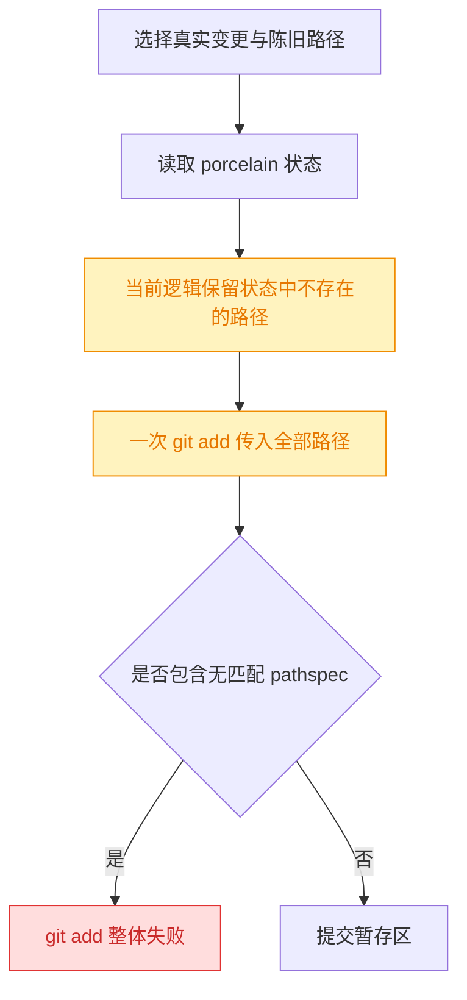
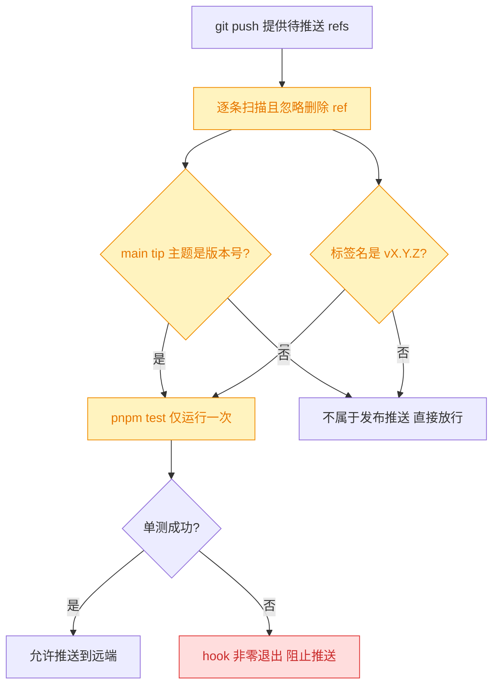
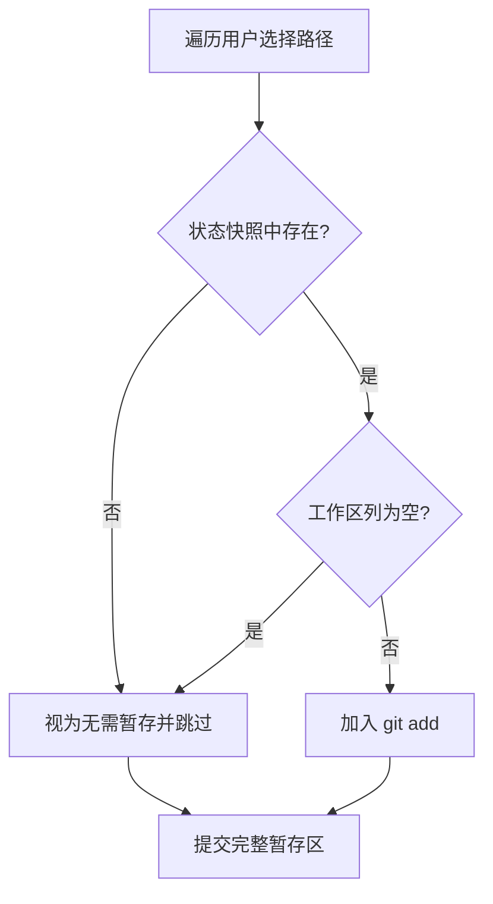
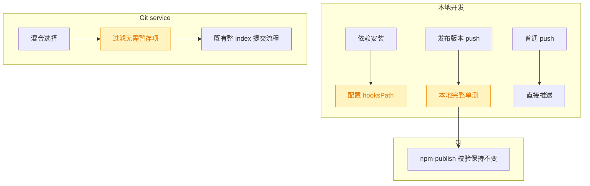

# 发布前本地单测与 Git 陈旧选择修复

## 1. 背景

当前 npm 发布由 `@.github/workflows/npm-publish.yml` 在 `main` 的版本号提交或 `v*.*.*` 标签推送后触发。发布任务会在远端安装依赖并执行类型检查和单测，因此本地漏跑的失败通常要等 GitHub Actions 才暴露，延迟了发布反馈。

现有 Git service 的混合状态提交回归用例还稳定复现一处错误：选择列表同时含真实变更与已经从状态列表消失的陈旧路径时，`git add` 因不存在的 pathspec 退出，真实变更也无法提交。

## 2. 需求

1. 推送满足 npm 发布条件的版本提交或语义化版本标签前，先在本地执行完整单测；单测失败时阻止推送，成功后才允许发送到远端。
2. GitHub Actions 中的发布前校验继续保留，作为远端最终防线。
3. 修复 `git.commit mixed states > ignores a stale selection entry instead of failing the whole commit`，使陈旧选择不影响同批真实路径提交。

## 3. 现状分析

### 3.1 发布校验发生得太晚

仓库没有受版本控制的 Git hook，也没有安装 hook 的脚本；当前 `package.json` 仅提供手动 `pnpm test`。因此发布推送之前不存在本地自动门禁。

### 3.2 陈旧路径会毒化整次暂存

`pathsNeedingStage` 已拿到本次 `git status --porcelain` 快照，但对快照中不存在的路径仍加入 `git add`。这无法区分“干净的已跟踪路径”和“从未存在/已经消失的路径”；不过二者都没有需要暂存的工作区变更，提交函数随后又是提交整个 index，因此都可安全跳过。若最终暂存区为空，既有 `nothing_to_commit` 分支仍会给出明确错误。

精确层：现有实现与失败位置

- `@src/service/git.ts` 的 `pathsNeedingStage` 在 `change` 缺失时把路径加入返回值。
- `@src/service/git.ts` 的 `commit` 将返回值一次性交给 `git add -- ...`，任一无匹配 pathspec 都会令整条命令失败。
- `@src/service/__tests__/git.test.ts` 已覆盖“真实未跟踪文件 + never-existed.txt”组合，当前失败为 `GitError: git add failed`。
- 定向执行 `pnpm exec vitest run src/service/__tests__/git.test.ts --reporter=verbose` 已复现该失败，其余已运行用例通过。

## 4. 技术实现方案

### 4.1 在仓库内提供可自动安装的 pre-push 门禁

新增受版本控制的 `.githooks/pre-push`，并由轻量 setup 脚本把当前仓库的 `core.hooksPath` 配置为 `.githooks`；在 `package.json` 的 `prepare` 生命周期安装配置，使正常安装依赖后门禁自动生效。setup 在非 Git 工作区中采用无害跳过，避免 npm 打包等场景因找不到仓库而失败。

hook 读取 Git 传入的待推送 ref 列表，只在下列任一条件命中时执行一次 `pnpm test`：

- 推送 `main`，且本地 tip 的提交主题严格匹配 `X.Y.Z` 或 `vX.Y.Z`；
- 推送名称严格匹配 `vX.Y.Z` 的标签。

> 决策说明：本地门禁对齐现有 workflow 的发布标记，而不是拦截每一次普通开发推送，避免日常 push 重复承担完整单测成本；Actions 中的 `typecheck`、`test` 和构建仍保留，防止跳过 hook 或环境差异绕过发布校验。

> 决策说明：不引入 Husky 等新依赖。该 hook 逻辑很小，仓库脚本即可完成安装，能避免新增包、锁文件变更和第三方生命周期封装。

### 4.2 过滤状态快照中不存在的选择项

将 `pathsNeedingStage` 的缺失分支改为跳过：只有当前 porcelain 状态中存在且工作区列非空的路径进入 `git add`。已完全暂存的删除/重命名仍按既有逻辑跳过；未跟踪与未暂存变更仍正常进入暂存。

> 决策说明：不为每个缺失路径额外调用 `git ls-files`。无论它是干净路径还是陈旧路径，都没有待暂存内容；额外探测不会改变提交树，只会增加子进程与竞态窗口。

### 4.3 兼容性与影响范围

本次不改变发布 workflow 的触发和远端校验，不改变普通 push，也不改变 Git service 的公开接口或错误类型。`prepare` 只写当前仓库的本地 Git 配置；未安装依赖或显式使用 `--no-verify` 时仍可能绕过，所以远端校验不能删除。

精确层：计划改动与验证

- 新增 `@.githooks/pre-push`：解析 stdin 中的四列 ref 信息，匹配发布条件并执行 `pnpm test`。
- 新增 `@scripts/setup-git-hooks.mjs`：确认处于 Git 工作区后执行 `git config core.hooksPath .githooks`，非 Git 环境正常退出。
- 修改 `@package.json`：增加 `prepare` 脚本调用 setup。
- 修改 `@src/service/git.ts`：`pathsNeedingStage` 对状态快照缺失项执行 `continue`。
- 验证 `pnpm exec vitest run src/service/__tests__/git.test.ts`、`pnpm test`、`pnpm run typecheck`。
- 用临时 Git 仓库和伪 `pnpm` 命令验证普通 push 不运行测试、版本提交/标签运行测试、测试失败阻止 hook。

## 5. 待确认项

_暂无_

## 6. 任务清单

- [x] 新增 .githooks/pre-push，实现发布版本 ref 识别与 pnpm test 门禁（验收：普通 push 不触发测试，版本提交和 vX.Y.Z 标签触发一次测试，失败时返回非零）
- [x] 新增 scripts/setup-git-hooks.mjs 并接入 package.json prepare，自动配置当前仓库 hooksPath（验收：运行 setup 后 git config --get core.hooksPath 输出 .githooks）
- [x] 修改 src/service/git.ts 的 pathsNeedingStage，跳过 porcelain 快照中不存在的选择项（验收：陈旧选择与真实变更混合提交的回归用例通过）
- [x] 执行定向测试、完整单测与类型检查（验收：pnpm exec vitest run src/service/**tests**/git.test.ts、pnpm test、pnpm run typecheck 均通过）

## 7. 执行记录

- 2026-09-08 21:05:48：新增 `.githooks/pre-push`，以远端目标 ref 和本地 SHA 判断发布 push；隔离验证普通分支跳过、版本 main/tag 各执行一次 `pnpm test`，并确认模拟退出码 7 会阻止 hook。
- 2026-09-08 21:05:48：新增 `scripts/setup-git-hooks.mjs` 并接入 `prepare`；执行后 `git config --get core.hooksPath` 输出 `.githooks`，hook 通过 `sh -n`。
- 2026-09-08 21:06:52：`pathsNeedingStage` 改为跳过 porcelain 快照中不存在的路径；定向 Git service 测试通过，原失败用例已恢复。
- 2026-09-08 21:10:57：完整测试首次运行发现旧 route 断言仍期待未知 pathspec 失败，已更新为统一的 `nothing_to_commit` 陈旧选择契约；随后 `pnpm test` 通过（88 个测试文件，887 个通过、2 个跳过），`pnpm run typecheck` 通过。
- 2026-09-08 21:10:57：全部非 manual 任务完成、无待确认项或批注，spec 标记为 `done`。
