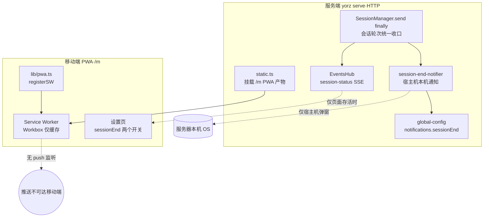
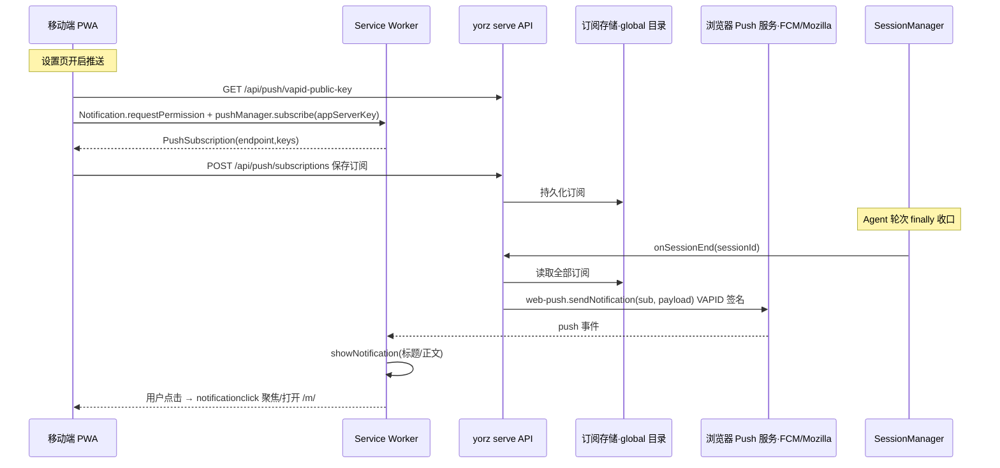
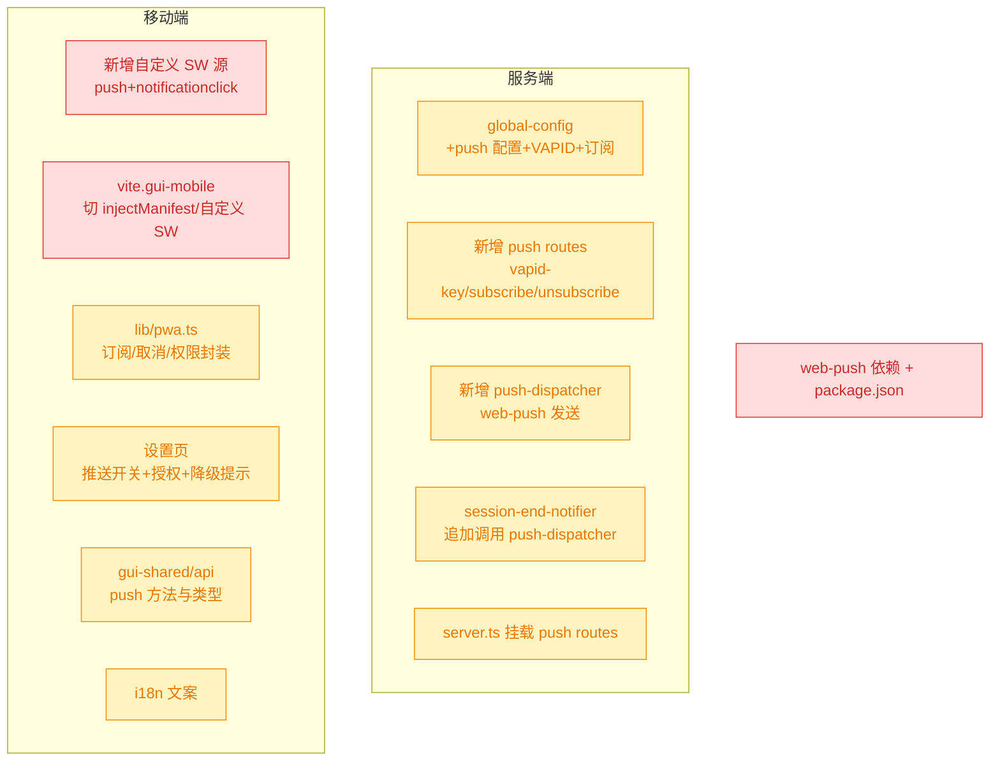

# 移动端 PWA 任务完成消息推送

## 1. 背景

用户安装 YorZ 移动端 PWA 后，期望在 Agent 任务（会话轮次 / spec 执行）完成时，手机上能收到消息推送。实测发现并未出现任何推送。

经代码排查确认：当前移动端 PWA 的 Service Worker 由 `vite-plugin-pwa`(Workbox) 生成，**仅用于离线缓存与安装**，不含任何 `push` / `notificationclick` 监听；代码库中也完全没有 Web Push 订阅、VAPID 密钥、`web-push` 发送、`Notification` API 调用。现有「任务结束提醒」（`session-end-notifier.ts`）调用的是**运行 `yorz serve` 那台宿主机的操作系统原生通知命令**（osascript / notify-send / PowerShell），只会弹在服务器本机，**无法触达移动设备**。

原始需求：

```text
安装 PWA 应用之后，任务完成时移动端没有出现消息推送，实现任务执行完成时推送消息功能。
```

## 2. 需求

- 移动端 PWA 在「任务执行完成」时，于手机上出现消息推送（横幅/通知）。
- 「任务完成」对齐现有服务端会话结束收口点，覆盖普通聊天会话、spec 执行、review/git 等复用 session 的后台 Agent 轮次。
- 推送能力可由用户在移动端设置页开关，并走标准的浏览器通知授权流程。
- 推送文案走 i18n（`src/gui-mobile/src/i18n/`）。
- best-effort：缺少能力（非安全上下文 / 未授权 / 旧系统）时优雅降级并给出可理解的提示，不影响会话结束主流程与页面可用性。

## 3. 现状分析

### 3.1 现有通知与 PWA 架构



关键事实：

- `SessionManager.send()` 的 `finally` 是所有 Agent 轮次结束的**唯一统一收口**，已通过 `onSessionEnd(sessionId)` 回调向外暴露；`project-registry.ts` 的 `materialize()` 在此接入了 `createSessionEndNotifier`，并已能拿到 `projectName`。这是接入推送的理想挂载点，**无需改动业务流程**。
- 全局配置 `global-config.ts` 已有 `notifications.sessionEnd {banner, sound}` 结构与完整的 load/normalize/save + `GET/PUT /api/global-config` 路由，天然适合扩展一个推送配置子项与订阅存储。
- 移动端 `lib/pwa.ts` 用 `registerSW`（`virtual:pwa-register`）注册 SW，`vite.gui-mobile.config.ts` 用 `injectManifest` 之外的 `generateSW` 模式——当前是纯 Workbox 生成，**没有自定义 SW 源文件**，要加 `push` 监听必须切换到可注入自定义逻辑的方式。
- **致命约束**：`yorz serve` 以 **HTTP** 对外（`http://localhost:<port>`，局域网内走 IP）。Web Push 与 `Notification`/`ServiceWorkerRegistration.pushManager` 均要求**安全上下文（HTTPS 或 localhost）**。手机经局域网 IP 以 HTTP 访问 `/m/` 时，SW 虽可能注册失败、`pushManager` 不可用——**这是推送能否落地的根本前提，非代码本身能绕过**。

<details>
<summary>现状精确层（文件 / 符号 / 行号）</summary>

- `src/service/session-manager.ts:502`：`void Promise.resolve(this.opts.onSessionEnd?.(currentSid)).catch(() => {})`——会话轮次结束统一收口。
- `src/service/project-registry.ts:240-247`：`materialize()` 中 `createSessionEndNotifier({ globalConfigPath, projectName: basename(input.path) })` 作为 `onSessionEnd` 注入 `SessionManager`。
- `src/service/session-end-notifier.ts`：`createSessionEndNotifier()` → `notifySessionEnded()`，读取 `cfg.notifications.sessionEnd`，`showBanner`/`playSound` 调用 osascript(darwin) / PowerShell(win32) / notify-send+paplay(linux)；全程仅作用于服务器本机。
- `src/service/global-config.ts:52-80`：`GlobalNotificationsConfig = { sessionEnd: SessionEndNotificationsConfig }`，`SessionEndNotificationsConfig = { banner, sound }`；`normalizeNotifications()`(238-257) 负责容错解析；`DEFAULT_NOTIFICATIONS`(87-89)。
- `src/service/routes/global-config.ts`：`GET/PUT /global-config`，`PutBody.notifications.sessionEnd`。
- `src/service/static.ts:MOBILE_PREFIX='/m'`：挂载移动端产物；`.webmanifest` MIME 已配置。
- `src/service/index.ts:100-101`：`const url = http://localhost:${port.port}/`，`serve()` 来自 `@hono/node-server`，纯 HTTP。
- `src/gui-mobile/src/lib/pwa.ts`：`initPWA()` / `registerSW` / `isStandalone()`（已处理 iOS `navigator.standalone`）。
- `vite.gui-mobile.config.ts:63-109`：`VitePWA({ registerType:'autoUpdate', injectRegister:null, manifest:{...}, workbox:{...}, devOptions:{enabled:true} })`——generateSW 模式，无自定义 SW。
- `src/gui-mobile/src/pages/settings/GlobalSettings.tsx:87-110`：通知分组，读写 `cfg().notifications.sessionEnd.banner/sound`。
- `src/gui-mobile/src/i18n/zh-CN.ts:164-166`：`notifications/sessionEndBanner/sessionEndSound` 文案。
- `src/gui-shared/api/`：`index.ts` / `project.ts` / `sse.ts`，移动端与桌面端共享的 API 封装层。

</details>

## 4. 技术实现方案

> 本节给出**推荐方案（标准 Web Push）** 的完整设计。推送策略与 HTTPS 前提属用户决策，见 `## 5. 待确认项`；待确认项放行后于 tasks 阶段据此定稿任务清单。

### 4.1 总体链路（推荐：标准 Web Push）



### 4.2 改造影响面



> 🔴 breaking：`vite.gui-mobile.config.ts` 需从 generateSW 切到 `injectManifest`（引入自定义 SW 源文件）、新增 `web-push` 运行时依赖——改变构建产物形态与依赖树。🟡 affected：其余为增量扩展，不破坏既有接口。

### 4.3 服务端设计

- **配置模型**：`global-config.ts` 扩展 `notifications.push: { enabled: boolean }`；VAPID 密钥对与订阅列表**不入 `config.json`**（避免污染用户可见配置），落在全局配置目录下独立文件（如 `<globalConfigDir>/push-subscriptions.json`、`<globalConfigDir>/vapid.json`），首次需要时惰性生成 VAPID 密钥对并持久化。
- **订阅 API**（新增 `routes/push.ts`，挂载进 `server.ts`）：
  - `GET /api/push/vapid-public-key` 返回公钥（Base64URL）。
  - `POST /api/push/subscriptions` 保存浏览器 `PushSubscription`（按 endpoint 去重）。
  - `DELETE /api/push/subscriptions` 按 endpoint 退订。
- **推送发送**（新增 `push-dispatcher.ts`）：封装 `web-push.sendNotification`，用 VAPID 私钥签名；发送失败且为 404/410（订阅失效）时自动剔除该订阅。
- **接入收口点**：`session-end-notifier.ts` 的 `notifySessionEnded()` 在原有本机横幅/声音之外，追加一路「若 `notifications.push.enabled` 则向所有订阅推送」。title 复用现有 `YorZ · <projectName>`，body 为「任务已完成」。保持 best-effort（整体 `catch`）。

### 4.4 移动端设计

- **自定义 SW**：新增 SW 源文件，注册 `self.addEventListener('push', ...)`（解析 payload → `registration.showNotification(title, { body, icon })`）与 `'notificationclick'`（`clients.openWindow('/m/')` 或聚焦已有窗口）；通过 `vite-plugin-pwa` 的 `injectManifest` 模式保留 Workbox 预缓存同时注入自定义逻辑。
- **订阅封装**（`lib/pwa.ts`）：新增 `isPushSupported()`（含安全上下文 + `PushManager` 特性检测）、`enablePush()`（请求权限 → 取 VAPID 公钥 → `pushManager.subscribe` → POST 订阅）、`disablePush()`（取消订阅 + DELETE）。
- **设置页**：在现有通知分组下新增「任务完成推送」开关，联动 `enablePush/disablePush`；当非安全上下文或不支持时禁用开关并展示降级提示（引导用户以 HTTPS/localhost 访问）。iOS 需 standalone 且 16.4+，复用现有 `isStandalone()` 做提示。
- **API 与 i18n**：`gui-shared/api` 增加 push 相关方法与类型；新增文案（推送开关、授权失败、需 HTTPS、需添加到主屏等）。

> 决策记录：VAPID 密钥与订阅存储放在全局配置目录的独立文件而非 `config.json`——避免把二进制密钥/易变订阅塞进用户可读写的配置，并复用 `resolveGlobalConfigDir()` 的定位逻辑，无需用户介入。
> 决策记录：订阅失效（web-push 返回 404/410）时由 dispatcher 自动剔除，不作为待确认项——这是可由规范确定的标准容错。
> 决策记录：5.1 任务完成推送策略 —— 用户选择「标准 Web Push（VAPID + `web-push` + 浏览器 Push 服务）」，理由：应用在后台甚至完全关闭时也能收到真推送，契合「安装 PWA 后随时收到任务完成提醒」的诉求；接受引入 `web-push` 依赖、VAPID 密钥与订阅存储、依赖安全上下文与公网可达 Push 服务的代价。本节 4 的推荐设计即据此定稿。
> 决策记录：5.2 启用推送需以 HTTPS/localhost 访问移动端 —— 用户确认「按此推进」，理由：接受局域网 HTTP 访问时推送能力不可用，由代码侧做特性检测并在设置页降级提示，不改造 `yorz serve` 的监听协议；`yorz serve` 内建 HTTPS 属额外范围，不在本 spec。

<details>
<summary>实施精确层（挂载点 / 依赖 / 新增文件）</summary>

- 新增依赖：`web-push`（服务端，package.json dependencies）。
- 新增文件：`src/service/routes/push.ts`、`src/service/push-dispatcher.ts`、`src/service/push-store.ts`（订阅/VAPID 持久化）、`src/gui-mobile/src/sw.ts`（自定义 SW）。
- 修改点：
  - `src/service/global-config.ts`：`GlobalNotificationsConfig` 增 `push`，新增 normalize/default。
  - `src/service/routes/global-config.ts`：`PutBody.notifications` 带上 `push`。
  - `src/service/session-end-notifier.ts`：注入并调用 push-dispatcher（新增可注入参数，便于单测）。
  - `src/service/project-registry.ts:240-247`：向 notifier 传入 push 发送依赖。
  - `src/service/server.ts:~109`：`api.route('/', createPushRoutes(...))`。
  - `vite.gui-mobile.config.ts:63-109`：`strategies:'injectManifest'` + `srcDir/filename` 指向 `sw.ts`。
  - `src/gui-mobile/src/lib/pwa.ts`、`.../pages/settings/GlobalSettings.tsx`、`.../i18n/zh-CN.ts`、`src/gui-shared/api/*`。

</details>

## 5. 待确认项

_暂无_

## 6. 任务清单

- [x] package.json 增加 `web-push` 运行时依赖并安装（验收：`package.json` dependencies 含 `web-push`，`node_modules/web-push` 存在，`@types/web-push` 列入 devDependencies）
- [x] 新增 `src/service/push-store.ts`：在全局配置目录惰性生成并持久化 VAPID 密钥对（`vapid.json`）与订阅列表（`push-subscriptions.json`），导出 getVapidKeys/listSubscriptions/addSubscription(按 endpoint 去重)/removeSubscription（验收：单测或手动验证首次调用生成 vapid.json，重复 addSubscription 同 endpoint 不重复）
- [x] 扩展 `src/service/global-config.ts`：`GlobalNotificationsConfig` 增 `push: { enabled: boolean }`，补 `DEFAULT_NOTIFICATIONS.push`、`defaultGlobalConfig()` 与 `normalizeNotifications()` 的容错解析（验收：旧 config.json 缺 push 字段时 load 回落默认 `enabled:false`）
- [x] 扩展 `src/service/routes/global-config.ts`：`PutBody.notifications` 带 `push`，GET/PUT 回读与校验 push.enabled 为 boolean（验收：PUT 带 `notifications.push.enabled` 往返一致，非 boolean 返回 400）
- [x] 新增 `src/service/push-dispatcher.ts`：封装 `web-push.sendNotification`（VAPID 私钥签名），向全部订阅发送 payload，发送返回 404/410 时调用 push-store 剔除该订阅；整体 best-effort 不抛（验收：对失效订阅返回 410 时该订阅被移除）
- [x] 新增 `src/service/routes/push.ts`：`GET /push/vapid-public-key`、`POST /push/subscriptions`（保存订阅）、`DELETE /push/subscriptions`（按 endpoint 退订）（验收：三个路由返回 2xx 且订阅读写落到 push-store）
- [x] 在 `src/service/server.ts` 挂载 push routes：`api.route('/', createPushRoutes(opts.registry.configPath()))`（验收：`/api/push/vapid-public-key` 可访问）
- [x] 改造 `src/service/session-end-notifier.ts`：新增可注入的 push 发送依赖，`notifySessionEnded()` 在原本机横幅/声音之外追加「若 `notifications.push.enabled` 则向所有订阅推送」，title 复用 `YorZ · <projectName>`、body 为「任务已完成」，保持整体 catch（验收：push.enabled=true 时触发 dispatcher 调用，enabled=false 时不调用）
- [x] 在 `src/service/project-registry.ts` 的 `materialize()` 向 `createSessionEndNotifier` 传入基于 globalConfigPath 构造的 push 发送依赖（验收：会话结束收口能走到推送分支）
- [x] 新增 `src/gui-mobile/src/sw.ts` 自定义 Service Worker：用 `injectManifest` 预缓存（`precacheAndRoute(self.__WB_MANIFEST)` + navigateFallback），注册 `push`（解析 payload → `registration.showNotification`）与 `notificationclick`（聚焦已有窗口或 `clients.openWindow('/m/')`）（验收：`vite build` 产物 sw.js 含 push 监听）
- [x] 改造 `vite.gui-mobile.config.ts`：`VitePWA` 切 `strategies:'injectManifest'`，设 `srcDir:'src'`、`filename:'sw.ts'`，迁移原 workbox 的 navigateFallback/denylist 语义到自定义 SW，保留 manifest 与 registerType（验收：`nr build:gui-mobile` 成功且产物含自定义 push 逻辑）
- [x] 扩展 `src/gui-shared/api/index.ts`：`GlobalConfig.notifications` 增 `push:{enabled:boolean}` 类型；新增 `getVapidPublicKey()`、`savePushSubscription(sub)`、`deletePushSubscription(endpoint)` 方法与类型（验收：tsc 通过，类型与服务端一致）
- [x] 扩展 `src/gui-mobile/src/lib/pwa.ts`：新增 `isPushSupported()`（安全上下文 + `PushManager`/`serviceWorker` 特性检测）、`enablePush()`（requestPermission → 取 VAPID 公钥 → `pushManager.subscribe` → POST 订阅）、`disablePush()`（取消订阅 + DELETE）（验收：非安全上下文下 isPushSupported 返回 false，不抛错）
- [x] 改造 `src/gui-mobile/src/pages/settings/GlobalSettings.tsx`：通知分组下新增「任务完成推送」开关，联动 enablePush/disablePush 并读-改-写回 `notifications.push.enabled`；不支持/非安全上下文时禁用开关并展示降级提示（引导 HTTPS/localhost，iOS 需 standalone 16.4+）（验收：开关在支持时可切换、不支持时禁用并提示）
- [x] 扩展 i18n 文案 `src/gui-mobile/src/i18n/zh-CN.ts` 与 `en.ts`：新增推送开关标题、授权失败、需 HTTPS、需添加到主屏等键（验收：两语言键集一致，GlobalSettings 引用的键均存在）
- [x] 构建与校验：运行 `tsc --noEmit`（或等价类型检查）与 `nr build:gui-mobile`，修复类型/构建错误（验收：类型检查与移动端构建均通过）

## 7. 执行记录

- 依赖：`pnpm add web-push` + `pnpm add -D @types/web-push workbox-precaching workbox-routing workbox-core`。package.json 已含 `web-push@^3.6.7`（deps）与各 workbox/类型包（devDeps）。验证：`grep` 确认写入。
- 新增 `src/service/push-store.ts`：全局配置目录惰性生成 `vapid.json`、持久化 `push-subscriptions.json`，含按 endpoint 去重与串行化读改写。验证：临时 vitest 用例确认首调生成且稳定、同 endpoint 覆盖不重复、removeSubscription 命中删除（已通过后删除临时用例）。
- `src/service/global-config.ts`：`GlobalNotificationsConfig` 增 `push`，补 `PushNotificationsConfig`、`DEFAULT_NOTIFICATIONS.push`、`defaultGlobalConfig()` 与 `normalizeNotifications()` 容错（缺字段回落 `enabled:false`）。验证：`global-config.test.ts` 35 用例通过。
- `src/service/routes/global-config.ts`：`PutBody.notifications` 带 `push`，PUT 校验 `push.enabled` 为 boolean（缺省向后兼容回落 false）。验证：tsc 通过。
- 新增 `src/service/push-dispatcher.ts`：`web-push.sendNotification` + VAPID 签名，向全部订阅投递，404/410 自动剔除失效订阅，整体 best-effort。验证：tsc 通过、被 session-end-notifier 引用编译通过。
- 新增 `src/service/routes/push.ts`：`GET /push/vapid-public-key`、`POST /push/subscriptions`、`DELETE /push/subscriptions`，并在 `src/service/server.ts` 以 `createPushRoutes(opts.registry.configPath())` 挂载。验证：tsc 通过。
- `src/service/session-end-notifier.ts`：新增可注入 `pushDispatcher`，`notifySessionEnded()` 在本机横幅/声音之外追加「push.enabled 时向订阅推送」，title 复用 `YorZ · <projectName>`，body 依全局语言取「任务已完成」/「Task completed」。`project-registry.ts` 原已传入 `globalConfigPath`，dispatcher 据此惰性构造，收口链路自然走到推送分支。验证：`session-end-notifier.test.ts` 6 用例通过。
- 新增 `src/gui-mobile/src/sw.ts` 自定义 Service Worker：`precacheAndRoute(self.__WB_MANIFEST)` + NavigationRoute（迁移 navigateFallback/denylist）、`push`→`showNotification`、`notificationclick`→聚焦/打开 `/m/`，并 `skipWaiting()`+`clientsClaim()`。因 WebWorker 与 DOM lib 冲突，已在 `tsconfig.gui-mobile.json` 排除该文件（由 injectManifest 独立打包）。
- `vite.gui-mobile.config.ts`：`VitePWA` 切 `strategies:'injectManifest'` + `srcDir:'src'`/`filename:'sw.ts'`，`workbox` 配置迁为 `injectManifest.globPatterns`。验证：`nr build:gui-mobile` 成功，产物 `dist/gui-mobile/sw.js` 含 `push`/`notificationclick`/`showNotification`。
- `src/gui-shared/api/index.ts`：`GlobalConfig.notifications` 增 `push`，新增 `PushSubscriptionPayload` 类型与 `getVapidPublicKey`/`savePushSubscription`/`deletePushSubscription` 方法。验证：tsc 通过。
- `src/gui-mobile/src/lib/pwa.ts`：新增 `isPushSupported()`（安全上下文 + SW/PushManager/Notification 检测）、`hasPushSubscription()`、`enablePush()`、`disablePush()`。验证：tsc 通过、移动端构建通过。
- `src/gui-mobile/src/pages/settings/GlobalSettings.tsx`：通知分组新增「任务完成推送」开关，联动 enablePush/disablePush 并读-改-写回 `notifications.push.enabled`；不支持时渲染禁用态与降级提示（HTTPS/添加到主屏）。验证：tsc 通过。
- i18n：`zh-CN.ts` 与 `en.ts` 新增 `pushNotification`/`pushUnavailable`/`pushNeedsHttps`/`pushNeedsInstall`/`pushPermissionDenied`/`pushFailed`，两语言键集一致。验证：tsc 通过。
- 连带修复共享类型波及点：桌面端 `src/gui/src/lib/global-config.ts`、`GlobalConfigDialog.tsx` 回写时保留 `push`；服务端测试字面量补 `push` 字段。
- 全量校验：`pnpm typecheck`（tsc -b）通过；`nr build:gui-mobile` 通过；受影响服务端测试 `power-inhibit`/`global-config`/`session-end-notifier`/`project-registry` 共 56 用例通过。
- 前提提示：按 5.2 决策，推送仅在安全上下文（HTTPS / localhost）可用；局域网 HTTP 访问时设置页开关禁用并提示，符合 best-effort 降级要求。
- 收尾：全部任务完成，无待确认项 / 批注 / `[open]`，`stage` 置 `done`。
