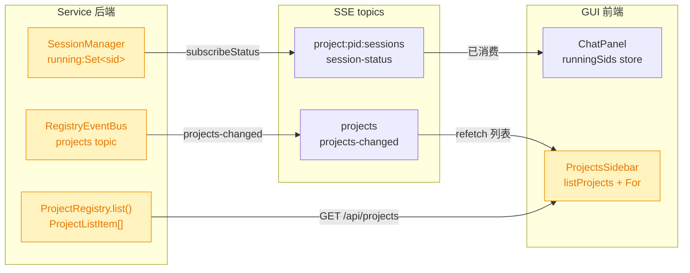
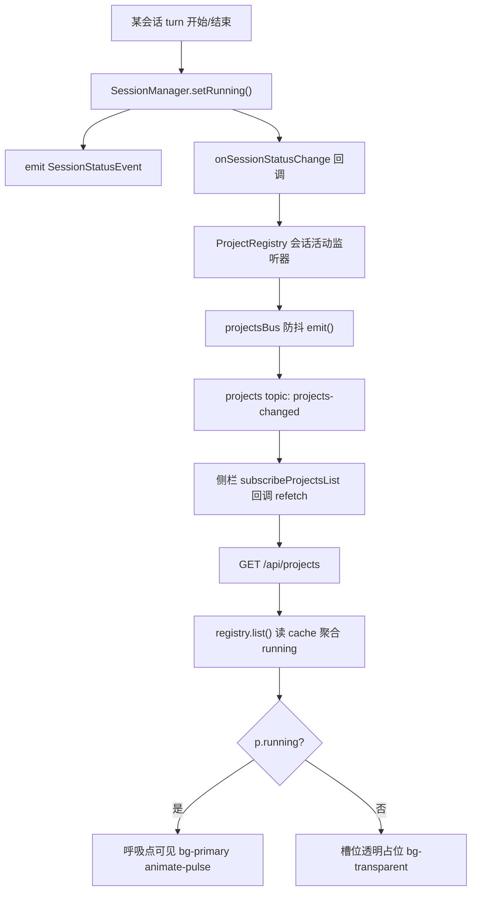
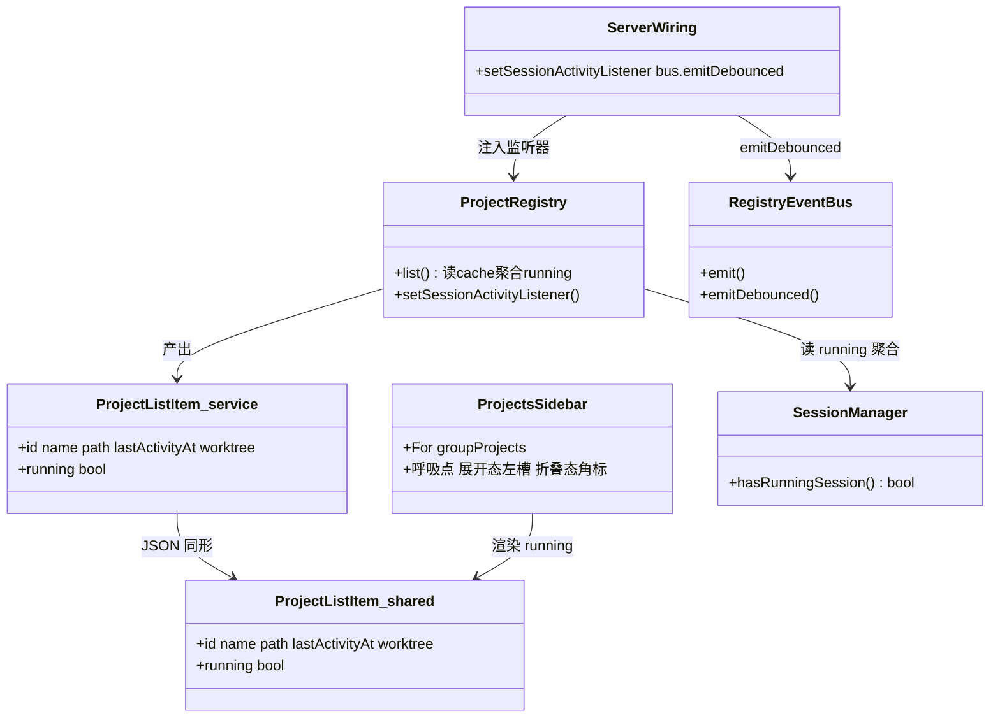

# GUI 项目列表运行中呼吸小圆点

## 1. 背景

桌面端项目侧栏 `ProjectsSidebar` 目前只渲染项目名（展开态）或分组首字母（折叠态），**没有任何「该项目下有 agent / session 任务正在运行」的视觉体现**。用户在项目列表这一层无法判断某个项目的任务是否还在跑、是否已经执行完成，必须进入项目、打开 Chat 面板才能看到 `ChatPanel` 里会话级的 `Loader2` 旋转图标。

移动端 session 列表（`src/gui-mobile/src/pages/Sessions.tsx`）已有一个成熟做法：在列表行用一个 `size-2` 的小圆点标识运行中会话——运行时 `bg-primary animate-pulse`（呼吸/脉冲），非运行时 `bg-transparent` 占位，从而既有呼吸效果、又不会让相邻行的标题截断宽度跳动。

本需求把这套「呼吸小圆点」的视觉语言下沉到**桌面端项目列表**：项目维度地标识「有任务在运行」，展开态与折叠态都要有，并且在项目名左侧预留固定槽位，保证项目名文字不因为圆点的出现/消失而左右错位。

## 2. 需求

- 桌面端项目列表（`ProjectsSidebar`）中，**有任意 session 任务在运行的项目**显示一个呼吸效果的小圆点，表示任务进行中；任务全部结束后圆点消失（或变为透明占位）。
- **折叠态（rail collapsed）同样要有运行标识**，不能只在展开态显示。
- 视觉风格参考移动端 session 列表小圆点：主色圆点 + 呼吸动画（`animate-pulse`）。
- 项目名**左侧**预留呼吸小圆点的固定空间：无论圆点是否可见，项目名的起始位置保持一致，不得因圆点出现/消失导致项目名文字左右错位。
- 运行状态需实时更新：任务开始 → 圆点出现；任务结束 → 圆点消失，无需用户手动刷新。

## 3. 现状分析

结论先行：**运行状态在系统里是「会话级（per-session）」的，前端目前完全没有「项目级（per-project）聚合的 running」这一数据源**。后端 `SessionManager` 持有每会话的 `running` Set，并通过 `project:<pid>:sessions` 这个 **per-project SSE topic** 广播 `session-status` 事件；但这套链路只有「进入某个项目后的 Chat 面板」在消费（渲染会话行 spinner）。项目侧栏 `ProjectsSidebar` 消费的是另一条链路——`projects` topic 的 `projects-changed` → 重新 `listProjects()`，而 `ProjectListItem` 里根本没有 `running` 字段。

因此本需求的技术核心不在「画一个圆点」，而在**补一个项目级 running 数据源并把它接到项目侧栏既有的 list-refetch 链路上**。

**关键事实（黄色 = 本需求会改动/依赖的现有模块）：**

- 项目侧栏对项目列表的刷新走 `subscribeProjectsList` → `listProjects()`，与会话级 running 完全解耦。
- 后端 `ProjectRegistry` 是**懒加载**的：项目实例（含 `SessionManager`）只有在被打开 / 派发任务时才 `getOrCreate` materialize。未 materialize 的项目不可能有 running 会话，因此「项目级 running」可以只从已缓存实例读取，不会反过来强制 materialize 所有项目。
- 移动端项目列表 `src/gui-mobile/src/pages/Projects.tsx` 同样没有运行标识，但移动端无折叠态；本需求按用户「折叠态也要标识」聚焦桌面端。

精确层：现状涉及的文件、符号与行号

- 桌面项目侧栏：`src/gui/src/components/ProjectsSidebar.tsx`
  - 列表渲染 `For each={groupProjects(projects())}`，行容器 `<li class="group relative flex items-center">`（L367–L422）。
  - 折叠判定：`railCollapsed()`（L134）；展开态项目名 `{displayProjectName(p)}`（L396）；折叠态 fallback 渲染 `info.letter` + `{info.indexInGroup}`（L382–L394）。
  - 列表刷新订阅：`subscribeProjectsList(() => refetch)`（L188）。
- 共享类型：`src/gui-shared/api/project.ts`
  - `interface ProjectListItem { id; name; path; lastActivityAt; worktree? }`（L20–L26）；`displayProjectName`（L34）；`groupProjects`（L78，每个项目/每个 worktree 各返回一条 `ProjectGroupInfo`）。
- 共享 API：`src/gui-shared/api/index.ts` `listProjects: () => request<ProjectListItem[]>('/api/projects')`（L480）。
- 后端列表：`src/service/project-registry.ts`
  - `interface ProjectListItem`（L58–L64，与共享类型平行，需同步加字段）；`ProjectRegistry.list()`（L87–L110）；懒加载缓存 `private readonly cache = new Map<string, CachedInstance>()`（L77）；`materialize()` 里 `new SessionManager(..., { onSessionStatusChange })`（L230–L235）。
- 后端会话：`src/service/session-manager.ts`
  - `private readonly running = new Set<string>()`（L111）；`isSpecRunning`（L202）；`setRunning` 发 `SessionStatusEvent` 并回调 `onSessionStatusChange`（L282–L294）；`subscribeStatus`（L277）。
- SSE：`src/service/events-hub.ts` `attachProjects` → `projectsBus.subscribe(() => emit 'projects-changed')`（L275–L282）；`attachSessionsStatus`（L382–L387）。
- bus 接线：`src/service/server.ts` `const projectsBus = new RegistryEventBus(); projectsBus.start(...)`（L70–L71），`createEventsRoutes(..., projectsBus, ...)`（L120）。`RegistryEventBus`（`src/service/registry-events.ts`）有公开 `emit()`（立即）与私有防抖 `scheduleEmit()`（200ms）。
- 移动端参考：`src/gui-mobile/src/pages/Sessions.tsx` 运行点（L225–L231）`class={cn('size-2 shrink-0 rounded-full', group.running ? 'bg-primary animate-pulse' : 'bg-transparent')}`。

## 4. 技术实现方案

总体思路：**后端把「项目是否有任意 session 在运行」聚合进 `ProjectListItem.running`，并在任意会话 running 状态翻转时触发 `projects` topic 的 `projects-changed`**；前端项目侧栏复用既有 `subscribeProjectsList → listProjects()` 刷新链路拿到 `running`，用移动端同款呼吸小圆点渲染（展开态走左侧固定槽位、折叠态走角标）。

### 4.1 后端：项目级 running 聚合

- `SessionManager` 暴露一个只读聚合方法 `hasRunningSession(): boolean`（即 `this.running.size > 0`），供 registry 读取，无需暴露内部 Set。
- `ProjectRegistry.list()` 对每个项目查 `this.cache`：命中缓存实例则读 `instance.sessions.hasRunningSession()`，未命中（未 materialize）一律 `running=false`。该读取是同步、廉价的，且**不触发 materialize**——保持「打开侧栏不会把所有项目的 watcher/SessionManager 全拉起」的现有资源语义。
- `running` 作为 `ProjectListItem` 的字段同步加到**两处平行类型**：`src/service/project-registry.ts` 的后端类型与 `src/gui-shared/api/project.ts` 的共享类型。字段设为必填 `running: boolean`（后端 list 永远产出，避免前端判空分叉）。

### 4.2 后端：running 翻转触发 projects-changed

- 现状 `onSessionStatusChange` 在 `materialize()` 里只接了 `powerInhibit`。新增一条：把会话状态翻转「升维」为项目列表变更信号。
- 接线方式：给 `ProjectRegistry` 增加一个可后置设置的监听器 `setSessionActivityListener(cb: () => void)`，`materialize()` 的 `onSessionStatusChange` 内部追加调用 `this.sessionActivityListener?.()`。`server.ts` 创建 `projectsBus` 后调用 `registry.setSessionActivityListener(() => projectsBus.emitDebounced())`。
- **防抖**：会话 running 翻转比「全局配置变更」频繁得多，直连 `emit()`（立即）会在一个 turn 的起止瞬间触发两次全量列表 refetch、并广播给所有连接的客户端。复用 `RegistryEventBus` 已有的 200ms 防抖路径（把私有 `scheduleEmit` 暴露为公开 `emitDebounced()`，FS watch 内部继续用它），把一个 turn 起止的抖动合并。
- 时序安全：`registry` 在 `index.ts` 构造，`projectsBus` 在 `server.ts.createApp` 构造；两者之间不存在任何 `getOrCreate`（`registry.add` / `registry.list` 都不 materialize），因此「先建 registry、后建 bus 再 setSessionActivityListener」不会漏接任何已存在实例的状态回调。

### 4.3 前端：项目侧栏呼吸小圆点

渲染点在 `ProjectsSidebar` 的 `<li>` 行内，分展开态 / 折叠态两套：

- **展开态**：在项目名 `<A>` 内部、项目名 `` 之前插入一个固定宽度的圆点槽位（`size-2 shrink-0 rounded-full` + `mr-*` gap），`p.running` 为真 `bg-primary animate-pulse`、为假 `bg-transparent`。槽位常驻 → 项目名起点恒定、文字不错位。需把 `<A>` 的 `pl-2.5` 改成能容纳左侧圆点槽位的 flex 布局（`flex items-center`），`pr-12` 维持给右侧编辑/删除按钮让位。
- **折叠态**：rail 很窄、内容是居中首字母，圆点作为**绝对定位角标**叠加在字母徽标上（如右上角 `absolute -top-* -right-*`），避免挤占首字母宽度；同样 `p.running` 控制可见/透明。
- 复用移动端语义：仅运行中画点，非运行不画灰点（透明占位），避免「满屏灰点淹没真正在跑的那颗」。
- 无障碍 + i18n：圆点运行态加 `aria-label`，新增文案键 `sidebar.projectRunning`（en + zh 两份 i18n 同步）。
- 数据链路零新增订阅：侧栏已有 `subscribeProjectsList`（L188）在 `projects-changed` 时 refetch，拿到的 `ProjectListItem.running` 直接驱动圆点；无需新开 per-project SSE。

### 4.4 改造影响面（语义配色）

本次改动均为**新增字段 / 新增方法 / 新增 UI 元素**，无删除、无破坏性变更（故无红色 breaking 区）：`running` 字段对不认识它的旧消费者是多余字段、可忽略；`emitDebounced` 与 `emit` 并存。

### 4.5 决策说明（已自行查证定夺，不打断用户）

- **决策：项目级 running 走「后端聚合进 list + projects-changed 刷新」，而非前端逐项目订阅 `project:pid:sessions` 聚合。** 理由：前端逐项目订阅需要对列表里每个项目开一条 SSE 并 seed 会话列表，而 `attachSessionsStatus` 会 `resolveProject`→`getOrCreate` **强制 materialize 每个项目**（拉起全部 watcher + SessionManager），仅为显示侧栏就付出全量资源代价，是明显回归。被否决的备选：新增独立 `projects:running` 增量 topic——能免整表 refetch，但要新增 topic + 前端新 store/聚合，代码更多，且项目数通常很少、整表 refetch 成本可忽略；不如复用既有 `subscribeProjectsList` 链路最小化改动。
- **决策：`projects-changed` 对会话活动走 200ms 防抖（`emitDebounced`）而非立即 `emit`。** 理由：一个 turn 的起/止会在短时间内翻转两次 running，立即 emit 会放大为两次全量 refetch 并广播所有客户端；防抖把抖动合并，复用 bus 既有防抖实现，零新机制。
- **决策：本次仅做桌面端 `src/gui` 项目侧栏，移动端 `src/gui-mobile` 项目列表不在本 spec 范围。** 理由：需求明确强调「折叠态也要标识」，折叠态是桌面 rail 专有形态；移动端项目列表无折叠态、且用户以「移动端 session 列表」为**样式参照物**而非改造对象。移动端项目列表运行标识可作为后续独立需求。
- **决策：运行态仅画点、非运行态透明占位（不画灰点）。** 理由：直接沿用移动端 `Sessions.tsx` 已验证的做法，既满足「左侧预留空间不错位」，又不让灰点噪声淹没真正在运行的项目。

## 5. 待确认项

_暂无_

## 6. 任务清单

- [x] SessionManager 新增只读聚合方法 hasRunningSession(): boolean（src/service/session-manager.ts，返回 running.size > 0）（验收：pnpm -s exec tsc -p tsconfig.json --noEmit 通过）
- [x] 共享类型 ProjectListItem 增加 running: boolean 字段（src/gui-shared/api/project.ts）（验收：tsc gui 配置通过且引用处无类型错误）
- [x] 后端 ProjectListItem 类型同步增加 running，ProjectRegistry.list() 从 this.cache 读 instance.sessions.hasRunningSession() 聚合写入每项 running（未缓存实例置 false，不触发 materialize）（src/service/project-registry.ts）（验收：service tsc 通过，list 对未打开项目返回 running=false）
- [x] ProjectRegistry 增加 setSessionActivityListener(cb) 并在 materialize 的 onSessionStatusChange 内追加调用该监听器（src/service/project-registry.ts）（验收：tsc 通过，会话状态翻转时监听器被触发）
- [x] RegistryEventBus 暴露公开 emitDebounced() 复用既有 200ms 防抖路径（src/service/registry-events.ts）（验收：tsc 通过，FS watch 仍走同一防抖）
- [x] server.ts 在创建 projectsBus 后调用 registry.setSessionActivityListener(() => projectsBus.emitDebounced())（src/service/server.ts）（验收：tsc 通过，会话 running 翻转触发 projects-changed）
- [x] ProjectsSidebar 展开态在项目名前插入固定宽度呼吸点槽位、折叠态在首字母徽标加绝对定位角标，均由 p.running 控制 bg-primary animate-pulse / bg-transparent（src/gui/src/components/ProjectsSidebar.tsx）（验收：展开态项目名起点不随圆点出现消失而错位；折叠态有运行标识）
- [x] 新增 i18n 文案键 sidebar.projectRunning（src/gui/src/i18n/en.ts 与对应 zh 文件），圆点运行态设置 aria-label（验收：两份 i18n 均含该键，tsc 通过）
- [x] 回归验证：运行 service 与 gui 的 tsc/lint、相关单测（project-registry / session-manager）、gui 构建（验收：命令全部通过并在执行记录登记结果）

## 7. 执行记录

- 2026-10-03 后端 running 聚合落地：`SessionManager.hasRunningSession()`（session-manager.ts）；`ProjectRegistry.list()` 从 `this.cache` 读 `hasRunningSession()` 聚合 `running`，中间排序结构改为 `Omit<ProjectListItem,'running'>` 避免未聚合前要求该字段（project-registry.ts）。
- 2026-10-03 running 翻转广播链路：`ProjectRegistry.setSessionActivityListener()` + `materialize` 的 `onSessionStatusChange` 内追加调用；`RegistryEventBus.emitDebounced()`（复用 200ms `scheduleEmit`）；`server.ts` 创建 `projectsBus` 后 `registry.setSessionActivityListener(() => projectsBus.emitDebounced())`。
- 2026-10-03 类型同步：共享 `ProjectListItem` 与后端 `ProjectListItem` 均加必填 `running: boolean`；修正 `project.test.ts` 的 `proj()/wt()` 构造补 `running: false`（worktree-manager.test.ts 用的是 `GlobalProjectEntry`，不受影响）。
- 2026-10-03 前端呼吸点：`ProjectsSidebar.tsx` 展开态在项目名前插入常驻固定圆点槽位（`size-2`，运行 `bg-primary animate-pulse` / 空闲 `bg-transparent`，`mr-1.5` gap，`flex min-w-0 items-center` 保证名字 truncate 且起点恒定）；折叠态在首字母徽标右上角叠加 `size-1.5` 绝对定位呼吸点（仅运行中显示，不挤占字母）；引入 `@shared/lib/cn.js`。
- 2026-10-03 i18n：`sidebar.projectRunning` 增补到 en（`Task running in {{name}}`）与 zh-CN（`{{name}} 有任务正在运行`），圆点运行态挂 `aria-label`。
- 2026-10-03 新增单测：project-registry.test.ts 覆盖「未运行/已 materialize 均 running=false」与「setSessionActivityListener 随会话状态翻转触发、hasRunningSession 同步变化」。
- 2026-10-03 验证通过：`pnpm run typecheck`（tsc -b）零错误；`vitest run`（project.test.ts / project-registry.test.ts / session-manager.test.ts / service.test.ts）共 60 passed（含新增 2 项）；`pnpm run build:gui` 构建成功；spec `yorz lint` errorCount=0。
- 2026-10-03 收尾：任务清单非 manual 项全部完成，待确认项为 `_暂无_`、无批注、无追加任务 `[open]`，标记 done。
