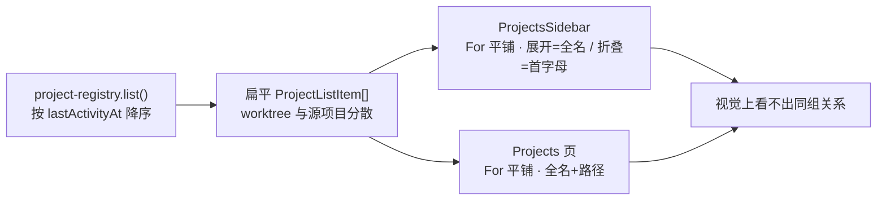
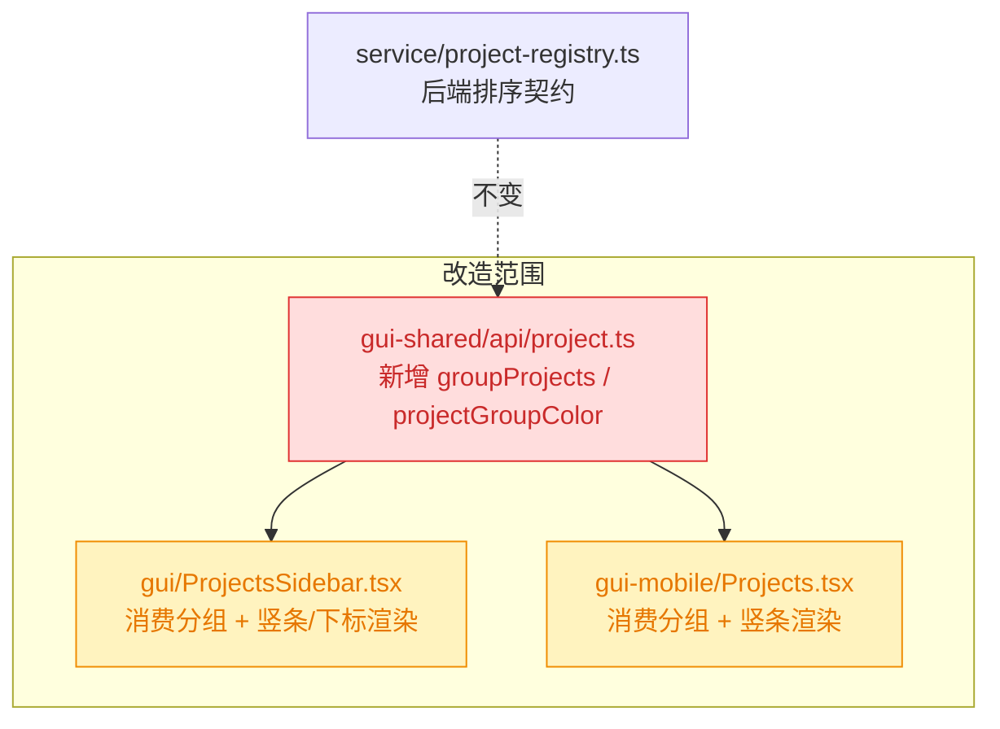

# worktree 项目分组视觉关联

## 1. 背景

YorZ 支持从一个主项目派生出多个 git worktree 子项目（`ProjectListItem.worktree` 携带 `mainProjectId` / `mainPath` / `branch` / `cleanSlug`）。当前桌面侧边栏 `ProjectsSidebar.tsx` 与移动端 `Projects.tsx` 都把后端返回的扁平列表按「最近活动时间」降序平铺渲染，worktree 项目和它的源项目在列表里彼此分散，用户无法一眼看出「它们属于同一组对象」。

## 2. 需求

让 worktree 项目与其源项目在列表中建立**视觉关联**，表达「同一组对象」：

1. **分组排序**：worktree 项目紧随其源项目下方排列。
2. **分组标识（展开态）**：列表左侧有一根相同颜色的竖条矩形，覆盖同组所有行。
3. **分组标识（折叠态，仅桌面端）**：折叠时每行只显示一个字母，需用同色标识分组，并在字母右下方追加数字下标区分组内序号——如 `Y0`（源项目）、`Y1`、`Y2`（worktree）。
4. 移动端 `Projects.tsx` 不存在折叠态，只需实现分组排序 + 左侧同色竖条。

## 3. 现状分析

- 后端 `src/service/project-registry.ts` 的 `list()` 把所有项目（含 worktree）统一按 `sortKey`（`lastActivityAt` 回退到 spec 的 `maxSpecUpdatedAt`）**降序**排列后返回扁平数组，不做任何分组。
- 两端各自渲染这份扁平列表：
  - 桌面 `ProjectsSidebar.tsx`：`<For each={projects()}>` 直接平铺；展开态显示 `displayProjectName(p)`，折叠态（`railCollapsed()`）只显示 `(p.name[0] ?? '?').toUpperCase()` 一个字母。
  - 移动端 `Projects.tsx`：`<For each={projects()}>` 平铺，每行 `displayProjectName(p)` + 截断路径，无折叠态。
- 分组所需数据已齐备：worktree 行的 `p.worktree.mainProjectId` 指向源项目 id；`displayProjectName` 已用 `mainBasename · slug` 区分 worktree。
- 缺口：没有任何「把 worktree 归到源项目名下、紧随其后」的排序逻辑，也没有分组配色与组内序号的概念。



## 4. 技术实现方案

### 4.1 总体思路

分组「排序 + 元信息计算」是两端共享的纯逻辑，抽到 `src/gui-shared/api/project.ts`（与 `displayProjectName` 同一文件），避免桌面端与移动端各写一份、各自漂移。视觉呈现（竖条、折叠字母+下标）仍由各端自行渲染。后端 `project-registry.ts` **不改**——排序重排放在前端消费层，保持后端返回「按活动时间排序的扁平列表」这一既有契约不受影响。

### 4.2 共享层：分组与元信息计算

在 `gui-shared/api/project.ts` 新增一个纯函数，把扁平 `ProjectListItem[]` 重排为「源项目 + 其 worktree 紧随其后」的顺序，并为每一行附带渲染所需的分组元信息（组 id、组内序号、是否分组、分组色种子、折叠态字母）。

分组规则：

- 以 `mainProjectId` 为组键聚合：源项目（列表中 `id === mainProjectId` 的那一项）为组长，其 worktree 为组员。
- **组内顺序**：组长（源项目）排第 0 位，worktree 按其在原扁平列表中的相对先后（即活动时间降序）依次排 1、2…
- **组间顺序**：各组按「组内成员的最大 `sortKey`（活动时间）」降序——保证任一成员被触达都会把整组顶上去；不属于任何多成员组的独立项目按自身活动时间参与同一排序，彼此穿插。
- **分组判定**：仅当一个源项目至少带 1 个 worktree（组大小 ≥ 2）时才视为「分组」、渲染竖条与下标；单独项目（无 worktree）或孤儿 worktree（源项目不在列表内）视为非分组，保持现状渲染。
- **分组色**：由源项目 `id`（即 `colorSeed = groupId`）做简单字符串哈希派生 HSL **色相**，饱和度/亮度取固定值；颜色与项目**稳定绑定**，活动重排不改变配色，无需维护调色板（已定，见 4.6 决策记录）。
- **折叠字母**：同组共用一个字母 = 源项目 `name` 首字母大写（组长与组员一致），组内序号作为右下角数字下标。

<details>
<summary>新增 API 形状（gui-shared/api/project.ts）</summary>

```ts
// 每行渲染所需的分组元信息
export interface ProjectGroupInfo {
  project: ProjectListItem
  groupId: string // = mainProjectId（分组）或 project.id（独立项）
  grouped: boolean // 组大小 ≥ 2 时为 true，驱动竖条/下标渲染
  indexInGroup: number // 组长=0，worktree=1,2,...
  groupSize: number
  colorSeed: string // 用于派生分组色，取 groupId
  letter: string // 折叠态字母：源项目 name 首字母大写
}

// 把扁平列表重排为分组顺序并附带元信息
export function groupProjects(projects: ProjectListItem[]): ProjectGroupInfo[]

// 由 colorSeed 派生稳定分组色（hsl 字符串或 {bar,...} 结构），供竖条/折叠字母共用
export function projectGroupColor(seed: string): string
```

实施要点：

- `groupProjects` 内部先按 `mainProjectId` 建组、计算每组 max sortKey（sortKey 在前端不可见，用列表原始下标近似「活动时间降序」即可——后端已按该序返回，原始 index 越小越新）；再按「组 max 新鲜度」展开输出。
- 孤儿 worktree（`mainProjectId` 不在当前列表）：`grouped=false`，`indexInGroup=0`，按独立项处理。
- `projectGroupColor` 用简单字符串哈希（如逐字符 `h = h*31 + c`）取模映射到色相；饱和度/亮度取固定值，保证明/暗主题下都清晰。

</details>

### 4.3 桌面端 ProjectsSidebar.tsx 渲染改造

- 用 `groupProjects(projects() ?? [])` 的结果替换 `<For each={projects()}>` 的数据源，`For` 遍历 `ProjectGroupInfo[]`，内部仍用 `info.project` 取原字段。
- **展开态**：当 `info.grouped` 时，在 `<li>` 左侧渲染一根绝对定位的竖条（宽 ~3px，`background: projectGroupColor(seed)`）；源项目行与 worktree 行共用同色，视觉连成一组。worktree 行可叠加轻微左缩进强化从属感。
- **折叠态（`railCollapsed()`）**：字母仍取 `info.letter`，但当 `info.grouped` 时字母着分组色（或字母旁加一小段竖条），并在右下角以 `<sub>`/绝对定位小字渲染 `info.indexInGroup`，形成 `Y0`/`Y1`/`Y2`。
- 既有的 active 高亮、hover 操作按钮、`title` 提示保持不变。

### 4.4 移动端 Projects.tsx 渲染改造

- 同样以 `groupProjects(projects() ?? [])` 为数据源渲染 `<ul>`。
- 在每个分组 `<li>` 左侧渲染同色竖条（复用 `projectGroupColor`）；worktree 行可轻微左缩进。
- **不含折叠态**，无字母/下标逻辑。
- 保留现有整行点击选中、行尾设置省略号、路径截断等行为。

### 4.5 影响面



- 🔴 新增：`gui-shared/api/project.ts` 的两个纯函数（新代码，含单测）。
- 🟡 受影响：两端列表渲染层（`For` 数据源与 `<li>` 结构变化）。
- 后端 `project-registry.ts` 与 `/api/projects` 契约不变。

### 4.6 决策说明

- **分组逻辑放前端共享层而非后端**：后端 `list()` 的「按活动时间排序扁平数组」契约被其它调用点与既有行为依赖，改它影响面更大；分组纯属展示重排，放 `gui-shared` 一处共享、两端复用即可，风险最小。被否决备选：改后端返回已分组结构（侵入契约、牵连面大）。
- **组间按「组内最大新鲜度」排序**：满足「worktree 紧随源项目」的同时，保留「最近活动的组靠前」的既有体感；若改用「源项目自身活动时间」，活跃 worktree 无法把老源项目顶上来，不符直觉。
- **仅 ≥2 成员的组渲染竖条/下标**：竖条是「分组」信号，给单独项目也画一根会让「有无分组」失去区分度。孤儿 worktree 按独立项处理。
- **折叠字母取源项目首字母、全组一致**：契合需求里 `Y0/Y1/Y2` 共享字母 `Y` 的示例语义。

> 决策记录：待确认项「分组色的生成策略」—— 用户选择「由源项目 id 哈希派生 HSL 色相（固定饱和度/亮度），颜色与项目稳定绑定、无需维护调色板」，理由：配色与项目稳定绑定、免维护调色板，接受相邻组色相可能相近的代价。被否决备选：固定调色板按出现顺序循环取色（颜色会随分组顺序漂移、分组多时重复）。

### 4.7 去色重构（追加任务 refct）

用户反馈：高饱和的分组色（左侧竖条 + 折叠态字母前景色）抢占视觉重点，希望去掉。重构后分组关系改由**排序**（worktree 紧随源项目）与**折叠态右下角序号下标**（`Y0/Y1/Y2`，默认文字色）表达，不再使用任何高亮色。

改动：

- 桌面 `ProjectsSidebar.tsx`：移除分组左侧竖条 `<span>` 与其 `color`；折叠态字母去掉 `style={{ color }}` 改用默认前景色，保留右下角 `indexInGroup` 下标；active/hover/title/编辑删除按钮行为不变。
- 移动端 `Projects.tsx`：移除分组左侧竖条与 `color`；保留 worktree 行左缩进（`isMember` 仍由 `grouped && indexInGroup > 0` 判定，与颜色无关）。
- 共享层 `gui-shared/api/project.ts`：`projectGroupColor` 与 `ProjectGroupInfo.colorSeed` 随之变为死代码，一并删除；`groupProjects` 的排序/分组/序号/字母逻辑不变。
- 测试 `__tests__/project.test.ts`：移除 `projectGroupColor` 用例与 `colorSeed` 断言。

> 决策记录：追加任务「去掉左侧色条与折叠态文字前景色」—— 纯视觉重构，答案可由代码/测试自证（grep 确认 `projectGroupColor`/`colorSeed` 仅这两处组件消费），无需用户抉择；顺带清理随之死掉的 `projectGroupColor` 函数与 `colorSeed` 字段及其测试，避免遗留死代码。保留折叠态序号下标作为去色后组内序号的唯一信号。

## 5. 待确认项

_暂无_

## 6. 任务清单

- [x] 在 `src/gui-shared/api/project.ts` 新增 `ProjectGroupInfo` 接口与 `groupProjects(projects)`、`projectGroupColor(seed)` 两个纯函数（分组排序 + 组内序号 + 分组判定 + 哈希派生 HSL 色相）（验收：`pnpm typecheck` 通过，两函数与接口均被导出）
- [x] 新增 `src/gui-shared/api/__tests__/project.test.ts`，覆盖分组排序、组内序号、组间按最大新鲜度排序、孤儿 worktree/单独项非分组、颜色随 seed 稳定（验收：`pnpm test` 中该文件用例全绿）
- [x] 改造桌面 `src/gui/src/components/ProjectsSidebar.tsx`：`For` 数据源改为 `groupProjects(...)`，展开态渲染左侧同色竖条并为 worktree 行加左缩进，折叠态字母着分组色并在右下角渲染 `indexInGroup` 下标（验收：`pnpm typecheck` 通过，active/hover/title 行为保持不变）
- [x] 改造移动端 `src/gui-mobile/src/pages/Projects.tsx`：`For` 数据源改为 `groupProjects(...)`，分组行左侧渲染同色竖条并为 worktree 行加左缩进，无折叠字母逻辑（验收：`pnpm typecheck` 通过，整行点击/设置/路径截断行为保持不变）
- [x] 运行 `pnpm typecheck` 与 `pnpm test` 做整体回归（验收：两命令均通过）

## 7. 追加任务

- [fixed] [fix] 2026-10-03 20:26:34 | 展开状态，worktree 项目左侧不需要缩进，保持默认左对齐即可
  - 描述：展开状态，worktree 项目左侧不需要缩进，保持默认左对齐即可
  - 修复：`ProjectsSidebar.tsx` 展开态移除 worktree 行 `pl-5` 左缩进（删除无用 `isMember`），worktree 与源项目默认左对齐；竖条绝对定位不受影响。typecheck 通过。详见 `debug.md` Debug 1。
- [fixed] [refct] 2026-10-03 20:45:10 | 去掉左侧边缘的色条，与折叠态项目文字前景色；避免高亮色影响视觉重点
  - 描述：去掉左侧边缘的色条，与折叠态项目文字前景色；避免高亮色影响视觉重点
  - 修复：两端移除分组左侧竖条；桌面折叠态字母去掉分组着色、保留右下角序号下标；共享层删除死代码 `projectGroupColor`/`colorSeed` 及对应测试。typecheck 通过、`pnpm test` 全绿。详见 4.7 与执行记录。
- [fixed] [fix] 2026-10-03 20:54:07 | @src/gui-mobile/src/pages/Projects.tsx 移动端的 worktree 项目也不需要缩进，保持坐姿对齐即可
  - 描述：@src/gui-mobile/src/pages/Projects.tsx 移动端的 worktree 项目也不需要缩进，保持坐姿对齐即可
  - 修复：`Projects.tsx` 行按钮类名由 `isMember ? 'pl-7' : 'pl-4'` 改为固定 `pl-4`，删除随之无用的 `isMember` 声明；移动端 worktree 行与源项目默认左对齐。typecheck 通过。详见 `debug.md` Debug 2。

## 8. 执行记录

- 2026-10-03 共享层：在 `src/gui-shared/api/project.ts` 新增 `ProjectGroupInfo` 接口、`groupProjects`、`projectGroupColor`；新增 `__tests__/project.test.ts`（8 用例）。验证：`npx vitest run src/gui-shared/api/__tests__/project.test.ts` 全绿。
- 2026-10-03 桌面端：`ProjectsSidebar.tsx` 的 `For` 数据源改为 `groupProjects(projects() ?? [])`；分组行加左侧 3px 同色竖条（绝对定位覆盖整行）、worktree 展开态左缩进 `pl-5`；折叠态字母按分组色着色并以 `<sub>` 渲染右下角序号下标；active/hover/title/编辑删除按钮行为不变。
- 2026-10-03 移动端：`Projects.tsx` 的 `For` 数据源改为 `groupProjects(projects() ?? [])`；分组行加左侧 3px 同色竖条、worktree 行左缩进 `pl-7`；无折叠逻辑；整行点击选中/设置省略号/路径截断行为不变。
- 2026-10-03 整体回归：`pnpm run typecheck` 通过；`pnpm test` 全绿（97 文件 / 981 用例通过、2 skipped）。
- 2026-10-03 收尾：任务清单全部完成，待确认项为空、无批注，标记 done。
- 2026-10-03 去色重构（refct）：两端移除分组左侧竖条（`ProjectsSidebar.tsx` / `Projects.tsx`）；桌面折叠态字母去掉 `style={{ color }}` 改用默认前景色、保留右下角 `indexInGroup` 下标；共享层 `project.ts` 删除死代码 `projectGroupColor` 与 `ProjectGroupInfo.colorSeed`，`groupProjects` 排序/分组/序号/字母逻辑不变；`__tests__/project.test.ts` 移除 `projectGroupColor` 用例与 `colorSeed` 断言。验证：`pnpm run typecheck` 通过；`pnpm test` 全绿（97 文件 / 978 通过、2 skipped）。
- 2026-10-03 收尾（二次）：追加任务 refct 完成并标记 `[fixed]`，任务清单无未完成非 manual 项、待确认项为空、无批注、无 `[open]`，标记 done。
