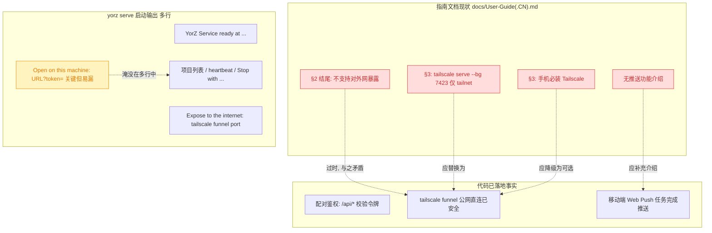
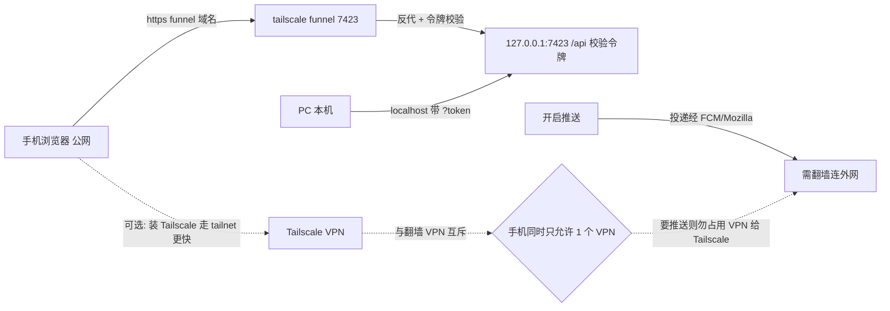
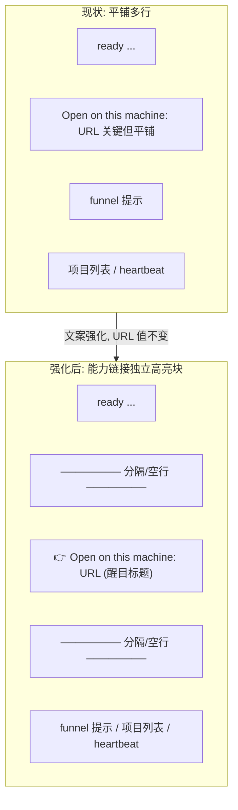
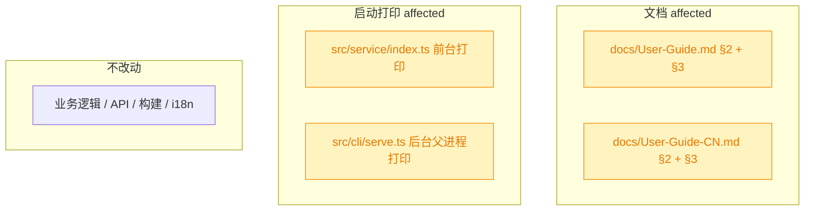

# 指南文档：Funnel 公网访问 + 移动推送 + 启动链接强化

## 1. 背景

前序 spec `261004.fix.mobile-pwa-pairing-auth` 已为移动端 PWA 落地**配对鉴权**：`/api/*` 一律校验 bearer 令牌，服务改用 `tailscale funnel` 暴露到公网也不再有未鉴权风险。另一前序 spec `261003.feat.mobile-task-complete-push` 已实现**移动端任务完成 Web Push 推送**（VAPID + `web-push` + 浏览器 Push 服务）。

但 `docs/User-Guide.md` / `docs/User-Guide-CN.md` 的使用指南仍停留在旧模型：

- §3 仍教用户用 `tailscale serve --bg 7423`（仅 tailnet 内网），未反映 funnel 公网直连 + 鉴权已可安全暴露；
- §2 末尾仍写「服务只监听回环地址，不支持对外网暴露」，与 funnel + 鉴权后的新事实相左；
- 手机端安装/启用 Tailscale 被写成**必需**步骤，而 funnel 公网直连下手机端 Tailscale 实为**可选**；
- 完全没有介绍「移动端任务完成推送」这一已实现能力，也未点明推送依赖浏览器 Push 服务（需翻墙连接外网）。

此外 `yorz serve` 启动打印了多行信息，`Open on this machine: <能力链接>` 这条**最关键**的令牌引导链接夹在其中，容易被用户漏看。

原始需求：

> - 更新指南文档，将 tailscale serve 替换为 tailscale funnel；实现授权访问后，暴露到公网也不用担心安全问题
> - 更新指南文档，手机上安装、启动 Tailscale 是可选项；手机端启用 Tailscale 会更快，但可能跟翻墙 VPN 冲突（着重说明：开启推送功能需要翻墙连接外网）
> - 更新指南文档，介绍移动端支持任务完成时推送消息功能，着重说明：开启推送功能需要翻墙连接外网
> - yorz serve 启动时，强化 Open on this machine: 这条消息后面的链接内容，当前打印内容较多容易漏掉

## 2. 需求

1. **Funnel 公网访问**：更新中英双份指南的移动端访问章节，把 `tailscale serve`（tailnet 内网）替换为 `tailscale funnel`（公网直连）；说明配对鉴权落地后，暴露到公网也无需担心安全。同步修正 §2 末尾「不支持对外网暴露」的过时表述。
2. **手机端 Tailscale 可选**：说明手机端安装/启动 Tailscale 是**可选**项——启用后经 tailnet 直连更快，但 Tailscale 是 VPN，可能与翻墙 VPN 互斥冲突；着重说明**开启推送功能需要翻墙连接外网**。
3. **移动端推送章节**：在指南中新增介绍「移动端任务完成时推送消息」功能（如何开启、安全上下文要求、iOS 需添加到主屏等），着重说明**开启推送功能需要翻墙连接外网**。
4. **强化启动链接**：`yorz serve` 启动时强化 `Open on this machine: <能力链接>` 的可见度，使其在多行输出中不易被漏看（前台 `src/service/index.ts` 与后台父进程 `src/cli/serve.ts` 两处打印均需处理）。
5. 中英双份指南（`docs/User-Guide.md` / `docs/User-Guide-CN.md`）内容保持同步对齐。

## 3. 现状分析

当前「文档陈述」与「代码已落地事实」的落差，以及 `yorz serve` 启动输出结构如下。核心事实：funnel + 鉴权、移动推送在代码层均已完成，仅文档与启动提示未跟上。

现状精确层（文件 / 行号 / 关键文本）

- **英文指南** `docs/User-Guide.md`：
  - §2 line 91：`The service only listens on the loopback address (127.0.0.1 by default) and cannot be exposed to the network.` —— 过时表述。
  - §3 line 93-121「Access the Mobile PWA」：line 103 `install Tailscale on both your PC and your phone`；line 108 `tailscale serve --bg 7423`；line 114-117 输出样例 `Available within your tailnet:`；line 121 安装到主屏说明。全章需改写为 funnel。
- **中文指南** `docs/User-Guide-CN.md`：
  - §2 line 92：`服务只监听回环地址（默认 127.0.0.1），不支持对外网暴露。`
  - §3 line 94-122「访问移动端 PWA」：line 104 PC/手机均装 Tailscale；line 109 `tailscale serve --bg 7423`；line 115-117 `Available within your tailnet:` 样例；line 122 安装到主屏。
  - 两份 TOC（EN line 5-39 / CN line 5-40）为手工锚点列表，若新增顶级章节需同步，故推送内容宜并入 §3 以免大面积重编号。
- **启动打印两处**：
  - 前台 `src/service/index.ts:107-119`：`url` + `capabilityUrl`，依次 `console.log` 打印 `YorZ Service ready...`、`Open on this machine: ${capabilityUrl}`、`Expose to the internet: tailscale funnel ${port.port}`、项目列表、`agent heartbeat ...`。
  - 后台父进程 `src/cli/serve.ts:227-239`：`YorZ Service started in background`、`Open ${url}`、`Open on this machine: ${url}?token=${masterToken}`、`Expose to the internet: tailscale funnel ${port}`、`Stop with: yorz serve stop`。
- **推送能力事实**（来自 `261003.feat.mobile-task-complete-push`）：移动端设置页「任务完成推送」开关 → `enablePush()`（请求通知权限 → 取 VAPID 公钥 → `pushManager.subscribe` → 保存订阅）；SW 监听 `push`/`notificationclick`；要求安全上下文（HTTPS / localhost，funnel 为 HTTPS 满足）；iOS 需 standalone 16.4+；推送投递经浏览器 Push 服务（FCM / Mozilla autopush），在受限网络下需翻墙方可送达。
- **funnel 安全前提**（来自 `261004.fix.mobile-pwa-pairing-auth`）：服务仍只绑 `127.0.0.1`，funnel 反代到本机；`/api/*` 一律校验令牌，故公网暴露安全。单端口 `tailscale funnel <port>`。

## 4. 技术实现方案

本 spec **仅改文档与启动打印文案**，不改任何业务逻辑 / 接口 / 构建产物。两类改动：文档改写（中英各一处 §2 + 一处 §3）、启动打印强化（两处 console.log）。

### 4.1 文档改写要点

目标访问模型与推送链路（改写后文档应传达的认知）：

- **§3「移动端访问」改写**（中英各一份，内容对齐）：
  1. 开篇改为：配对鉴权落地后推荐用 `tailscale funnel` 把服务暴露到公网，手机经公网 HTTPS 连接；`/api/*` 一律需令牌，公网暴露无安全顾虑。
  2. PC 端命令由 `tailscale serve --bg 7423` 改为 `tailscale funnel 7423`；输出样例由 `Available within your tailnet:` 改为 `Available on the internet:`（对齐 §4.4 原始 spec 示例）。
  3. 手机端 Tailscale 调整为**可选**：不装 Tailscale 也可经 funnel 公网域名访问；装了 Tailscale 并登录同一 tailnet 可经内网直连、速度更快，但 Tailscale 本身是 VPN，移动端同一时间通常只允许一个 VPN 生效，会与翻墙 VPN 互斥——**若需使用推送功能（需翻墙连外网），不要把 VPN 名额占给 Tailscale**。
  4. 保留「安装到主屏为可选步骤」说明。
  5. 首次打开：手机访问 funnel 域名 → 自动转 `/m/` → 未配对跳 `/m/pair` → 扫码 / 手输配对码（PC 点 header「YorZ」右侧二维码 icon 获取）。
- **§2 结尾修正**：把「不支持对外网暴露」改为准确表述——服务默认只绑定回环地址 `127.0.0.1`；需要手机 / 远程访问时，通过 `tailscale funnel` 反向代理暴露到公网，并由配对鉴权（令牌校验）保证安全（指引见 §3）。
- **推送章节**：并入 §3 末尾（避免新增顶级章节导致两份 TOC 与 §4–§9 大面积重编号，见决策记录），标题级用 `###` 子标题「任务完成推送」。说明：在移动端设置页开启「任务完成推送」→ 浏览器申请通知授权 → Agent 任务（会话轮次 / spec 执行）完成时手机收到通知；要求安全上下文（funnel 为 HTTPS 满足）；iOS 需先「添加到主屏」并 16.4+；**着重**：推送投递依赖浏览器 Push 服务（Google FCM / Mozilla），在受限网络环境下**需翻墙连接外网**才能收到；英文版用等价表述（需要能连通浏览器 Push 服务的网络）。

### 4.2 启动打印强化

两处打印都把 `Open on this machine:` 那条能力链接从「夹在多行中的普通一行」提升为**视觉分隔的高亮块**（用空行 + 分隔线 + 明确标题包裹），使其不被项目列表 / heartbeat / Stop 提示淹没。纯 `console.log` 文案调整，不改变 URL 值与既有其它行语义。

### 4.3 改造影响面

### 4.4 决策说明（plan 阶段自行查证敲定，非待确认项）

- **D1 推送内容并入 §3 而非新增顶级章节**：两份指南 TOC 为手工维护的锚点列表，`## 2`–`## 9` 为连续编号。新增顶级「推送」章节会迫使 §4–§9 全部重编号并改双份 TOC，改动面和出错风险都大。推送本质是「移动端 PWA 的一项能力」，归于 §3 语义自洽，故以 `###` 子标题并入 §3 末尾。
- **D2「翻墙」在英文指南的表述**：中文版按用户要求直书「需翻墙连接外网」；英文版不直译敏感词，改为语义等价、面向全球读者的表述——推送投递经浏览器 Push 服务（Google FCM / Mozilla autopush），需要能够连通这些服务的网络（on networks that restrict access to these services, a VPN/proxy is required）。两版信息等价。
- **D3 §2「只绑回环」事实保留**：服务确实仍只绑 `127.0.0.1`（`isLoopbackHost` 强校验未变），funnel 是反向代理而非改绑公网网卡。故 §2 不删「只监听回环」的事实，仅修正「不支持对外网暴露」这一结论，改为「经 funnel 反代 + 令牌鉴权安全暴露」。
- **D4 启动链接强化采用「文案/排版」而非新增交互**：需求只要求「不易漏看」，用空行 + 分隔线 + 醒目前缀即可达成，零行为风险；不引入颜色依赖（避免非 TTY / 重定向日志场景下的转义噪声），不改 `--open` 等既有行为。
- **D5 funnel 命令形态**：采用原始 spec §4.4 示例的 `tailscale funnel <port>`（单端口直连，前台会话型）；不混用 `--bg`，与 `tailscale serve --bg` 旧写法区分，保持与 `yorz serve` 启动提示 `Expose to the internet: tailscale funnel <port>` 完全一致。
- **D6 追加任务（refct）：能力链接加超链接 emoji 并进一步强化**：在 `printCapabilityUrl` 中把链接从「`>> Open on this machine: <url>` 同行」拆为两行——标题行 `>> Open on this machine:` 之后，URL 单独成行并以 `🔗 ` 超链接 emoji + 空格前缀。既满足「链接前加超链接 emoji + 空格」，又通过「URL 独占一行」进一步强化链接可见度。前台 `src/service/index.ts` 与后台 `src/cli/serve.ts` 共用该 helper，一处改动两处生效；仍为纯文案排版，不依赖颜色、不改 URL 值与其它行语义。

## 5. 待确认项

_暂无_

## 6. 任务清单

- [x] 改 `docs/User-Guide-CN.md` §2 结尾（line 92）：把「不支持对外网暴露」修正为「默认只绑回环，经 tailscale funnel 反代 + 配对鉴权可安全暴露到公网，详见 §3」（验收：该句不再出现「不支持对外网暴露」，指向 §3）
- [x] 改 `docs/User-Guide-CN.md` §3「访问移动端 PWA」：开篇改为 funnel 公网直连 + 鉴权已安全；PC 命令 `tailscale serve --bg 7423` → `tailscale funnel 7423`；输出样例 `Available within your tailnet:` → `Available on the internet:`；手机端 Tailscale 改为可选并说明 VPN 互斥 + 推送需翻墙；补首次配对流程（扫码/手输）（验收：全章无 `tailscale serve`，手机 Tailscale 表述为可选，含 VPN 冲突与推送翻墙提示）
- [x] 在 `docs/User-Guide-CN.md` §3 末尾新增 `### 任务完成推送` 子章节：介绍移动端设置页开启推送、通知授权、安全上下文（funnel HTTPS 满足）、iOS 需添加到主屏 16.4+，着重「开启推送功能需要翻墙连接外网」（验收：§3 含推送子章节且含翻墙提示；两份 TOC 顶级编号不变）
- [x] 改 `docs/User-Guide.md` §2 结尾（line 91）：等价于 CN 的修正表述（英文）（验收：不再出现 `cannot be exposed to the network`，改为 funnel 反代 + 鉴权安全暴露）
- [x] 改 `docs/User-Guide.md` §3「Access the Mobile PWA」：等价于 CN 的 funnel 改写，PC 命令改 `tailscale funnel 7423`、样例 `Available on the internet:`、手机 Tailscale 可选 + VPN 冲突、首次配对流程（验收：全章无 `tailscale serve`，与 CN 对齐）
- [x] 在 `docs/User-Guide.md` §3 末尾新增 `### Task-completion Push Notifications` 子章节：等价于 CN 推送章节，翻墙按 D2 用语义等价英文表述（需能连通浏览器 Push 服务的网络）（验收：§3 含推送子章节，与 CN 信息对齐，TOC 顶级编号不变）
- [x] 改 `src/service/index.ts:110-119` 前台启动打印：把 `Open on this machine: ${capabilityUrl}` 包成空行 + 分隔线 + 醒目标题的独立高亮块，使其在多行输出中突出；URL 值与其它行语义不变（验收：`tsc -b` 通过；前台启动肉眼可见能力链接被分隔突出）
- [x] 改 `src/cli/serve.ts:230-238` 后台父进程打印：同样把 `Open on this machine: ...` 强化为独立高亮块，与前台风格一致（验收：`tsc -b` 通过；后台启动输出中能力链接被分隔突出）
- [x] 全量校验：`npx tsc -b` 通过；`npx prettier --write` 格式化两份 docs 与改动的 ts；端到端肉眼确认 `yorz serve`（前台 / 后台）打印的能力链接醒目（验收：类型检查通过，格式化无 diff 残留，启动输出符合预期）
- [x] [refct] 改 `src/service/index.ts` 的 `printCapabilityUrl`：标题行 `>> Open on this machine:` 后让 URL 单独成行并加 `🔗 ` 超链接 emoji + 空格前缀强化链接；前台/后台共用该 helper 无需改第二处（验收：`tsc -b` 通过；启动输出中 URL 行以 `🔗 ` 开头且独占一行，URL 值不变）

## 7. 追加任务

- [fixed] [refct] 2026-10-04 16:32:49 | 在链接之前添加一个 “超链接 emoji <空格>” 再强化一点后面的链接
  - 描述：在链接之前添加一个 “超链接 emoji <空格>” 再强化一点后面的链接

## 8. 执行记录

- `docs/User-Guide-CN.md` §2 结尾：删除「不支持对外网暴露」，改为「默认只绑回环 `127.0.0.1`；需手机/远程访问时经 `tailscale funnel` 反代暴露公网，由配对鉴权保证安全」并锚点指向 §3。
- `docs/User-Guide-CN.md` §3：开篇改为「配对鉴权落地后推荐 Funnel 公网直连，公网暴露无安全顾虑」；PC 命令 `tailscale serve --bg 7423` → `tailscale funnel 7423`，输出样例 `Available within your tailnet:` → `Available on the internet:`；新增首次配对流程（PC 二维码 icon → 手机扫码/手输配对码）；手机端 Tailscale 改为「可选」并说明「Tailscale 是 VPN、与翻墙 VPN 互斥、要用推送勿占 VPN 名额」。
- `docs/User-Guide-CN.md` §3 末尾新增 `### 任务完成推送`：设置页开关 + 通知授权 + 安全上下文（Funnel HTTPS 满足、iOS 需添加到主屏 16.4+）+ **着重「开启推送需翻墙连接外网」**。推送内容并入 §3（`###` 子标题），两份 TOC 顶级编号不变（见决策 D1）。
- `docs/User-Guide.md` §2 / §3：与 CN 等价英文改写；§2 去除 `cannot be exposed to the network`；§3 全章改 `tailscale funnel 7423` + `Available on the internet:` + 配对流程 + 手机 Tailscale 可选 + VPN 冲突；新增 `### Task-completion Push Notifications`，「翻墙」按 D2 用语义等价英文（需能连通浏览器 Push 服务 FCM/Mozilla 的网络、受限网络需 VPN/proxy）。
- `src/service/index.ts`：新增并导出 `printCapabilityUrl(capabilityUrl)`——空行 + 60 字符分隔线 + `>> Open on this machine: <url>` 醒目块（纯文案排版、不依赖颜色）；前台 `start()` 打印改为调用它。
- `src/cli/serve.ts`：后台父进程打印改为复用 `printCapabilityUrl(...)`，与前台风格一致。
- 校验：`npx tsc -b` 通过；`npx prettier --write` 格式化两份 docs 与两处 ts（serve.ts 有格式化变更，index.ts/docs 无残留 diff）；`grep` 确认 docs 内已无 `tailscale serve` / `不支持对外网暴露` / `cannot be exposed to the network` 残留，中英推送子章节均存在。
- 端到端烟测：`YORZ_HOME=/tmp/... yorz serve --foreground --port 7955` 启动输出中能力链接已被分隔线高亮块包裹（`>> Open on this machine: http://localhost:7955/?token=...`），不再淹没于项目列表/heartbeat/Stop 等行；后台父进程走同一 helper，风格一致。
- 收尾：全部任务完成，无待确认项 / 批注 / `[open]`，`stage` 置 `done`。
- 追加任务（refct，D6）：`src/service/index.ts` 的 `printCapabilityUrl` 由单行 `>> Open on this machine: ${capabilityUrl}` 改为两行——标题行 `>> Open on this machine:` + URL 行 `  🔗 ${capabilityUrl}`。超链接 emoji `🔗 ` 前缀 + URL 独占一行双重强化链接可见度；前台 `src/service/index.ts` 与后台 `src/cli/serve.ts` 共用该 helper，改动一处两处生效，URL 值与分隔线/说明行等语义不变。`[open] → [fixed]`。
- 追加任务校验：`npx tsc -b` 通过；`npx prettier --write src/service/index.ts` 无残留 diff；烟测 `yorz serve --foreground` 输出能力链接 URL 行以 `🔗 ` 开头且独占一行，位于分隔线高亮块内。`stage` 重新置 `done`。
