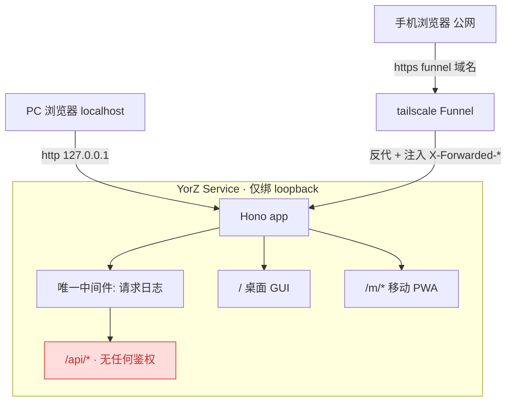
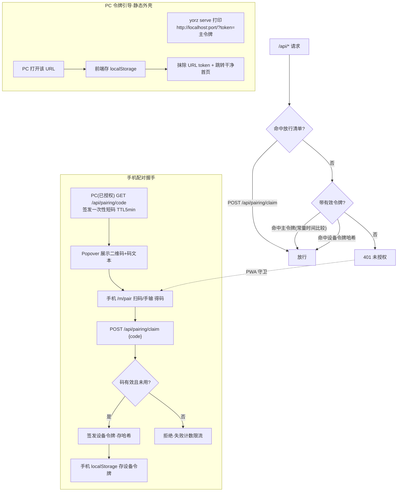
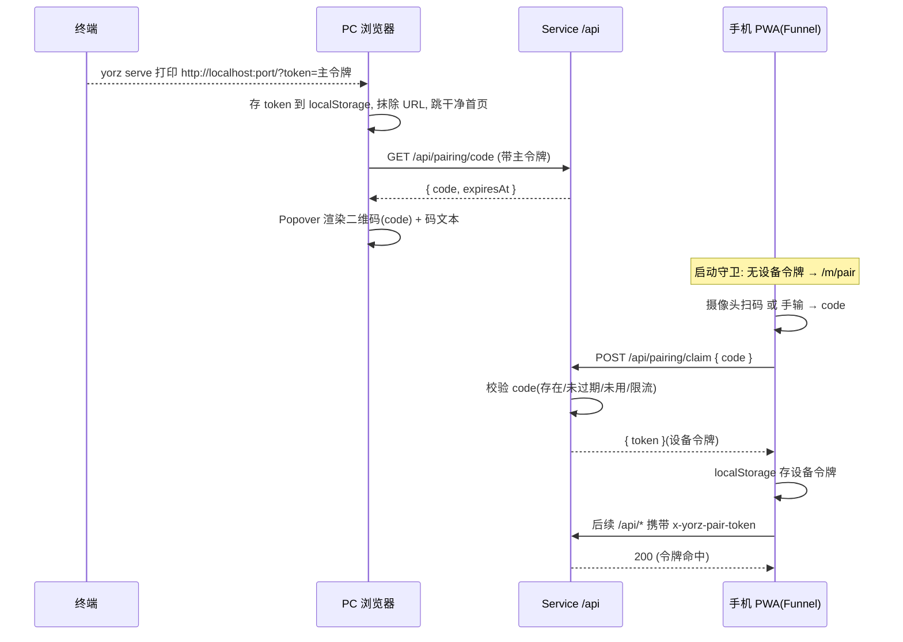
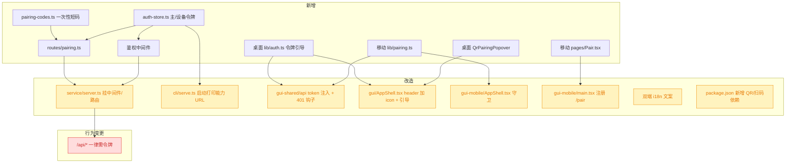
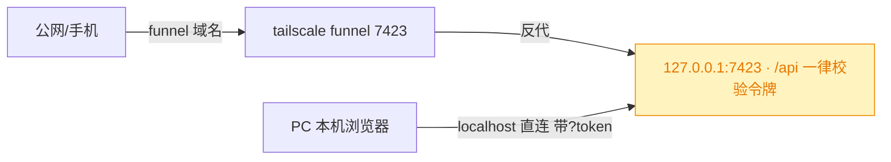

# 移动端 PWA 配对鉴权

## 1. 背景

YorZ Service 当前**完全无鉴权**，安全模型 100% 依赖「只绑定 loopback 地址」（`src/service/index.ts` 的 `isLoopbackHost` 强校验，非环回地址直接抛错）。此前移动端访问走 `tailscale serve`（仅 tailnet 内网，见 `260907.feat.mobile-pwa-access-docs`）。

现准备改用 **tailscale Funnel** 把服务暴露到**公网**，手机通过公共网络连接。Funnel 会把公网流量反代到本机 `http://127.0.0.1:<port>`，于是：

- 服务端看到的所有请求 TCP 源地址都是环回地址，**无法再用「只绑 loopback」或 socket 远端地址来保证安全**；
- 公网上任何人拿到 Funnel 域名即可访问未鉴权的命令类 API（可执行 shell 命令），风险极高。

因此必须新增**配对鉴权**：改用「持有有效令牌即授权」的能力 URL 模型，不区分来源，`/api/*` 一律校验令牌。PC 由 `yorz serve` 启动打印的带 token 链接引导一次（令牌持久化于 localStorage，重启复用）；手机经扫码/输码换取设备令牌后才能访问。

原始需求：

> 新增移动端（PWA）应用配对功能；该服务准备通过 tailscale Funnel 暴露到外网，手机端通过公共网络连接，所以需要实现配对鉴权。使用通用的配对交互，大致流程：
>
> - PC 端通过 localhost 访问，在 header 标题 YorZ 右侧添加一个二维码 icon
> - 点击 icon，Popover 组件展示二维码
> - 启动移动端 PWA 应用时检测是否配对，未配对跳转配对页面
> - 新开发配对页面，支持扫码或输入 code

## 2. 需求

1. **鉴权中间件**：对 `/api/*` 增加令牌鉴权。请求须携带有效 bearer 令牌（主令牌或设备令牌），否则 401。静态资源（PWA 外壳、manifest、sw.js、`/m/*`、桌面外壳）与配对握手端点 `POST /api/pairing/claim` 不受令牌限制。
2. **令牌引导与配对码签发**：服务持久化一个高熵**主令牌**，`yorz serve` 启动打印 `http://localhost:<port>/?token=<主令牌>`；已授权端（持主令牌）可生成短期一次性**配对码**供手机换取**设备令牌**。
3. **PC 端 UI**：桌面 header 标题「YorZ」右侧新增二维码 icon，点击弹出 Popover 展示二维码（二维码内容为配对码），并显示配对码文本以便手输。
4. **移动端启动检测**：PWA 启动时检测本地是否已存有效设备令牌；未配对 → 跳转配对页。
5. **配对页**：新增 `/m/pair` 页面，支持「摄像头扫码」或「手动输入配对码」两种方式，提交后换取设备令牌并持久化，随后放行进入应用。
6. 所有展示文案走 i18n（桌面 `src/gui/src/i18n`、移动 `src/gui-mobile/src/i18n` 双端同步）。

## 3. 现状分析

当前访问链路与「无鉴权」缺口如下图。核心事实：经 Funnel 后所有请求都从 127.0.0.1 落地，仅靠 loopback 绑定已不足以隔离公网，且 socket 源地址/`Host` 头都不足以区分内外，故改用统一令牌校验。



现有可直接复用的基础设施（精确层）：

<details>
<summary>服务端：持久化范式 / 中间件挂载点 / token 校验范式</summary>

- **loopback 强校验**：`src/service/index.ts:46-65` `isLoopbackHost()` + `start()` 开头抛错；Funnel 必须反代到 `127.0.0.1:<port>`，服务不会绑公网网卡。单端口直连 `tailscale funnel <port>`。
- **密钥类数据持久化范式**：`src/service/push-store.ts:42-114` —— 独立 JSON 文件落在全局配置目录（`resolveGlobalConfigDir`：`YORZ_HOME` > `XDG_CONFIG_HOME/yorz` > `~/.config/yorz`），`writeJsonAtomic`（临时文件 + rename）、`serialize`（读-改-写串行）、`getVapidKeys` 的「惰性生成 + 落盘」。主令牌/设备令牌 store 直接照此范式。
- **header token 校验范式**：`src/service/server.ts:60-69` 的 `/api/internal/shutdown` 用 `x-yorz-shutdown-token` 严格比对；token 为 `randomUUID()` 存 runtime.json（`src/cli/serve.ts:132,160-170`）。鉴权中间件沿用 `x-yorz-*` 头 + 常量时间比较。
- **中间件挂载点**：`src/service/server.ts:44`（全局日志 `app.use('*')`）之后、`app.route('/api', api)`（server.ts:126）之前；或在子 `api` 上 `api.use('*', ...)` 只保护 `/api`，静态资源天然放行。
- **来源判据已排除**：Funnel 本地端在同机以 `127.0.0.1` 回连，本机与外部流量都是环回地址，`getConnInfo(c).remote.address` 无法区分；`Host` 头由客户端决定且 tailscale 倾向透传，可被构造请求伪造。故不用来源判据，改用统一令牌校验（见 §4.1）。
- **静态路由**：`src/service/static.ts` —— `/m/*`（static.ts:43-54）、`/`（static.ts:56-65，已跳过 `/api`）、UA 探测分流（static.ts:58,70-75）。静态外壳天然属于放行清单，承载 PC 的 `?token` 引导。
</details>

<details>
<summary>桌面端 / 移动端 / 共享层：改造点</summary>

- **桌面 header**：`src/gui/src/AppShell.tsx:183-188`，`<A>YorZ</A>` 在 184-186；在 186 行 `</A>` 后插入二维码 Popover。Popover 封装 `src/gui/src/components/ui/popover.tsx`（Kobalte），用法参考 `src/gui/src/components/GitPanel.tsx:497-574`（`PopoverTrigger as={Button} size="icon"`）。图标 `QrCode`（lucide-solid）。
- **共享 API 封装**：`src/gui-shared/api/index.ts:340-347` `request<T>()`（相对 `/api`，无 token/无 401 分支）；另有 3 处裸 fetch：`createSpec`(369)、`addProject`(524)、`uploadAttachment`(624)。`api` 对象（349 起）为接口集中出口。
- **移动端入口与守卫**：`src/gui-mobile/src/main.tsx:34-79`（Router base `/m`）、`src/gui-mobile/src/AppShell.tsx`（root wrapper，可读 `useLocation`/`useNavigate`，放全局守卫）。路由常量 `src/gui-mobile/src/lib/routes.ts:8,11`（`ROUTER_BASE` / `TAB_PATHS`）。
- **移动端 localStorage 范式**：`src/gui-mobile/src/lib/active-project.ts:20-50`（`STORAGE_KEY` + try/catch 读写 + 信号化）。命名空间 `yorz.m.*`。
- **移动端 UI**：页面骨架 `src/gui-mobile/src/components/Page.tsx`；`Button`/`buttonVariants`（`components/ui/button.tsx`）；输入框范式 `src/gui-mobile/src/components/SettingsControls.tsx:107-130`（`ui/` 无独立 Input）。最简页模板 `src/gui-mobile/src/pages/NotFound.tsx`。
- **`/m/` 前缀五处须同步**：`vite.gui-mobile.config.ts`（base + manifest start_url/scope）、`src/gui-mobile/src/lib/routes.ts`、`src/service/static.ts:31`、`src/gui-mobile/src/sw.ts:25`。
- **安全上下文**：摄像头 `getUserMedia` 需 HTTPS / localhost（Funnel 为 HTTPS，满足）；参考 `src/gui-mobile/src/lib/pwa.ts:105-108` 的 `isSecureContext` 判据。
- **当前无任何 QR 生成 / 扫码解码依赖**，需新增。
</details>

## 4. 技术实现方案

### 4.1 鉴权模型与配对流程

采用**能力 URL / 持有令牌模型**（Jupyter/code-server 同款，5.1 已定）：不区分请求来源，统一「持有有效令牌即授权」。单端口，`tailscale funnel <port>` 直连。

**两类令牌：**

- **主令牌（capability/master token）**：高熵随机串（`randomBytes(32)` 的 base64url），惰性生成并**明文持久化**于全局配置目录 `auth.json`（重启复用 → 旧授权持续有效，故需明文回读以重新打印/校验，安全性等同 shutdown token）。`yorz serve` 启动打印 `http://localhost:<port>/?token=<主令牌>`；PC 打开该 URL，前端读取后存入 localStorage，**立即从地址栏抹除 token（`history.replaceState`）并跳转干净首页**。
- **设备令牌（device token）**：手机经配对码换取的各自令牌（`randomBytes(32)` base64url）；服务端只存其 **sha256 哈希**（`auth.json` 的 `devices: [{ tokenHash, label, pairedAt }]`），可按设备单独吊销。

**校验**：`/api/*` 一律校验 bearer 令牌（header `x-yorz-pair-token`）；命中主令牌（常量时间 `timingSafeEqual` 比较）或任一设备令牌哈希即放行，否则 401。**放行清单**：静态资源/PWA 外壳/`/m/*`/桌面外壳（天然不走 `/api`）、以及配对握手 `POST /api/pairing/claim`（设备引导入口）。PC 的令牌引导不走 API（静态外壳本就放行，前端读 `?token` 即可）。

整体鉴权与配对流程：



配对握手时序：



### 4.2 改造影响面

红 = 行为破坏性变更（API 由无鉴权变为需鉴权）；黄 = 受影响需改造；无色 = 新增。



### 4.3 决策说明

> 决策记录：鉴权实现方式 —— 用户选择「能力 URL / 持有令牌模型（Jupyter/code-server 同款）」，理由：部署最简（单端口直接 `tailscale funnel <port>`）、彻底不依赖来源判定（socket 源地址/Host 头均不可靠）、重启复用令牌使旧授权持续有效。据此将原 §4.1/§4.4 的方案 2（专用 Funnel 端口、双 loopback 监听）全部替换为方案 1；不再需要双端口监听与「切勿 funnel 主端口」的配置约束。

以下为 plan 阶段自行查证/依约定敲定的决策（准入门槛已过），不作为待确认项。

- **D1 鉴权判据**：已排除两种不可靠信号——① socket 源地址：Funnel 在同机以 127.0.0.1 回连，本机与外部都是环回、无法区分；② `Host=localhost`：Host 由客户端决定且 tailscale 倾向透传，可被构造请求伪造。最终采用**持有令牌模型**：不区分来源，统一 bearer 令牌校验，不可被 Host/头绕过。
- **D2 鉴权始终开启、无开关**：不依赖用户记得打开的开关。`/api/*` 恒校验令牌；不 Funnel 时本机 PC 仍走启动 URL 引导一次。`tailscale serve`(tailnet) 与 `funnel`(公网) 统一走令牌校验，无需按身份头特判。
- **D3 设备 token 存储**：设备 token = `randomBytes(32)` 的 base64url；服务端只存其 **sha256 哈希**于 `auth.json`（`{ token: <主令牌明文>, devices: [{ tokenHash, label, pairedAt }] }`），校验时哈希比对。持久化照搬 `push-store.ts`（独立文件 + 原子写 + serialize + 惰性创建）。
- **D4 配对码**：8 位 Crockford base32（去除易混的 0/O/1/I/L），内存 Map 存储，TTL 5 分钟、一次性、单活动码（新签发覆盖旧）；仅已授权端点（`GET /api/pairing/code`，需令牌）可生成。
- **D5 二维码内容 = 配对码纯文本**：PC 走 localhost 无法可靠得知 Funnel 外网域名，故二维码只编码配对码；配对页扫码或手输都得到同一个码。符合「配对页支持扫码或输入 code」的需求表述。
- **D6 扫码解码 = jsqr + getUserMedia**：iOS Safari 不支持原生 `BarcodeDetector`，jsqr 轻量、无额外运行时依赖；手输为始终可用的兜底，摄像头不可用（权限/非安全上下文）时自动退化为手输。QR 生成库用 `qrcode`（canvas/dataURL）。
- **D7 token 传递头**：`x-yorz-pair-token`，沿用现有 `x-yorz-*` 自定义头命名约定（与 `x-yorz-shutdown-token` 一致）；用 header bearer 而非 Cookie，规避 CSRF。
- **D8 共享 api 注入（双端）**：`gui-shared/api/index.ts` 增加可注入的 `authTokenProvider`（返回 token 或 null）与 `onUnauthorized` 回调；`request()` 及 3 处裸 fetch 统一在有 token 时附加 `x-yorz-pair-token`，响应 401 时触发 `onUnauthorized`。**桌面端与移动端都需注入**（方案 1 下 PC 不再因 localhost 自动免鉴权）：桌面从 `localStorage['yorz.token']` 取主令牌、401 提示重开启动 URL；移动从 `lib/pairing.ts` 取设备令牌、401 清 token 并跳 `/m/pair`。
- **D9 claim 防爆破**：大码空间（32^8 ≈ 1e12）+ 短 TTL + 一次性 + 失败计数限流（如单码/单 IP 连续失败 N 次后短暂封禁），使暴力猜码不可行。
- **D10 主令牌持久化与打印**：主令牌明文存 `auth.json`（全局配置目录），启动时惰性生成；`yorz serve` 把 `?token=` 拼进打印的 localhost URL（token 放 query 不进 path），并确保**请求日志中间件不记录 `token`/`x-yorz-pair-token`**（避免落日志）。提供轮换入口（删除 `auth.json` 或后续 CLI 子命令即可轮换，本期以文件删除为准）。
- **D11 桌面令牌引导**：桌面外壳加载时解析 `location.search` 的 `token`，存 `localStorage['yorz.token']` 后 `history.replaceState` 抹除并跳干净首页；无 token 且 API 401 时提示用户使用启动日志里的带 token 链接打开（不自动跳转，因桌面无法获知 token）。

### 4.4 访问示例与不可绕过原理

服务单端口（示例 `7423`，仅绑 `127.0.0.1`），直接 `tailscale funnel 7423`。公网与本机请求都统一走令牌校验。



<details>
<summary>PC / 手机访问命令示例</summary>

```bash
# PC（本机）
yorz serve
#   启动打印: Capability URL: http://localhost:7423/?token=<主令牌>
# 浏览器打开该带 token 链接 → 前端存 token、抹除 URL、跳干净首页
# → 点 header「YorZ」右侧二维码 icon，Popover 弹出配对二维码(配对码)

# 手机（公网，需配对）：直接 funnel 单端口
tailscale funnel 7423
#   Available on the internet:
#   https://fenghenmacbook-pro.taildce4ce.ts.net/
#   |-- proxy http://127.0.0.1:7423
# 手机访问 https://<你的>.ts.net/ → 按 UA 自动转 /m/ → 无设备令牌跳 /m/pair → 扫码/手输 code
```

</details>

**为什么不可绕过**：① 服务只绑 `127.0.0.1`，公网仅经 funnel 反代可达；② `/api/*` 一律校验 bearer 令牌，令牌是 256 位高熵随机串，常量时间比较，无法猜测或伪造；③ 配对码大空间 + 短 TTL + 一次性 + 失败限流，暴力换取设备令牌不可行；④ 令牌走自定义 header 而非 Cookie，天然免 CSRF；⑤ 主令牌放 query 不进 path 且用后即从地址栏剥除、请求日志不记录，降低泄漏面。相比「看 Host/来源判据」，令牌模型不依赖任何客户端可伪造的应用层字段。

## 5. 待确认项

_暂无_

## 6. 任务清单

- [x] 新增 src/service/auth-store.ts：照搬 push-store 持久化范式，惰性生成并明文存主令牌、设备令牌哈希列表于全局配置目录 auth.json，导出 getMasterToken/validateToken(常量时间)/addDevice/listDevices（验收：tsc --noEmit 通过，单测或手动调用生成 auth.json）
- [x] 新增 src/service/pairing-codes.ts：内存一次性短码（Crockford base32 8 位、TTL 5min、单活动码、失败计数限流），导出 issueCode/consumeCode（验收：tsc --noEmit 通过）
- [x] 新增 src/service/routes/pairing.ts：GET /api/pairing/code（需令牌，签发短码）、POST /api/pairing/claim（放行，校验短码→签发设备令牌）（验收：tsc --noEmit 通过）
- [x] 改 src/service/server.ts：在 /api 挂载鉴权中间件（放行 POST /api/pairing/claim），注册 pairing 路由，确保请求日志不记录 token/x-yorz-pair-token（验收：tsc --noEmit 通过；无令牌请求 /api 返回 401，带主令牌放行）
- [x] 改 src/cli/serve.ts（及按需 src/service/index.ts）：启动时取主令牌并打印 Capability URL http://localhost:<port>/?token=<主令牌>（验收：yorz serve 日志出现带 token 的 localhost URL）
- [x] 改 src/gui-shared/api/index.ts：新增 authTokenProvider + onUnauthorized，request() 与 createSpec/addProject/uploadAttachment 三处 fetch 注入 x-yorz-pair-token，401 触发回调（验收：tsc --noEmit 通过）
- [x] 新增 src/gui/src/lib/auth.ts（或等价）：解析 ?token→存 localStorage['yorz.token']→history.replaceState 抹除；注入 authTokenProvider，401 提示重开启动 URL（验收：带 ?token 打开后地址栏无 token 且后续请求带头）
- [x] 新增桌面 QrPairingPopover 组件并接入 src/gui/src/AppShell.tsx header（YorZ 右侧 QrCode icon → Popover 展示二维码(配对码)+码文本）（验收：构建通过，点击弹出二维码）
- [x] package.json 新增依赖 qrcode 与 jsqr（及所需类型声明）（验收：pnpm/npm install 成功，import 可解析）
- [x] 新增 src/gui-mobile/src/lib/pairing.ts：设备令牌 localStorage 存取（yorz.m.token）+ claim(code) + 注入 provider/onUnauthorized（清 token 跳 /m/pair）（验收：tsc --noEmit 通过）
- [x] 新增 src/gui-mobile/src/pages/Pair.tsx：扫码(jsqr+getUserMedia，不可用时退化手输)/手输→claim→存→进应用（验收：构建通过，页面可渲染）
- [x] 改 src/gui-mobile/src/main.tsx 注册 /pair 路由，改 src/gui-mobile/src/AppShell.tsx 加启动守卫（无设备令牌跳 /m/pair）（验收：构建通过，未配对访问跳配对页）
- [x] 双端 i18n 文案：src/gui/src/i18n 与 src/gui-mobile/src/i18n 新增配对相关 key（二维码标题、配对页提示、扫码/手输、401 提示等），保持双端同步（验收：无缺失 key，构建通过）
- [x] 全量 typecheck/构建验证：对受影响的 service/gui/gui-mobile 运行仓库构建或 tsc，记录结果（验收：构建/typecheck 通过）

## 7. 追加任务

- [open] [fix] 2026-10-04 16:11:50 | 1. 移动端每次刷新，或关闭页面重新进入都会跳转 http://localhost:7424/m/pair；期望持久化授权码
  - 描述：1. 移动端每次刷新，或关闭页面重新进入都会跳转 http://localhost:7424/m/pair；期望持久化授权码
2. 授权配对页面，“手动输入”按钮应该没用，移除该按钮

## 8. 执行记录

- 新增 `src/service/auth-store.ts`：`createAuthStore`，`auth.json` 存明文主令牌 + 设备令牌 sha256 哈希，`getMasterToken`（惰性生成 randomBytes(32) base64url）/`validateToken`（统一哈希 + timingSafeEqual 常量时间比较）/`addDevice`/`listDevices`，持久化照搬 push-store（原子写 + serialize 串行）。
- 新增 `src/service/pairing-codes.ts`：`createPairingCodes`，8 位自定义 base32 短码（去 0/O/1/I/L）、TTL 5min、单活动码、连续失败 5 次锁 60s，导出 `issue`/`claim` + `normalizeCode`。
- 新增 `src/service/routes/pairing.ts`：`GET /pairing/code`（经中间件鉴权后签发短码）、`POST /pairing/claim`（放行清单，校验短码→`randomBytes(32)` 设备令牌→`addDevice`→返回明文 token；锁定返回 429+Retry-After）。
- 改 `src/service/server.ts`：`CreateAppOptions` 增 `authStore?`；`api.use('*')` 挂鉴权中间件（放行 `/api/pairing/claim`、`/api/internal/shutdown`），校验 `x-yorz-pair-token`，失败 401；注册 pairing 路由。请求日志仅记录 `c.req.path`（不含 query），主令牌放 query 天然不入日志。
- 改 `src/service/index.ts`：`start()` 创建 authStore 并注入 createApp，启动打印 `Open on this machine: <url>?token=<主令牌>` 与 `tailscale funnel <port>` 提示；`--open` 改为打开能力 URL。
- 改 `src/cli/serve.ts`：后台启动父进程在 runtime 就绪后只读既有主令牌并打印能力 URL（不会新生成）。
- 验证：`npx tsc -b` 通过（服务端新增/改造全部类型检查无错）。
- 新增 `src/gui-shared/api/auth.ts`：`configureAuth`/`getAuthToken`/`notifyUnauthorized`/`withAuthHeaders`/`appendAuthToken`，共享层对令牌来源无感知。
- 改 `src/gui-shared/api/index.ts`：加 `authedFetch`（注入 `x-yorz-pair-token`、401 回调），`request()` 及 createSpec/addProject/uploadAttachment 三处裸 fetch 统一走它；新增 `getPairingCode`/`claimPairing` 两个 api 方法。
- 改 `src/gui-shared/api/sse.ts`：EventSource 走 `?token=`（`appendAuthToken`），/events/subscribe 走 `withAuthHeaders`——解决 EventSource 无法设自定义头的鉴权问题；服务端中间件相应接受 header 或 `?token` query。
- 新增 `src/gui/src/lib/auth.ts` 并在 `main.tsx` 调用 `bootstrapAuth()`：解析 `?token`→`localStorage['yorz.token']`→`history.replaceState` 抹除；注入 provider，401 置位 `unauthorized` 信号。
- 新增 `src/gui/src/components/QrPairingPopover.tsx` + `AppShell.tsx`：YorZ 右侧 QrCode icon → Popover 用 `qrcode` 渲染配对码二维码 + 码文本 + 刷新；AppShell 加 401 未授权横幅。
- 新增 `src/gui-mobile/src/lib/pairing.ts`（设备令牌 `yorz.m.token` 存取 + `claimPairing` + `initPairingAuth`）、`pages/Pair.tsx`（jsqr+getUserMedia 扫码，不可用退化手输）；`main.tsx` 注册 `/pair` 并 `initPairingAuth()`；`AppShell.tsx` 加未配对跳 `/m/pair` 守卫。
- 双端 i18n：桌面 `pairing.*`、移动 `pair.*`，zh-CN/en 同步。
- 依赖：`pnpm add qrcode jsqr` + `@types/qrcode`。
- 鉴权中间件加 `disableAuth` 开关（仅集成测试用，生产不设）；为 13 处 `start()` 与 2 处 `createApp()` 测试调用补 `disableAuth: true`；修正 `service.test.ts` 两处 `notifications` 断言缺失的 `push` 字段（既有陈旧断言，与本功能无关）。
- 新增 `src/service/__tests__/pairing-auth.test.ts`：真·鉴权下 401/200、`/pairing/code` 需令牌、claim 换设备令牌端到端、一次性复用拒绝；auth-store 主令牌复用与设备哈希；pairing-codes 一次性/TTL/失败锁定。
- 验证：`npx tsc -b` 全绿；`pnpm build:cli/build:gui/build:gui-mobile` 三端构建通过（qrcode/jsqr 浏览器打包正常）；`vitest run src/service src/gui-shared` 555 passed / `src/gui src/gui-mobile` 340 passed。
- 端到端冒烟（built CLI + YORZ_HOME 临时目录）：启动日志打印 `Open on this machine: http://localhost:7988/?token=...` 与 funnel 提示；无令牌 `/api/global-config` 返回 401，主令牌/设备令牌均 200；`/api/pairing/code`（带令牌）签发 8 位码 `8JKWZH84`，`/api/pairing/claim` 放行换得 43 字符设备令牌；静态 `/m/` 无令牌 200。
- 收尾：任务全部完成，标记 done。
