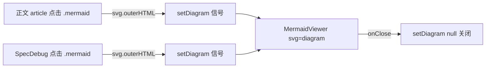
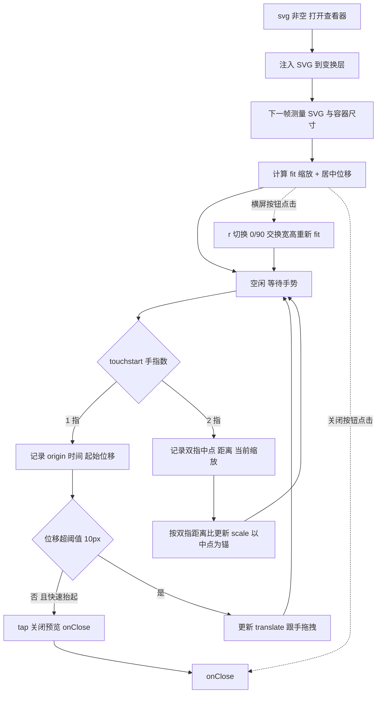
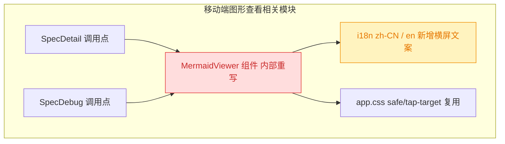

# 移动端 Mermaid 图形查看器体验重构

## 1. 背景

移动端在 spec 详情页（`src/gui-mobile/src/pages/SpecDetail.tsx`）浏览 mermaid 图形的体验非常差。当前全屏查看器 `MermaidViewer`（`src/gui-mobile/src/components/MermaidViewer.tsx`）只做「铺满 + overflow-auto 滚动 + 系统 `touch-action: pinch-zoom` 缩放」，没有自绘平移/缩放逻辑，导致：图形不会自动居中与适配缩放、无法单指拖拽、缺少常驻操作按钮、无法切换横竖屏。

## 2. 需求

重构移动端 mermaid 图形查看器，达成以下改进：

1. 支持单指 touch 事件拖拽移动图形。
2. 预览状态下单击（tap）关闭预览。
3. 图形初始化时在屏幕中间，垂直水平方向居中，并缩放到合适大小。
4. 右上角有常驻的关闭按钮，缩放图形时不改变关闭按钮的大小和位置。
5. 右上角有常驻的横屏按钮，点击可以切换图形的竖屏/横屏状态。

## 3. 现状分析

### 3.1 当前查看器的能力与短板

当前 `MermaidViewer` 是一个纯展示组件：外层 `fixed inset-0` 全屏容器，顶部一个右对齐的关闭按钮 header，下方一个 `overflow-auto` 滚动区，通过 `innerHTML` 注入 SVG 的 outerHTML，缩放完全交给系统 `touch-action: pinch-zoom`。它刻意「不与系统手势抢事件」，因此几乎没有自绘交互逻辑。

对照本次 5 条需求，短板逐条如下：

| 需求                         | 现状                                                                               | 差距                                   |
| ---------------------------- | ---------------------------------------------------------------------------------- | -------------------------------------- |
| 单指拖拽平移                 | 单指只能触发 `overflow-auto` 的原生滚动，图形小于容器时无法移动                    | 需自绘单指 pan                         |
| 单击关闭                     | 无 tap 识别，仅顶栏按钮可关                                                        | 需在交互层识别 tap 并与 pan/pinch 区分 |
| 初始居中 + 适配缩放          | SVG 原尺寸左上角贴边注入，不居中、不 fit                                           | 需测量后计算 fit 缩放与居中位移        |
| 常驻关闭按钮（不随缩放变化） | 已有关闭按钮且在 header 层（本就不随缩放变化），但缩放靠系统手势，位置语义未成体系 | 复用并纳入统一的「固定控件层」         |
| 横屏切换按钮                 | 完全缺失                                                                           | 新增按钮 + 旋转状态 + 重新 fit         |

### 3.2 调用链与复用面

`MermaidViewer` 的 API 是 `{ svg: string \| null; onClose: () => void }`（`svg` 非空即打开，内容是 `<svg>…</svg>` 的 outerHTML）。它被**两个页面**使用，本次重构必须保持该 API 不变、两处都受益：

精确层：调用点与关键源码位置

- 组件：`src/gui-mobile/src/components/MermaidViewer.tsx:17` 定义 `MermaidViewer: Component<{ svg: string | null; onClose: () => void }>`。
- 调用点 1：`src/gui-mobile/src/pages/SpecDetail.tsx:314-320`（`onArticleClick` → `setDiagram(svg.outerHTML)`）与 `:524`（`<MermaidViewer svg={diagram()} onClose={() => setDiagram(null)} />`）。
- 调用点 2：`src/gui-mobile/src/pages/SpecDebug.tsx:73`（`setDiagram(svg.outerHTML)`）与 `:100`（`<MermaidViewer .../>`）。
- 两处传入的都是 `svg.outerHTML` 字符串，组件内以 `innerHTML` 注入克隆，**不**搬运原节点（无需像桌面端那样维护原位插回）。
- 现有 i18n：`specDetail.viewDiagram`（`src/gui-mobile/src/i18n/zh-CN.ts:268` / `en.ts:263`）、`common.close`（`zh-CN.ts:31`）。

### 3.3 可复用的既有基础设施

- **桌面端平移缩放参考**：`src/gui/src/lib/mermaid.ts` 已有一套 `translate(tx,ty)` 平移 + `scale` 缩放 + 初始 fit 计算的命令式实现，其数学可直接借鉴（详见精确层）。
- **点击/拖拽区分范式**：`src/gui-mobile/src/lib/long-press.ts` 用「按下记录 origin + 位移阈值（默认 10px）判定是否滚动」的模式区分点击与拖动，tap 识别沿用同一思路。
- **安全区样式**：`src/gui-mobile/src/app.css` 已定义 `.pt-safe` / `.pb-safe` / `.tap-target` 等工具类，固定控件层沿用。

精确层：桌面端 fit / 平移数学（src/gui/src/lib/mermaid.ts）

- `getSvgDisplaySize`（`:37`）：优先 `getBoundingClientRect`，退化到 `viewBox`，再退化到 `width/height` 属性。
- `getInitialMermaidOverlayScale`（`:58`）：`usable = max(rect - PADDING(96), rect*0.5)`；`fitScale = min(usableW/svgW, usableH/svgH)`；`clamp(fitScale, 0.25, 2.5)`。
- 平移/缩放常量：`MIN_SCALE=0.25`、`MAX_SCALE=8`、`MAX_INITIAL_SCALE=2.5`。
- `resetView`（`:178`）：居中位移 = `-(svgSize*scale)/2`（配合 canvas 在 viewport 居中）。
- `zoomAt`（`:165`）：以某锚点为中心缩放时的 translate 修正公式。

## 4. 技术实现方案

### 4.1 总体方案：接管全部触摸手势 + 分层 DOM

重构 `MermaidViewer`，从「系统手势滚动容器」改为「自绘变换查看器」。核心是**分两层 DOM**：

1. **变换层（stage）**：承载注入的 SVG，应用 `transform: translate(tx,ty) scale(s) rotate(r)`；监听 touch 事件做 pan / pinch / tap。`touch-action: none`，完全接管手势。
2. **固定控件层（controls）**：变换层的兄弟节点，`position: fixed/absolute` 贴在右上角，**不在** transform 内，因此其尺寸与位置恒定、不随图形缩放旋转变化。放「关闭」「横屏切换」两个常驻按钮。

> 决策记录：从「不与系统手势抢事件」改为「`touch-action: none` 全接管」—— 需求 1/2/3/5（单指拖拽、tap 关闭、初始 fit、旋转）都要求读取并裁决触摸轨迹，系统 `pinch-zoom` 无法与之共存；理由：单指拖拽会被原生滚动吞掉、tap 无法从滚动中分离、旋转后需重新 fit。被否决的备选：保留系统缩放（无法满足需求 1/2/5）。

> 决策记录：横屏切换采用「旋转图形内容 90°」（`rotate` + 重新 fit），而非调用设备方向锁 `screen.orientation.lock`。理由：需求原文为「图形的竖屏/横屏状态」指图形自身而非设备；且 iOS Safari / PWA 不支持方向锁，跨端不可靠。被否决的备选：`screen.orientation.lock`（iOS 不可用、需 fullscreen）。

### 4.2 初始居中与适配缩放（需求 3）

打开后，SVG 以 `innerHTML` 注入变换层；在**下一帧 / SVG 挂载后**测量其显示尺寸与容器可用尺寸，按桌面同款 fit 算法计算缩放，并把变换层初始 `translate` 置为使图形中心对齐容器中心（变换层本身在容器内 flex 居中，`transform-origin: center`，`translate` 初值取 0 即居中）。测量必须在布局完成后进行（`requestAnimationFrame` 或测量时机 effect），否则 SVG 尺寸为 0。

精确层：fit 与居中实现要点

- 显示尺寸取用顺序同桌面 `getSvgDisplaySize`：`getBoundingClientRect` → `viewBox` → `width/height` 属性。
- `fitScale = min((cw - PADDING)/sw, (ch - PADDING)/sh)`，`clamp(fitScale, MIN_SCALE, MAX_INITIAL_SCALE)`；移动端 PADDING 取较小值（如 32）。
- 变换层外层容器 `flex items-center justify-center`，使 `translate(0,0)` 即为居中；缩放用 `transform-origin: center`。
- 旋转后（r=90）fit 要用**交换后的**宽高参与 `min()`，否则横置图仍按竖直尺寸 fit 会偏小/偏大。
- 测量时机：`innerHTML` 注入后需等 SVG 实际布局；用 `requestAnimationFrame` 回调或在 `svg` 变化的 effect 内 `queueMicrotask`/rAF 后测量。SVG 为空/尺寸 0 时回退 scale=1、translate=0。

### 4.3 手势：单指 pan / tap 与双指 pinch（需求 1、2）

在变换层上用 touch 事件自绘状态机（`touch-action: none` + 必要处 `preventDefault` 阻止页面滚动与浏览器缩放）：

- **touchstart**：按 `e.touches.length` 分流。1 指进入「可能是 tap 或 pan」态，记录起点坐标、时间、当前 `translate`；2 指进入 pinch，记录双指距离与中点、当前 `scale`。
- **touchmove**：1 指时，位移 ≤ 阈值（约 10px，复用 long-press 口径）保持 tap 候选；超过阈值标记为拖动并实时更新 `translate = origin + (now - start)`。2 指时按 `当前距离/起始距离` 比例更新 `scale`（clamp min/max），以双指中点为锚做 translate 修正。
- **touchend**：若从未超过位移阈值、单指、且时长短（如 < 300ms），判定为 **tap → `onClose()`**；否则结束拖动。`touchcancel` 一律复位手势态。
- 控件层按钮用 `stopPropagation`，避免点按钮被变换层识别成 tap/pan。

精确层：手势状态与常量

- 信号/状态：`scale`、`translateX/Y`、`rotation(0|90)`；手势期临时变量：`pointers`（touch id→坐标）、`startDist`、`startScale`、`startTx/Ty`、`startX/Y`、`startTime`、`moved(boolean)`。
- tap 判定：`!moved && touches 从 1 → 0 && (now - startTime) < 300ms && 位移 < 10px`。
- pinch 锚点修正复用桌面 `zoomAt` 思路：`translate = point - origin - ((point - origin - translate)/oldScale)*newScale`。
- clamp：`MIN_SCALE≈0.25`、`MAX_SCALE≈8`。
- 绑定方式：SolidJS `onTouchStart/Move/End/Cancel`；move 内按需 `e.preventDefault()`（元素 `touch-action:none` 后浏览器不滚动，但 iOS 双指系统缩放仍需 preventDefault）。

### 4.4 常驻控件：关闭 + 横屏切换（需求 4、5）

控件层固定在右上角（`absolute top-0 right-0` + `pt-safe`/`pr-safe`），含两个 `tap-target` 按钮：

- **关闭**：沿用现有 `X` 图标，`onClose()`。因在 transform 外，尺寸位置恒定（满足需求 4）。
- **横屏切换**：新增按钮（lucide 图标，如 `RotateCw` / 自定义横竖屏图标）。点击把 `rotation` 在 `0 ↔ 90` 切换，并按 4.2 的交换宽高逻辑重新 fit + 居中。

新增 i18n key（zh-CN/en 各一条），如 `specDetail.toggleOrientation` / `mermaid.toggleOrientation`（命名在 tasks 阶段定稿，复用现有 `specDetail` 命名空间）。

> 决策记录（追加 refct 2026-10-04）：右上角控件层间距/边距 —— 将容器 `gap-1`→`gap-3`、`px-2`→`px-3`。理由：`src/gui-mobile/src/app.css:146` 明确约定「同组相邻图标按钮用 `gap-3`（12px）」，这样两侧各扩 12px 的 `tap-target::after` 命中区正好相接；原 `gap-1`（4px）两图标命中区严重重叠且视觉过近。`px-3`（12px）比 `px-2`（8px）离右边缘更舒展。

> 决策记录（追加 refct 2026-10-04）：关闭 X 与横屏 RotateCw 两图标大小是否一致 —— 二者**盒子尺寸本就一致**（均 `size={20}`，均在 `tap-target` 的 20×20 盒内）。视觉上 X 偏小是 lucide 字形几何差异：X 两条对角线仅占 viewBox 约 50%，RotateCw 圆弧箭头约 75%，故同为 20 时 X 墨迹更少。处理：把 X 略增至 `size={22}` 收窄视觉落差；不追求字形完全等墨，因那需把 X 放到约 30 才可比，会破坏 20×20 盒约定并溢出。被否决的备选：两者都强制 20 不动（无法回应用户「X 看起来更小」的观感）。

### 4.5 兼容性 / 影响范围

改动集中在单个组件内部，API（`svg` + `onClose`）保持不变，两个调用页零改动即受益；唯一新增外部依赖是 1 条 i18n 文案。

- 🔴 **breaking（内部重写）**：`MermaidViewer.tsx` 内部实现整体替换（展示层 → 变换/手势层）；但对外 props 契约不变，故调用方不破。
- 🟡 **affected（有影响但可控）**：`i18n/zh-CN.ts`、`i18n/en.ts` 各新增 1 条横屏切换文案。
- ⚪ 不变：`SpecDetail.tsx`、`SpecDebug.tsx` 调用方；桌面端 `src/gui/src/lib/mermaid.ts`（仅作参考，不改）。

## 5. 待确认项

_暂无_

## 6. 任务清单

- [x] 新增 i18n 文案 `specDetail.toggleOrientation`（zh-CN=“切换横竖屏”、en=“Toggle orientation”）到 `src/gui-mobile/src/i18n/zh-CN.ts` 与 `en.ts`（验收：两文件 specDetail 段均含该 key，`npm run build:gui-mobile` 不报缺 key）
- [x] 重写 `src/gui-mobile/src/components/MermaidViewer.tsx` 为分层结构：全屏 container + 承载手势的 stage 层（`touch-action:none`）+ 变换 holder（`innerHTML` 注入 SVG，`transform: translate scale rotate`，`transform-origin:center`）+ 右上角固定控件层；保持 props `{ svg, onClose }` 不变（验收：组件导出签名不变，两调用页无需改动）
- [x] 实现初始 fit + 居中：SVG 注入后经 `requestAnimationFrame` 测量自然尺寸（`getBoundingClientRect`→`viewBox`→`width/height` 回退）与 stage 尺寸，按 `fitScale=min((cw-PAD)/w,(ch-PAD)/h)` clamp 到 `[0.25,2.5]`，`translate` 取 0 居中（验收：打开任意图形初始即水平垂直居中且完整可见）
- [x] 实现手势状态机（手动 `addEventListener` 以 `{passive:false}` 绑定 touch，避免 Solid 事件委托使 `preventDefault` 失效）：单指 pan（位移>10px 判为拖动）、单指 tap（未拖动且 <300ms → `onClose`）、双指 pinch（距离比缩放，以双指中点为锚，clamp `[0.25,8]`）（验收：单指可拖动图形、空点单击可关闭、双指可缩放）
- [x] 实现右上角常驻关闭按钮（复用 `X`）与横屏切换按钮（`rotation` 在 `0↔90` 切换并按交换宽高重新 fit+居中）；控件层在 transform 之外，尺寸位置不随缩放旋转变化（验收：缩放后关闭/横屏按钮大小位置不变；点横屏按钮图形旋转 90° 并重新居中适配）
- [x] 构建与类型校验：运行 `npm run build:gui-mobile`（或等价 vite 构建）通过，无 TS/ESLint 报错（验收：构建成功，无新增告警）
- [ ] [manual] 真机触屏回归：在手机上打开 spec 图形，验证单指拖拽、单击关闭、初始居中适配、缩放时按钮不变、横屏切换四项手感（验收：人工确认体验达标）
- [x] 调整右上角控件层间距/边距：`MermaidViewer.tsx` 控件层容器 `gap-1`→`gap-3`、`px-2`→`px-3`（验收：两图标间距与右边距增大，符合 app.css `gap-3` 约定）
- [x] 收窄关闭/横屏图标视觉落差：关闭 `X` 由 `size={20}`→`size={22}`（横屏 `RotateCw` 保持 20）；两者 `tap-target` 盒子本就同为 20×20（验收：构建通过，X 视觉重量更接近 RotateCw）
- [x] 构建校验：`npm run build:gui-mobile` 通过（验收：构建成功，无新增报错）

## 7. 追加任务

- [fixed] [refct] 2026-10-04 15:28:27 | 右上角 icon 位置调整：
  - 描述：右上角 icon 位置调整：
    - 右边距增加一点，太靠近边缘了；icon 之间间距增加一点，太近了
    - 关闭 icon x 看起来比，切换图形方向更小一些，请确认两者大小是否一致
- [fixed] [fix] 2026-10-04 15:52:20 | 图形在预览时，点击事件会穿透到页面；如果点击位置对应的页面位置正好是图形区域，那么单次点击就无法关闭预览状态；请修复点击可能无法关闭预览图形的问题，同时移除右上
  - 描述：图形在预览时，点击事件会穿透到页面；如果点击位置对应的页面位置正好是图形区域，那么单次点击就无法关闭预览状态；请修复点击可能无法关闭预览图形的问题，同时移除右上角的关闭 icon

## 8. 执行记录

- 2026-10-04 i18n：`src/gui-mobile/src/i18n/zh-CN.ts`、`en.ts` 的 `specDetail` 段各新增 `toggleOrientation`（“切换横竖屏” / “Toggle orientation”）。
- 2026-10-04 组件重写：`src/gui-mobile/src/components/MermaidViewer.tsx` 由「铺满 + 系统 pinch-zoom 滚动」改为「分层变换查看器」。stage 层 `touch-action:none`，holder 以 `transform: translate scale rotate`（`origin-center`）承载 SVG；手势用 ref + `addEventListener({passive:false})` 手动绑定（规避 Solid 对 touch 的事件委托导致 `preventDefault` 失效）。实现单指 pan（位移 >10px 判拖动）、单指 tap（未拖动且 <300ms → `onClose`）、双指 pinch（距离比缩放、双指中点为锚，clamp `[0.25,8]`）。打开/切图时 `requestAnimationFrame` 后测量自然尺寸并 fit 居中（clamp 初始缩放 `[0.25,2.5]`，留白 32px）。右上角控件层在 transform 之外，含常驻关闭（`X`）与横屏切换（`RotateCw`，`rotation` 0↔90 并按交换宽高重新 fit）两按钮，尺寸位置不随缩放旋转变化。props `{ svg, onClose }` 契约不变，`SpecDetail.tsx`、`SpecDebug.tsx` 两调用点零改动。
- 2026-10-04 验证：`npm run build:gui-mobile` 构建成功（无报错，仅既有 chunk 体积告警）；`npm run typecheck`（`tsc -b`）通过无错误。仓库根未配置可运行的 ESLint flat config，故跳过独立 lint 命令；组件内保留 `solid/no-innerhtml` 行内禁用注释与既有版本一致。真机触屏手感回归留作 `[manual]` 人工项。
- 2026-10-04 收尾：非 manual 任务全部完成，待确认项 `_暂无_`、无批注、无追加 `[open]`，标记 `stage=done`。
- 2026-10-04 追加（fix / yorz-debug）：修复「预览单击关不掉（点击穿透重开）」。根因为 `MermaidViewer.tsx:onTouchEnd` 识别 tap 调 `onClose()` 关闭预览后，未 `preventDefault`，浏览器在同坐标派发合成 click 穿透到下方页面，若命中 `.mermaid` 触发 `SpecDetail.onArticleClick` 重新打开。修复：tap 分支在 `onClose()` 前 `e.preventDefault()` 并置 `mode='none'`（touchend 以 `{passive:false}` 绑定，preventDefault 生效）。同时移除右上角关闭 `X` 按钮及 `X` 导入，关闭改为单击图形。`typecheck` + `build:gui-mobile` 通过。详见 `debug.md` Debug 1。
- 2026-10-04 追加（refct）：右上角 icon 位置调整。`MermaidViewer.tsx` 控件层容器 `gap-1 px-2`→`gap-3 px-3`（间距 4→12px 对齐 app.css 同组图标约定、右边距 8→12px）；关闭 `X` `size={20}`→`size={22}` 收窄与横屏 `RotateCw`（20）的视觉落差。确认：两图标大小本就一致（均 `size={20}`、均在 `tap-target` 20×20 盒内），X 显小是字形墨迹差异（X≈50% vs RotateCw≈75% viewBox），非盒子不等。`npm run build:gui-mobile` 构建成功。追加条目 `[open]→[fixed]`，重新收尾 `stage=done`。
