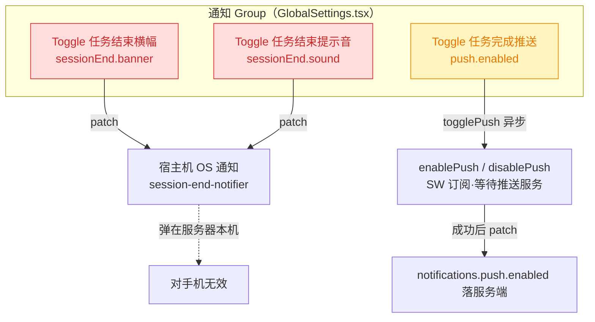
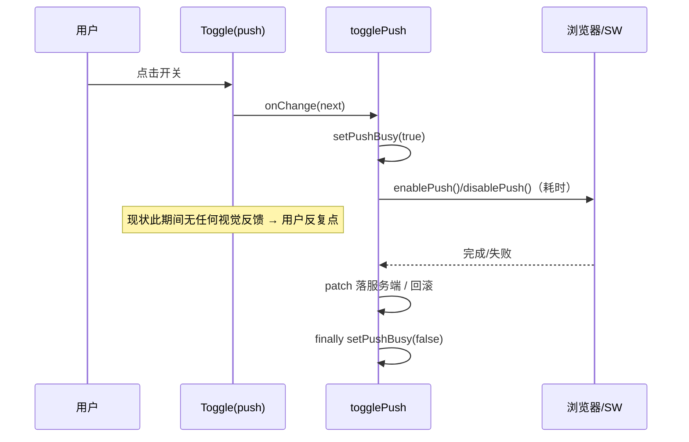
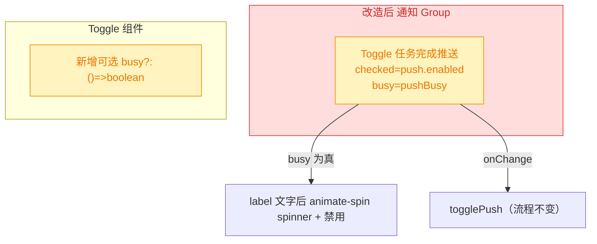

# 移动端通知设置精简与推送 loading

## 1. 背景

移动端 PWA 全局设置页（`GlobalSettings.tsx`）的「通知」版块当前有三项开关：任务结束横幅、任务结束提示音、任务完成推送。

- 前两项（`notifications.sessionEnd.banner` / `notifications.sessionEnd.sound`）对应的实现是 `session-end-notifier.ts`，走的是**运行 `yorz serve` 那台宿主机的操作系统原生通知**（osascript / notify-send / PowerShell），只会弹在服务器本机，**对手机无任何效果**——这点在前序推送 spec（`261003.feat.mobile-task-complete-push`）的现状分析里已确认。把两个对移动端用户无意义的开关摆在手机设置页，只会造成误导。
- 第三项「任务完成推送」（`notifications.push.enabled`）才是真正触达手机的能力。它的切换是异步的：`togglePush` 需要先完成浏览器侧 `enablePush()` / `disablePush()`（Service Worker 订阅 / 退订、等待推送服务响应），成功后才把 `enabled` 落服务端。真机上这一步往往耗时较长，而当前开关在等待期间没有任何「进行中」的视觉反馈，用户会误以为点击无效而反复点击。

原始需求：

```text
移动端全局设置中通知版块：
- 移除两个设置：任务结束横幅，任务结束提示音 ；这两个在移动端无效
- 任务完成推送是一个异步行为，往往需要等待较长的时间开关才能切换状态；
  希望在文字后增加 loading 效果
```

## 2. 需求

- 移除移动端全局设置「通知」版块中的「任务结束横幅」「任务结束提示音」两个开关。
- 「任务完成推送」开关在异步切换进行中时，于标签文字后展示 loading（旋转）态反馈。
- 仅改动移动端（`src/gui-mobile`）；不触碰桌面端设置与服务端 `GlobalConfig` 结构，`notifications.sessionEnd` 字段保持原样回写，避免清空桌面端配置。

## 3. 现状分析

### 3.1 通知版块结构与推送切换链路

当前「通知」Group 内三项控件，前两项对手机空转，仅第三项异步且无进行中反馈：



### 3.2 异步切换的 busy 状态已存在、但未暴露到 UI

`togglePush` 全程被 `pushBusy` 信号包裹（入口置 `true`、`finally` 置 `false`），已能准确表征「切换进行中」，只是这个状态目前仅用于**防重入**（`if (pushBusy()) return`），从未反映到开关 UI 上。补 loading 态无需新增状态，只需把既有的 `pushBusy()` 透传到渲染。



<details>
<summary>精确层：涉及文件、符号与行号</summary>

- `src/gui-mobile/src/pages/settings/GlobalSettings.tsx`
  - L53：`const [pushBusy, setPushBusy] = createSignal(false)`
  - L72-98：`togglePush`（入口 `if (pushBusy()) return` → `setPushBusy(true)` → `enablePush/disablePush` → `patch` → `finally setPushBusy(false)`）
  - L121-177：`<Group title={t('globalSettings.notifications')}>`，内含 `sessionEndBanner`（L122-134）、`sessionEndSound`（L135-147）、push 的 `<Show>`/`<Toggle>`（L148-176）。
- `src/gui-mobile/src/components/SettingsControls.tsx`
  - L62-90：`Toggle` 组件，props 仅 `label / checked / onChange`，无 busy/loading 入参；标签由 `<span class="min-w-0 flex-1 text-sm">{props.label}</span>` 渲染。
- i18n：`src/gui-mobile/src/i18n/zh-CN.ts` L165-166、`en.ts` L162-163 的 `sessionEndBanner` / `sessionEndSound`（经 grep 确认仅被本页引用）。
- 现成 spinner 范式：`src/gui-mobile/src/components/ChatComposer.tsx` 用 `animate-spin` + lucide 图标；lucide-solid 已是移动端通用图标来源。

</details>

## 4. 技术实现方案

三处最小改动，互相独立：

### 4.1 移除两个无效开关（GlobalSettings.tsx）

删除「通知」Group 内 `sessionEndBanner`、`sessionEndSound` 两个 `<Toggle>` 整块（L122-147），Group 只保留「任务完成推送」。

- `patch()` 的读-改-写语义不变：仍基于最近一次 GET 的完整 `config()` 浅合并回写，`notifications.sessionEnd` 字段原样保留，桌面端配置不受影响。
- `togglePush` 中对 `cfg.notifications.sessionEnd` 无读写，删除两项不影响推送逻辑。

### 4.2 Toggle 支持可选 loading 态（SettingsControls.tsx）

为 `Toggle` 增加**可选** prop `busy?: () => boolean`（保持 solid 的 getter 约定，与现有 `checked` 一致），默认不传则行为与现状完全一致，不影响其它调用点（项目设置等）：

- `busy()` 为真时，在 `label` 文字**后面**渲染一个 `animate-spin` 的小 spinner（复用 lucide-solid 的 `Loader2`，与 ChatComposer 的 `animate-spin` 范式一致，尺寸/颜色走 `text-muted-foreground`）。
- 同时在 `busy()` 为真时禁用 checkbox（`disabled`）并降低轨道可点性，避免等待期间重复触发——这与 `togglePush` 现有的 `if (pushBusy()) return` 防重入形成 UI + 逻辑双保险。

### 4.3 推送开关接入 busy（GlobalSettings.tsx）

push 的 `<Toggle>` 传入 `busy={pushBusy}`，把既有信号透传给 UI；无需新增状态或改动 `togglePush` 流程。

### 4.4 改造后结构与影响面



> 影响面：移除两项为「通知 Group 内删节点」，不动数据结构（🔴 仅 UI 删除，无破坏性 API 变更）；`Toggle` 新增 prop 为可选、向后兼容，其余调用点零改动（🟡 受影响但可控）。

### 4.5 决策说明

- **i18n 键处理**：`sessionEndBanner` / `sessionEndSound` 经 grep 确认仅被本页引用，移除开关后成为死键。本 refct 一并删除 `zh-CN.ts` / `en.ts` 中这两个键，避免遗留死字符串；`notifications` 等其余键保留。
- **spinner 选型**：复用项目既有的 lucide-solid `Loader2` + `animate-spin`，不自造组件、不引新依赖，与 ChatComposer 的进行中动效保持一致。
- **不下沉 gui-shared**：`Toggle` 是移动端私有控件（桌面端为另一套设置 UI），busy 态只在移动端有意义，不下沉共享层以免两端互相牵制。
- **保留 sessionEnd 配置字段**：需求只要求「移动端设置页移除开关」，`GlobalConfig.notifications.sessionEnd` 仍服务于桌面端 / 服务端，故仅删 UI 不删数据结构，`patch` 继续原样回写。

## 5. 待确认项

_暂无_

## 6. 任务清单

- [x] 为 `Toggle`（SettingsControls.tsx）新增可选 `busy?: () => boolean`：为真时在 label 文字后渲染 `Loader2` + `animate-spin` spinner，并禁用 checkbox（验收：不传 busy 时渲染与行为同现状，tsc --noEmit 通过）
- [x] GlobalSettings.tsx 删除「通知」Group 内 `sessionEndBanner`、`sessionEndSound` 两个 `<Toggle>`（验收：grep 本页无 sessionEnd 残留引用，push 开关保留）
- [x] GlobalSettings.tsx push 的 `<Toggle>` 传入 `busy={pushBusy}`（验收：切换期间文字后出现 loading 态）
- [x] 删除 i18n 死键 `sessionEndBanner` / `sessionEndSound`（zh-CN.ts、en.ts）（验收：grep 全仓无 sessionEndBanner/sessionEndSound 残留）
- [x] 运行 typecheck 验证改动（验收：tsc -b 通过，无新增类型错误）

## 7. 执行记录

- 2026-10-04 13:25 · Toggle 增 busy 态：`SettingsControls.tsx` 新增可选 prop `busy?: () => boolean`，导入 `Loader2`/`Show`；busy 为真时在 label 文字后渲染 `animate-spin` 的 `Loader2`（`text-muted-foreground`），并对 checkbox 加 `disabled`、轨道 `opacity-60`。不传 busy 行为与现状一致，其它调用点零改动。
- 2026-10-04 13:25 · 移除无效开关：`GlobalSettings.tsx` 删除「通知」Group 内 `sessionEndBanner`、`sessionEndSound` 两个 `<Toggle>`，Group 仅保留「任务完成推送」；同步更新文件头注释说明移除原因。`patch` 读-改-写语义不变，`notifications.sessionEnd` 原样回写，桌面端配置不受影响。
- 2026-10-04 13:25 · push 接入 busy：push 的 `<Toggle>` 传入 `busy={pushBusy}`，复用既有 `pushBusy` 信号，`togglePush` 流程零改动。
- 2026-10-04 13:25 · 删除 i18n 死键：`zh-CN.ts` / `en.ts` 移除 `sessionEndBanner`、`sessionEndSound`；grep 全仓确认无残留引用。
- 2026-10-04 13:25 · 验证：`pnpm run typecheck`（tsc -b）通过无报错；`grep -rn 'sessionEndBanner\|sessionEndSound' src` 无残留；prettier 格式化 4 个改动文件均 unchanged（已符合风格）。
- 2026-10-04 13:25 · 收尾：非 manual 任务全部完成，待确认项为暂无、无批注、无追加任务 [open]，标记 done。
