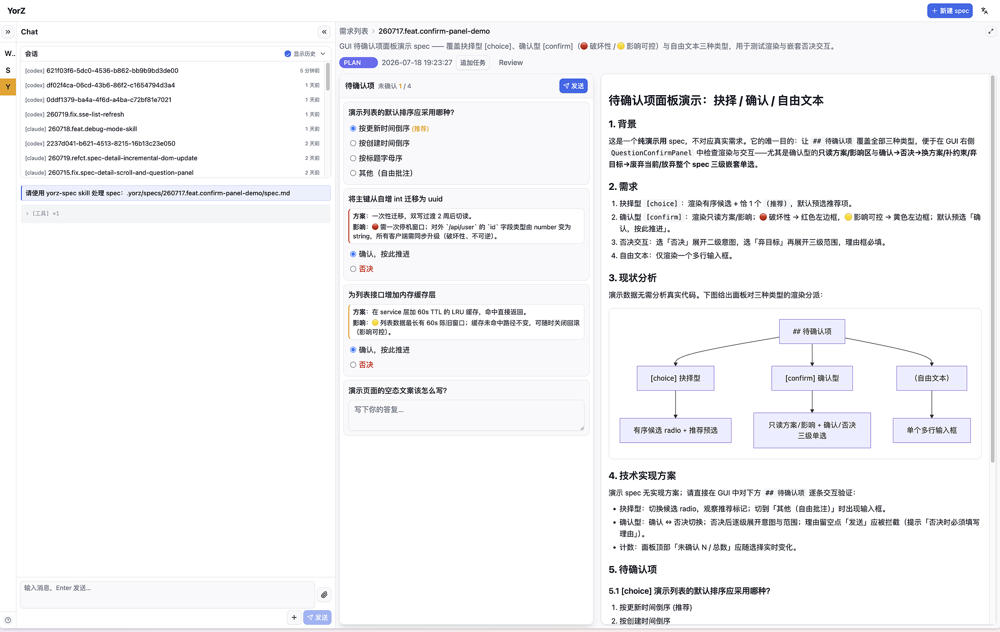

# YorZ

[English](./README.md) | **中文**

---

## 为什么需要 YorZ

YorZ（柚子）避免 vibe coding 将程序编成黑盒；  
YorZ 解决 SDD （spec 驱动开发）工作流中，开发者不看 spec 的问题。

Agent 输出文档的速度也会导致开发者信息过载，从而将开发者排挤出工作流；  
YorZ 将 spec 文档信息进行图形化升维，并为 SDD 工作流定制 UI，解决开发者信息过载，最大化 Agent 输出功率。



## 功能

- 内置轻量级 SDD skill，为 SDD 工作流定制 UI
- 用可视化图形对 Agent 输出信息进行升维，提升阅读理解效率
- 一键启用 git worktree 隔离环境，并发启动 Agent 执行任务
- 尽量减少用户介入流程，但保留关键决策权
- 提供深度 debug 模式，用证据链定位 Agent 难以解决的疑难问题
- 适配 Claude Code、OpenCode、Codex 等主流 Coding Agent

[_使用指南_](./docs/User-Guide-CN.md)

## 安装

```bash
pnpm add -g @yorz/cli

# or

npm install -g @yorz/cli
```

## 快速开始

### 启动服务

```bash
yorz serve
```

启动 YorZ Service，服务默认在后台运行。在浏览器打开 `http://localhost:7423` 即可访问仪表盘。

启动时，`yorz serve` 会自动检测 `yorz-spec` skill：当缺失或非最新时，为所有支持的 Agent（Claude Code / OpenCode / Codex）自动安装或更新，并在服务启动前输出日志。

若需停止后台服务：

```bash
yorz serve stop
```

### 添加项目

```bash
yorz add /path/to/your/project
```

将目录初始化为 YorZ 项目（创建 `.yorz/` 配置），注册到 Service，并将 `.yorz/tmp` 加入 `.gitignore`。

`yorz-spec` skill 教会你的 AI Agent 如何按 plan / tasks / execute / done 阶段驱动 spec 文档；它由 `yorz serve` 自动安装并保持最新（见第一步），无需手动安装。

## 命令参考

| 命令              | 说明                                          |
| ----------------- | --------------------------------------------- |
| `yorz serve`      | 后台启动或复用 YorZ Service，支持多项目管理。 |
| `yorz serve stop` | 停止后台 YorZ Service。                       |
| `yorz add <path>` | 初始化并注册一个目录为 YorZ 项目。            |

### 全局选项

| 选项            | 说明                     |
| --------------- | ------------------------ |
| `-V, --version` | 输出 YorZ 版本号。       |
| `-h, --help`    | 显示任意命令的帮助信息。 |

## 开发

```bash
# 安装依赖
pnpm install

# 构建 CLI + GUI
pnpm build

# 开发模式（监听 + 启动服务）
pnpm dev

# 运行测试
pnpm test
```
