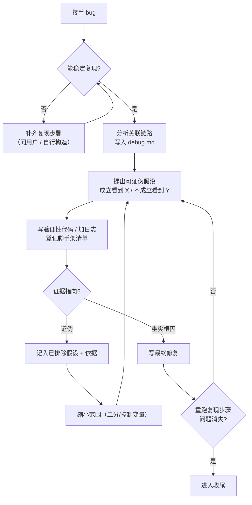
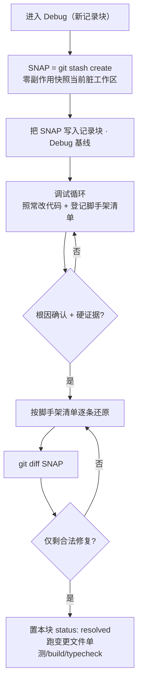

# YorZ Debug 深度调试 Skill

指导 Agent 以**资深工程师的调试纪律**逐步逼近疑难 bug 的根因：不凭猜测改代码，坚持「假设 → 取证 → 验证 → 缩小范围 → 再假设」的证据闭环。调试过程赋予更大的自由度（临时改代码、Mock 数据、加日志、建临时验证入口），同时用 `debug.md` 活文档 + `git stash create` 快照兜住"污染性改动不进入最终提交"。

> 本 skill **不复用** yorz-spec 的 plan/tasks/execute 状态机。真相以 `debug.md` 为单一载体；Agent 持续推进直至需要用户回传证据（人在环路），或根因确认并收尾。

## 何时进入本 skill

- **独立触发（无需 spec / UI）**：用户在 Agent 对话中直接点名「用 yorz-debug 调这个 bug」。此时可能没有任何 spec 上下文——按下方「无 spec 场景」处理 `debug.md` 落点。
- **追加任务勾选 Debug**：用户在 SpecDetail 追加 `fix` 任务时勾选「Debug 模式」，后端 prompt 指向本 skill。
- **重入**：spec 目录已存在 `status: debugging` 的 `debug.md`（有未收尾记录块），run/append 路由自动切到本 skill。此时**不新建记录块**，定位活跃记录块（frontmatter `active: NNN`）续跑。

## 输入约定

- `spec_dir`（**可选**）：spec 目录路径（含 `spec.md`）。给出时 `debug.md` 建在此目录，与 `spec.md` 同级。
- 待调试 bug 的描述：来自追加任务行 / 用户 prompt。

### debug.md 落点

- **有 spec 上下文**：`debug.md` 落 `spec_dir`（与 `spec.md` 同级）。
- **无 spec 场景（独立触发）**：没有 `spec_dir` 时，`debug.md` 落**当前工作目录**；若用户在 prompt 中显式指定了路径，则以用户指定为准。其余多记录模型、快照、脚手架、收尾流程与有 spec 时**完全一致**。

## debug.md：多记录活文档

**一个 `debug.md` 承载同一 spec 生命周期内的多次调试**（某次收尾后又发现新 bug，就追加下一条记录，不覆盖历史）。它同时是：调试活文档、**Debug 模式的持久化标记**（存在未收尾记录 = 处于 Debug 模式）、脚手架是否清理干净的守卫。

### 文件级 frontmatter

```yaml
---
status: debugging # debugging（存在未收尾记录）| resolved（全部记录已收尾）
active: 2 # 当前活跃记录编号；resolved 时留空
updated_at: '2026-07-19 15:54:37' # 本地秒级，单引号包裹
---
```

### 正文按「记录块」组织

每次进入 Debug **在文末追加**一个记录块，编号 `NNN` 从 1 递增、**不复用**、不覆盖既有块：

```markdown
## Debug 1 · <bug 一句话简述>

- 状态：debugging # debugging | resolved
- 快照：<git stash create 得到的 SHA>
- 进入时间：'2026-07-19 15:54:37'

### 1. Bug 现象与复现

...

### 2. 关联链路分析

...

### 3. Debug 基线

快照 SHA + 进入时间；`git diff <SHA>` 为退出闸门基准。

### 4. 假设看板

...

### 5. 证据

...

### 6. 脚手架清单

...

### 7. 收尾核对

...
```

### 生命周期

- **创建 / 进入**：`debug.md` 不存在则创建（写文件 frontmatter + 第 1 个记录块）；已存在则追加 `## Debug <max+1>`，置文件 `status: debugging`、`active: <新编号>`。进入后**立刻**打快照（见「污染防线」）。
- **单块收尾**：把该记录块块头 `状态` 置 `resolved`，脚手架逐条核销，`git diff <SNAP>` 校验只剩合法修复。
- **文件 status 收敛**：单块收尾后，若**所有**记录块均 `resolved`，置文件 `status: resolved`、清空 `active`；否则保持 `debugging` 且 `active` 指向仍在调试的块。
- **归档**：收尾**保留** `debug.md` 供复盘，绝不删除。

## 核心调试循环

**分析 → 规划 → 假设 → 实施 → 验证 → 缩小范围 → 再假设**，直至根因被硬证据锁定。



### 方法层

- **二分法**：在可疑区间（提交历史 / 代码路径 / 数据范围）二分定位，每次砍掉一半。
- **控制变量法**：一次只改一个变量，隔离单一因素的影响。
- **遍历可能分支**：对有限的分支/枚举/状态逐一验证，排除法收敛。

## 硬约束（资深工程师容易做、Agent 容易漏）

1. **先复现，再调试**：无法稳定复现，**不得进入修改阶段**——否则无从验证修没修好。复现不了就先构造复现路径或请用户提供。
2. **假设必须可证伪**：提出假设时，同时写出"若成立会看到 X，若不成立会看到 Y"，再去取证。写进「假设看板」。
3. **记录已排除假设 + 依据**：每否定一个假设，连同证据写入看板，**避免兜圈子反复验证同一已否定项**。
4. **禁止无证据修复**：拿到指向根因的**硬证据**（日志 / 截图 / 可复现的最小用例）前，**只许写验证性代码，不许写最终修复**。
5. **人在环路**：加日志后**停下**，请用户复现并回传日志 / 截图（MVP 复用现有 Chat 会话承接回传，无需新 UI）。回传前不臆断。
6. **退出双条件**：根因有硬证据 **且** 修复后重跑复现步骤、证据显示问题消失——**缺一不可**。

### 日志纪律

- **可读可复制**：打印结构化字符串而非整个 object（如 拼接关键字段 k1=v1&k2=v2 或 `JSON.stringify(x)`），避免直接打印对象或复杂结构变量的引用。
- **避免刷屏**：不要在循环/高频路径里打印大量日志；聚焦怀疑环节，必要时带唯一标记便于检索。
- **可定位**：日志带上下文（哪个函数 / 哪个分支 / 关键变量值），让用户回传的一段就能判定假设成立与否。

## 更大的自由度（Debug 模式内允许）

- 编写临时代码（条件短路）或注释有意义代码，控制程序进入 / 屏蔽特定分支；
- 临时篡改变量值、Mock API 返回，让程序走到特定分支；
- 编写临时独立测试页面 / 入口，简化复现路径、直接验证怀疑环节；
- 联网查询第三方 SDK 文档、向用户询问必要信息；
- 允许 lint / typecheck / build / 单测出现错误，允许**临时**跳过这些检查。

> 每一处临时改动都**必须**在「脚手架清单」登记一行（文件 + 位置 + 类型：短路 / Mock / 注释 / 临时页面 / 临时日志），收尾逐条核销。**未登记 = 会漏还原**。

## 污染防线（强制流程）

在**当前项目与分支就地调试**，不开 worktree；靠快照 + 脚手架清单 + diff 兜住污染。



- **进入即打快照**：`git stash create`（**不是** `git stash` / 临时 commit）生成一个记录当前脏工作区的 commit 对象，但**不动工作区 / index / HEAD**。它天然区分"进入前的既有未提交改动"与"调试引入的改动"，避免临时 commit 的还原风险。把返回的 SHA 写入记录块「Debug 基线」。
  - 若 `git stash create` 无输出（工作区干净），以当前 `HEAD`（`git rev-parse HEAD`）作为快照基准并注明。
- **git diff 是退出闸门**：宣告完成前，`git diff <SNAP>` 必须**只剩合法修复**——所有短路 / Mock / 注释 / 临时页面 / 临时日志都已还原。diff 里还有脚手架残留 = 不许收尾。

## 收尾（退出 Debug 模式）

根因确认且修复通过复现验证后：

1. **还原脚手架**：按「脚手架清单」逐条还原临时代码与被注释代码，确保原有逻辑正确；清理不需要的 debug 日志。
2. **退出闸门**：`git diff <SNAP>` 只剩合法修复（脚手架清单全部核销）。
3. **常规完整性检查**：跑变更文件关联单测、构建、类型检查。
4. **落状态**：把该记录块块头 `状态` 置 `resolved`；按「文件 status 收敛」更新文件 frontmatter（全部 resolved → 文件 `status: resolved`、清空 `active`）。
5. **保留归档**：`debug.md` 保留，供复盘。

> 收尾后如又发现**新** bug，回到本 skill 追加下一条 `## Debug NNN` 记录块（不覆盖历史），重新走一遍循环。

## 写回纪律

- 每次写回 `debug.md` 都更新文件 frontmatter 的 `updated_at`（本地秒级，单引号）。
- `updated_at` 用 `YYYY-MM-DD HH:mm:ss`。
- 记录块编号连续递增、不复用、不重排既有块。
